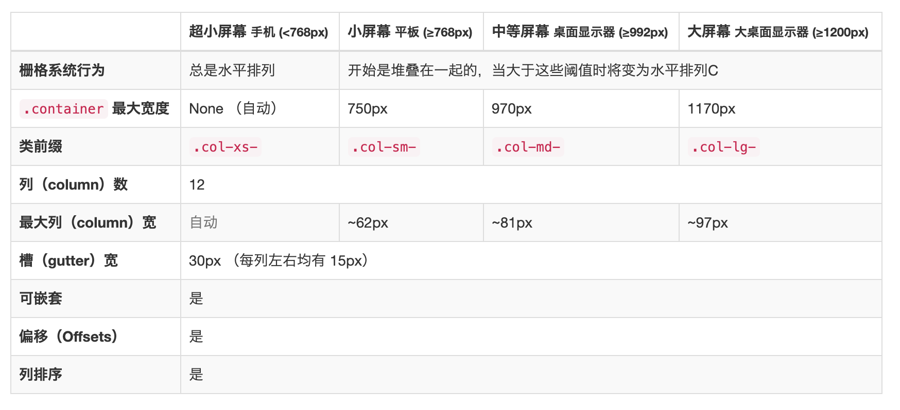
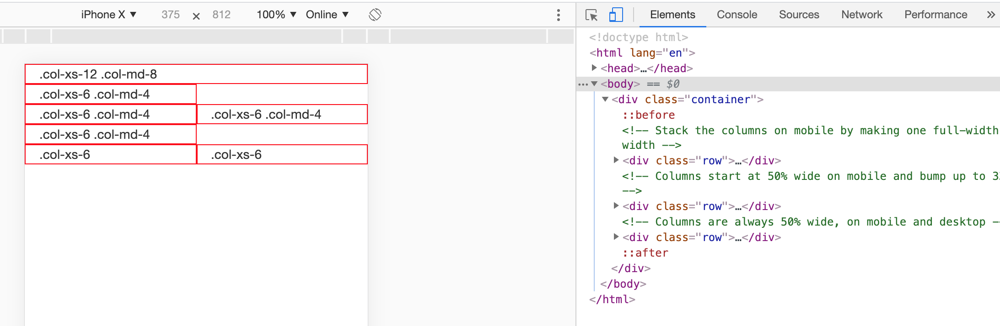
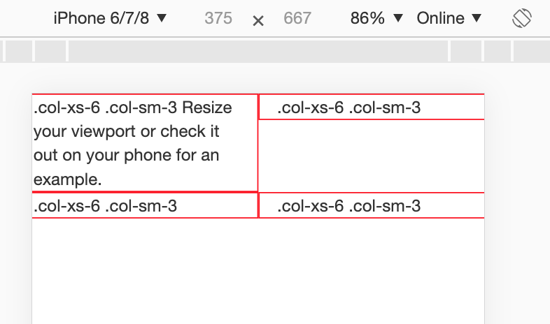
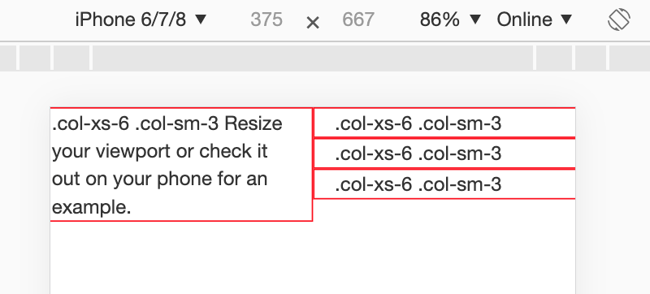
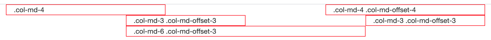
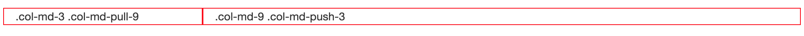

# 响应式布局

- 使用响应式布局可以使同一套页面兼容不同分辨率的设备  
- 实现: 依赖于栅格系统, 将一行平均分成12个格子, 可以指定元素占几个格子, 比如可以指定一个div在显示在pc上占了pc一行的4格, 显示在手机上占了手机一行的12格  
- 步骤:
    - 定义容器, 相当于之前的table
        - 1. container容器: 有相对设备的固定宽度, 两侧有留白
        - 2. container-fluid容器: 100% 宽度
    - 定义行, 相当于之前的tr
    - 定义元素, 相当于td, 指定该元素在不同的设备上所占的格子数目. 样式: col-设备代号-格子数目  
        - xs: 超小屏幕 手机 (<768px)
        - sm: 小屏幕 平板 (≥768px)
        - md: 中等屏幕 桌面显示器 (≥992px)
        - lg: 大屏幕 大桌面显示器 (≥1200px)
        

注:   
- 如果一行中格子超出12个, 则会换行  
- 栅格类属性可以向上兼容, 比如设置手机上一个div指定占4格, 则pad和pac上也是同样占4格. 即栅格类适用于与屏幕宽度大于或等于分界点大小的设备.
- 但是并无法向下兼容, 比如在PC上一个div指定占4格, 在手机上不一定也占4格. 如果真实设备宽度小于设置栅格类属性的设备的最小值,则会占满一整行   

其中行"row"一般要位于流式布局容器`container-fluid`或`container`中



示例:  

```html
<!DOCTYPE html>
<html lang="zh-CN">
<head>
    <meta charset="utf-8">
    <meta http-equiv="X-UA-Compatible" content="IE=edge">
    <meta name="viewport" content="width=device-width, initial-scale=1">
    <!-- 上述3个meta标签*必须*放在最前面，任何其他内容都*必须*跟随其后！ -->
    <title>Bootstrap 101 Template</title>
    <link href="css/bootstrap.min.css" rel="stylesheet">
    <script src="jquery/1.12.4/jquery-3.2.1.min"></script>
    <script src="js/bootstrap.min.js"></script>

    <link href="1.css" rel="stylesheet">
</head>
<body>
<!--定义容器-->
<div class="container">
    <!--定义行-->
    <div class="row">
        <!--定义元素-->
        <!--指定:
        在PC(大)上占12个格式
        在Pad上占6个格子
        -->
        <div class="col-lg-1 col-sm-2 inner">栅格</div>
        <div class="col-lg-1 col-sm-2 inner">栅格</div>
        <div class="col-lg-1 col-sm-2 inner">栅格</div>
        <div class="col-lg-1 col-sm-2 inner">栅格</div>
        <div class="col-lg-1 col-sm-2 inner">栅格</div>
        <div class="col-lg-1 col-sm-2 inner">栅格</div>
        <div class="col-lg-1 col-sm-2 inner">栅格</div>
        <div class="col-lg-1 col-sm-2 inner">栅格</div>
        <div class="col-lg-1 col-sm-2 inner">栅格</div>
        <div class="col-lg-1 col-sm-2 inner">栅格</div>
        <div class="col-lg-1 col-sm-2 inner">栅格</div>
        <div class="col-lg-1 col-sm-2 inner">栅格</div>
    </div>
</div>
</body>
</html>
```

```css
/*inner是自定义的css*/
.inner {
    border: 1px red solid;
}
```

----------------------------------------

### 示例: 

```html
<div class="container">
    <div class="row">
        <div class="col-md-1 inner">.col-md-1</div>
        <div class="col-md-1 inner">.col-md-1</div>
        <div class="col-md-1 inner">.col-md-1</div>
        <div class="col-md-1 inner">.col-md-1</div>
        <div class="col-md-1 inner">.col-md-1</div>
        <div class="col-md-1 inner">.col-md-1</div>
        <div class="col-md-1 inner">.col-md-1</div>
        <div class="col-md-1 inner">.col-md-1</div>
        <div class="col-md-1 inner">.col-md-1</div>
        <div class="col-md-1 inner">.col-md-1</div>
        <div class="col-md-1 inner">.col-md-1</div>
        <div class="col-md-1 inner">.col-md-1</div>
    </div>
    <div class="row">
        <div class="col-md-8 inner">.col-md-8</div>
        <div class="col-md-4 inner">.col-md-4</div>
    </div>
    <div class="row">
        <div class="col-md-4 inner">.col-md-4</div>
        <div class="col-md-4 inner">.col-md-4</div>
        <div class="col-md-4 inner">.col-md-4</div>
    </div>
    <div class="row">
        <div class="col-md-6 inner">.col-md-6</div>
        <div class="col-md-6 inner">.col-md-6</div>
    </div>
</div>
```

----------------------------------------

###示例:  

指定显示在手机上一行占有三个div, 每个div占4个小格, 那么Pad和PC上显示也同样如此  

```html
<div class="container">
    <div class="row">
        <div class="col-md-4 inner">栅格</div>
        <div class="col-md-4 inner">栅格</div>
        <div class="col-md-4 inner">栅格</div>
    </div>
</div>
```

----------------------------------------

### 移动设备和桌面屏幕  

```html
<!-- Stack the columns on mobile by making one full-width and the other half-width -->
<div class="row">
  <div class="col-xs-12 col-md-8">.col-xs-12 .col-md-8</div>
  <div class="col-xs-6 col-md-4">.col-xs-6 .col-md-4</div>
</div>

<!-- Columns start at 50% wide on mobile and bump up to 33.3% wide on desktop -->
<div class="row">
  <div class="col-xs-6 col-md-4">.col-xs-6 .col-md-4</div>
  <div class="col-xs-6 col-md-4">.col-xs-6 .col-md-4</div>
  <div class="col-xs-6 col-md-4">.col-xs-6 .col-md-4</div>
</div>

<!-- Columns are always 50% wide, on mobile and desktop -->
<div class="row">
  <div class="col-xs-6">.col-xs-6</div>
  <div class="col-xs-6">.col-xs-6</div>
</div>
```



------------------------------------

### 手机 | 平板 | 桌面

```html
<div class="row">
  <div class="col-xs-12 col-sm-6 col-md-8">.col-xs-12 .col-sm-6 .col-md-8</div>
  <div class="col-xs-6 col-md-4">.col-xs-6 .col-md-4</div>
</div>
<div class="row">
  <div class="col-xs-6 col-sm-4">.col-xs-6 .col-sm-4</div>
  <div class="col-xs-6 col-sm-4">.col-xs-6 .col-sm-4</div>
  <!-- Optional: clear the XS cols if their content doesn't match in height -->
  <div class="clearfix visible-xs-block"></div>
  <div class="col-xs-6 col-sm-4">.col-xs-6 .col-sm-4</div>
</div>
```

------------------------------------

### 响应式列重置 
在某些阈值时，某些列可能会出现比别的列高的情况。为了克服这一问题，建议联合使用 .clearfix 和 响应式工具类

```html
<div class="row">
    <!--指定在手机`xs`上占6列, 但由于第一行的内容过多, 6列依然不能放得下, 于是此列会变高, 默认跨越几行,
    可以使用clearfix标识暂时清除自动调整功能, 进行响应式列重置, 让它仍然显然在一行, 而不是跨行-->
    <!--下面指定了第一个div占了6列-->
    <div class="col-xs-6 col-sm-3 inner">.col-xs-6 .col-sm-3 Resize your viewport or check it out on your phone for an example.</div>
    <div class="col-xs-6 col-sm-3 inner">.col-xs-6 .col-sm-3</div>

    <!-- Add the extra clearfix for only the required viewport -->
    <div class="clearfix visible-xs-block"></div>

    <div class="col-xs-6 col-sm-3  inner">.col-xs-6 .col-sm-3</div>
    <div class="col-xs-6 col-sm-3  inner">.col-xs-6 .col-sm-3</div>
</div>
```



如果把代码 `<div class="clearfix visible-xs-block"></div>`去掉, 则运行效果就变成了:; 



------------------------------------

### 列偏移 

```html
<div class="container">
    <div class="row">
        <div class="col-md-4 inner">.col-md-4</div>
        <div class="col-md-4 col-md-offset-4 inner">.col-md-4 .col-md-offset-4</div>
    </div>
    <div class="row">
        <div class="col-md-3 col-md-offset-3 inner">.col-md-3 .col-md-offset-3</div>
        <div class="col-md-3 col-md-offset-3 inner">.col-md-3 .col-md-offset-3</div>
    </div>
    <div class="row">
        <div class="col-md-6 col-md-offset-3 inner">.col-md-6 .col-md-offset-3</div>
    </div>
</div>
```



------------------------------------

### 嵌套列  
为了使用内置的栅格系统将内容再次嵌套，可以通过添加一个新的 .row 元素和一系列 .col-sm-* 元素到已经存在的 .col-sm-* 元素内。被嵌套的行（row）所包含的列（column）的个数不能超过12（其实，没有要求你必须占满12列）  

```html
<div class="row">
  <div class="col-sm-9">
    Level 1: .col-sm-9
    <div class="row">
      <div class="col-xs-8 col-sm-6">
        Level 2: .col-xs-8 .col-sm-6
      </div>
      <div class="col-xs-4 col-sm-6">
        Level 2: .col-xs-4 .col-sm-6
      </div>
    </div>
  </div>
</div>
```

------------------------------------

### 列偏移
```html
<div class="container">
    <div class="row">
        <div class="row">
            <!-- push 是推过去  pull是拉回来 如果以左右为列的话  从左到右用push  从右往左用pull-->
            <!--占9格, 左边3格是别人用的-->
            <div class="col-md-9 col-md-push-3 inner">.col-md-9 .col-md-push-3</div>
            <!--占3格, 右边新的9格是别人用的-->
            <div class="col-md-3 col-md-pull-9 inner">.col-md-3 .col-md-pull-9</div>
        </div>
    </div>
</div>
```

------------------------------------

### 列排序 
```html
<div class="container">
    <div class="row">
        <div class="row">
            <!-- push 是推过去  pull是拉回来 如果以左右为列的话  从左到右用push  从右往左用pull-->
            <!--占9格, 左边3格是别人用的-->
            <div class="col-md-9 col-md-push-3 inner">.col-md-9 .col-md-push-3</div>
            <!--占3格, 右边新的9格是别人用的-->
            <div class="col-md-3 col-md-pull-9 inner">.col-md-3 .col-md-pull-9</div>
        </div>
    </div>
</div>
```



