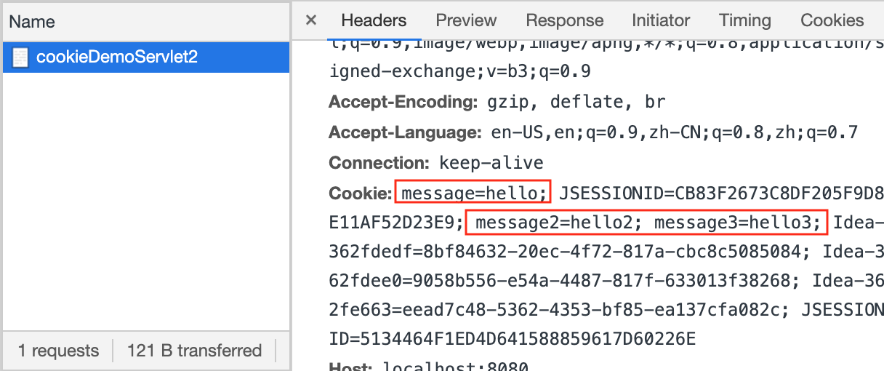

# Cookie细节

### 一次可以发送多个cookie  
```java
protected void doPost(javax.servlet.http.HttpServletRequest request, javax.servlet.http.HttpServletResponse response) throws javax.servlet.ServletException, IOException {
    Cookie cookie1 = new Cookie("message", "hello");
    Cookie cookie2 = new Cookie("message2", "hello2");
    Cookie cookie3 = new Cookie("message3", "hello3");
    response.addCookie(cookie1);
    response.addCookie(cookie2);
    response.addCookie(cookie3);
}
```

Server发给client的响应头:

  

然后client再次发起请求时会在请求头上带上这些cookie:  



---------------------------------------------------------------------------

### cookie在浏览器中保存时间

默认情况下, cookie存储在浏览器内存中, 把浏览器关闭后, cookie数据被销毁.   
注: 这里的关闭是指退出浏览器App, 即浏览器进程退出, 而不是关闭某一个tab.   
浏览器进程退出后, 内存释放, cookie数据也就从没有了. 

但是可以要求client对cookie进行持久化存储, 使用setMaxAge(int seconds), 参数seconds取不同范围值的意义:
- 正数: 将cookie数据写到硬盘的文件中, 持久化存储, seconds代表cookie的存活时间, 单位秒
- 负数: 默认值
- 零: 删除cookie

```java
protected void doPost(javax.servlet.http.HttpServletRequest request, javax.servlet.http.HttpServletResponse response) throws javax.servlet.ServletException, IOException {
    Cookie cookie = new Cookie("message", "hello");
    cookie.setMaxAge(30); // 要求client将cookie持久化存储, 时间30秒, 30秒后自动删除cookie文件
    cookie.setMaxAge(-1); // 内存存储, 浏览器进程退出, cookie消失
    cookie.setMaxAge(0); // 删除cookie, 浏览器会根据cookie的name找到相应的cookie对象并删除
    response.addCookie(cookie);
}
```

---------------------------------------------------------------------------

### cookie中能不能存中文

- 在tomcat 8之前, cookie中不能直接存储中文数据, 如果要存储, 需要将中文采用URL编码数据转码
- 在tomcat 8之后, cookie中可以存储中文数据  

但对于特殊字符支持依然不够友好, 不过, 这也是规范中的一部分: 

> With Version 0 cookies, values should not contain white space, brackets, parentheses, equals signs, commas, double quotes, slashes, question marks, at signs, colons, and semicolons. Empty values may not behave the same way on all browsers.

因此可以对cookie的value进行URL转码存储: 

```java
String encodedStr = URLEncoder.encode(str, "utf-8");
String decodeStr = URLDecoder.decode(str, "utf-8");
```

注: Cookie有两个版本, 分别是0和1
版本0适用于原始的基于网景的规范; 版本1适用于RFC 2109, 默认是0, 如果是版本0的cookie, value不可以包含:
white space, brackets, parentheses, equals signs, commas, double quotes, slashes, question marks, at signs, colons, and semicolons. Empty values may not behave the same way on all browsers

---------------------------------------------------------------------------

### cookie共享问题

**同一个服务器(比如tomcat)中部署了多个web项目, 这些web项目中的cookie能否共享?**  

- 默认情况下不能共享
- 可以使用`setPath(String path)`设置cookie的获取范围, 默认path是当前虚拟目录, 如果设置成"/", 则多个web项目就可以共享 

```java
Cookie cookie = new Cookie("message", "你好中国");
cookie.setPath("/");
response.addCookie(cookie);
```

**不同的服务器间cookie可否共享?**  
比如`news.baidu.com`和`tieba.baidu.com`部署在不同的服务器上, 同样可以设置cookie共享  
- setDomain(String path) 如果设置一级域名相同, 那么多个服务器之间cookie可以共享, 对于"news.baidu.com", baidu.com是一级域名, news.baidu.com是二级域名, 如果设置 setDomain(".baidu.com"), 则tieba.baidu.com和new.baidu.com cookie可以共享  

---------------------------------------------------------------------------

### Cookie的特点和作用
特点:   
1. Cookie数据存储在客户端中
2. 浏览器对于单个cookie的大小有限制(比如4kb), 对同一个域名下的总cookie数量也有限制(比如20以内)  

作用: 
- 一般用于存储少量的不太敏感的数据
- 在不登录的情况下完成服务器对客户端的身份识别, 比如在不登录百度的情况下作一些设置, 重启浏览器进入百度, 原来的设置还是生效的

