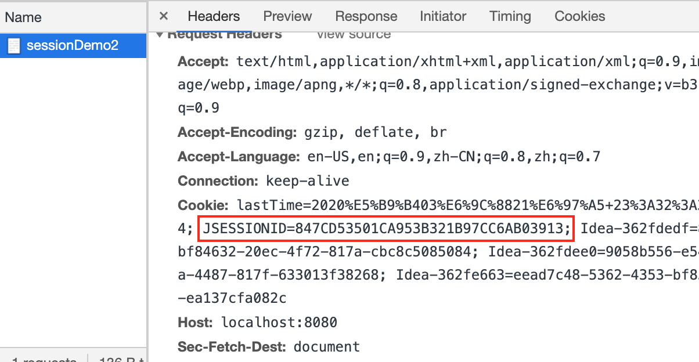

# Session

Session是一种服务器端会话技术, 在一次会话的多次请求间共享数据, 将数据保存在服务器端的对象中, HttpSession:  

- 获取HttpSession对象:  HttpSession = request.getSession
- 使用HttpSession共享数据: 
    - Object getAttribute(String name)
    - void setAttribute(String name, Object value)
    - void removeAttribute(String name)  

示例: 

**com.daliu.servlet.SessionDemo.java**

```java
package com.daliu.servlet;

import javax.servlet.annotation.WebServlet;
import javax.servlet.http.HttpSession;
import java.io.IOException;

@WebServlet("/sessionDemo")
public class SessionDemo extends javax.servlet.http.HttpServlet {
    protected void doPost(javax.servlet.http.HttpServletRequest request, javax.servlet.http.HttpServletResponse response) throws javax.servlet.ServletException, IOException {
        HttpSession session = request.getSession();
        session.setAttribute("message", "hello_session");
    }

    protected void doGet(javax.servlet.http.HttpServletRequest request, javax.servlet.http.HttpServletResponse response) throws javax.servlet.ServletException, IOException {
        this.doPost(request, response);
    }
}
```

**com.daliu.servlet.SessionDemo2.java**  
```java
package com.daliu.servlet;

import javax.servlet.annotation.WebServlet;
import javax.servlet.http.HttpSession;
import java.io.IOException;

@WebServlet("/sessionDemo2")
public class SessionDemo2 extends javax.servlet.http.HttpServlet {
    protected void doPost(javax.servlet.http.HttpServletRequest request, javax.servlet.http.HttpServletResponse response) throws javax.servlet.ServletException, IOException {
        HttpSession session = request.getSession();
        String msg = (String) session.getAttribute("message");
        System.out.println(msg);
        response.getWriter().println(msg);
    }

    protected void doGet(javax.servlet.http.HttpServletRequest request, javax.servlet.http.HttpServletResponse response) throws javax.servlet.ServletException, IOException {
        this.doPost(request, response);
    }
}
```

浏览器键入`http://localhost:8080/demo/sessionDemo`, 然后键入`http://localhost:8080/demo/sessionDemo2`, 会看到页面上打印出来了session的值: "hello_session", 退出浏览器App(杀掉进程, 不是关闭tab)再访问`http://localhost:8080/demo/sessionDemo2`, 打印结果是null, 这说明使用session可以一次会话的多个request中传递数据, 会话断开, 就无法继续使用.  

------------------------------

### 原理分析 

我们知道, Cookie的本质由响应头set-cookit和请求头cookit实现的, 而Session是依赖于Cookie的:

- 第一次获取session时, 由于没有cookie, 服务器在内存中创建一个新的Session对象, 并且有一个唯一的id标识, 比如id=1234, 然后服务器创建一个cookie并在响应头上携带这个session的唯一标识发给client:
set-cookie:JSESSIONID=session的id(1234), 由client把这个cookie存储在本机     
- 下一次访问时会在请求头上携带这一个cookie(cookie:JSESSIONID=1234)发送给服务器, 服务器找到后解析出来就认为这两次request是基于同一个session的

  
  
