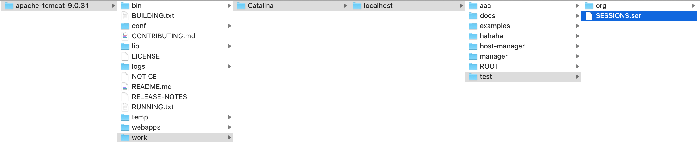

# Session细节

### 客户端关闭后, 服务器不关闭, 两次获取的session是不是同一个?
- 默认情况下不是同一个
- 可以手动创建一个名为JSESSIONID的cookie使用客户端关闭后, session也能相同:
```java
HttpSession session = request.getSession();
session.setAttribute("message", "hello_session");
Cookie cookie = new Cookie("JSESSIONID", session.getId());
cookie.setMaxAge(60*60);
...
```

### 客户端不关闭, 服务器关闭后, 两次获取的session是不是同一个?
- 默认不是同一个

这有可能引发一个问题, 比如购物商城网站中, 用户在匿名情况把商品加入购物车, 可以把购物车存入session中, 当用户在操作时服务器重启了一次, 那么session中保存的东西就不见了, 所以针对数据情况要解决数据不丢失的问题, 这就引出两个概念:

- session的钝化(序列化session): 在服务器正常关闭之前, 将session对象序列化到硬盘上 
- session的活化(反序列化session): 在服务器启动后, 将session文件转化为内存中的session对象  

这两件事情一般服务器会处理好, 但由于IDEA做了一些事情不便演示, 此处我们把项目拷贝到Tomcat中演示:

把IDEA中下out中的要打包到Tomcat中的项目复制成.zip然后改成后缀名, 可以重命名, 这里重命名为test, 启动Tomcat, 它会自动解压缩test


然后调用bin目录下的shutdown命令:

```
./shutdown.sh
```

之后就会在Tomcat的work目录下(work目录是Tomcat在运行时产生的一些文件的临时存放目录)发现这个钝化后的session对象  



然后再启动Tomcat `./startup.sh`会发现此文件不见了, Tomcat把这个文件读取到内存中, 还原session对象并删除了此文件.   
即使关闭并开启很多次Tomcat, 访问`http://localhost:8080/test/sessionDemo2`依然可以成功获取相同的值

**注: ** IDEA在重启时会把CATALINA_BASE标识的work目录删除再新建, 因此无法演示此种情况

### session失效时间

1. 服务器关闭
2. session对象调用invalidate()
3. session默认失效时间 30分钟, 在 `apache-tomcat-x.x.xx/conf/web.xml`中可以找到并修改session默认失效时间  
```xml
  <!-- ==================== Default Session Configuration ================= -->
  <!-- You can set the default session timeout (in minutes) for all newly   -->
  <!-- created sessions by modifying the value below.                       -->

    <session-config>
        <session-timeout>30</session-timeout>
    </session-config>
```

### session特点
1. session是用于存储一次会话的多次请求的数据, 存在服务器端
2. session可以存储任意类型, 任意大小的数据

### session与cookie的区别
1. session存储在服务器端, cookie在客户端
2. sesion没有数据大小限制, cookie有
3. session相对于cookit安全性高