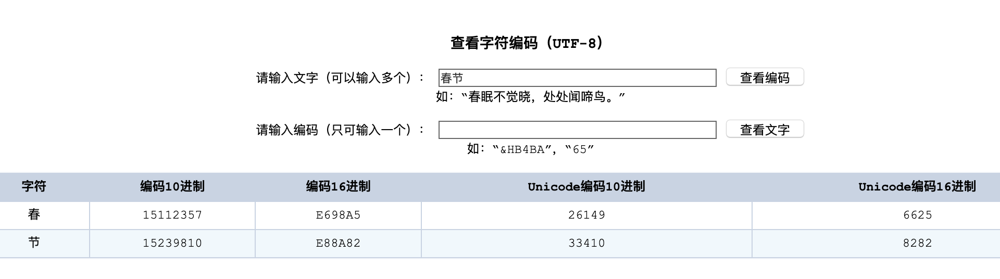
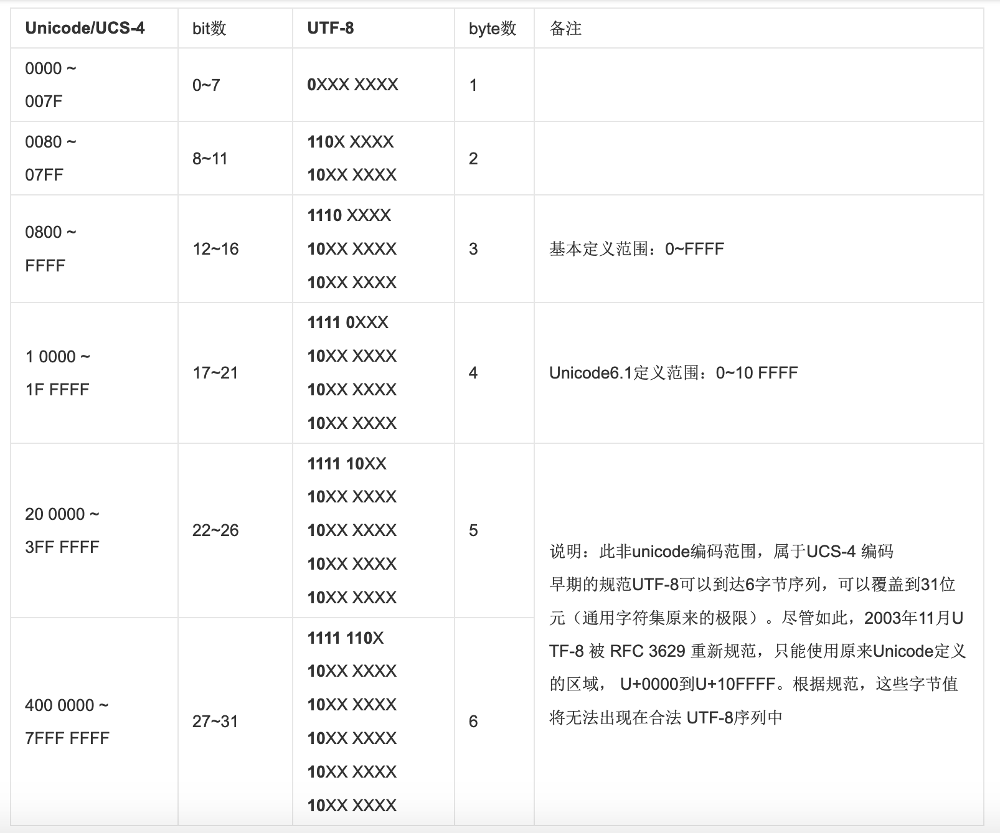

# URL汉字编码

[CSDN](https://blog.csdn.net/shabijiayong/article/details/79094438)
[RFC1738](https://www.ietf.org/rfc/rfc1738.txt)

根据[RFC1738](https://www.ietf.org/rfc/rfc1738.txt)规范:  

> Thus, only alphanumerics[0-9a-zA-Z], the special characters `$-_.+!*'(),`, and reserved characters used for their reserved purposes may be used unencoded within a URL.
> “只有字母和数字[0-9a-zA-Z]、一些特殊符号“$-_.+!*'(),”[不包括双引号]、以及某些保留字，才可以不经过编码直接用于 URL。”
>

这意味着，如果URL中有汉字，就必须编码后使用. 但是RFC 1738没有规定具体的编码方法，而是交给应用程序（比如浏览器）自己决定. 这导致URL编码成为一个混乱的领域.  

###在网址路径中包含汉字和请求参数包含汉字默认按UTF-8处理  
打开Chrome, 在浏览器上键入: `https://zh.wikipedia.org/wiki/春节`  
发现请求的URL为:  
`Request URL: https://zh.wikipedia.org/wiki/%E6%98%A5%E8%8A%82`
在UTF-8编码中:
春 -> E6 98 A5
节 -> E8 8A 82  

可以在[这里](http://www.mytju.com/classcode/tools/encode_utf8.asp)找到汉字对应的UTF-8编码  

因此，%E6%98%A5%E8%8A%82 就是按照顺序，在每个字节前加上%而得到的, 在IE和FireFox浏览器上得到的结果是相同的, 因此在网络路径的编码中, 浏览器使用的是UTF-8编码  

假如在浏览器上键入`http://www.baidu.com/?wd=春节`, 经测试, 在主流的浏览器上仍然按UTF-8编码翻译:  
`wd=%E6%98%A5%E8%8A%82`

###UTF-8

简体中文常见的编码方式是GB2312，使用两个字节表示一个汉字，所以理论上最多可以表示256x256=65536个符号, 而法语中字母上方有注音符号，它就无法用ASCII码表示。于是，一些欧洲国家就决定，利用字节中闲置的最高位编入新的符号。比如，法语中的é的编码为130（二进制10000010）。这样一来，这些欧洲国家使用的编码体系，可以表示最多256个符号。世界上存在着多种编码方式, 如果有一种编码，将世界上所有的符号都纳入其中。每一个符号都给予一个独一无二的编码，那么乱码问题就会消失。这就是Unicode，就像它的名字都表示的，这是一种所有符号的编码。  

所以Unicode是一个很大的集合, 现在的规模可以容纳100多万个符号。每个符号的编码都不一样，比如，U+0639表示阿拉伯字母 Ain，U+0041表示英语的大写字母A，U+4E25表示汉字“严”。具体的符号对应表可以查询[unicode.org](http://www.chi2ko.com/tool/CJK.htm)或[汉字对应表](http://www.chi2ko.com/tool/CJK.htm)

但是, Unicode只是一个符号集，它只规定了符号的二进制代码，却没有规定这个二进制代码应该如何存储。比如，汉字“严”的unicode是十六进制数4E25，转换成二进制数足足有15位（100111000100101），也就是说这个符号的表示至少需要2个字节。表示其他更大的符号，可能需要3个字节或者4个字节，甚至更多。  
而UTF-8就是被广泛采用的Unicode的实现方式之一, UTF-8最大的一个特点，就是它是一种变长的编码方式。它可以使用1~4个字节表示一个符号，根据不同的符号而变化字节长度  

UTF-8的编码规则很简单，只有二条:  

1. 对于单字节的符号，字节的第一位设为0，后面7位为这个符号的unicode码。因此对于英语字母，UTF-8编码和ASCII码是相同的,
    - 比如"a"对应为二进制"0110 0001", 八进制"0141" 十进制"97", 十六进制"0x61", 
    - 在Unicode中是一致的, 二进制仍为"0110 0001", 当然十进制, 十六进制也一样
2. 对于n字节的符号（n>1），第一个字节的前n位都设为1，第n+1位设为0，后面字节的前两位一律设为10。剩下的没有提及的二进制位，全部为这个符号的unicode码 
    - 比如汉字严的unicode是4E25(100111000100101), 根据下表, 发现4E25处在第三行的范围内（0000 0800-0000 FFFF），因此“严”的UTF-8编码需要三个字节 
    - 即格式是 1110xxxx 10xxxxxx 10xxxxxx
    - 然后，从“严”的最后一个二进制位开始，依次从后向前填入格式中的x，多出的位补0。这样就得到了，“严”的UTF-8编码是:  
      1110 0100 
      1011 1000 
      1010 0101
      转换成十六进制就是E4B8A5
      1110 XXXX  -->  1110 0100  --> E4
      10XX XXXX  -->  1011 1000  --> B8
      10XX XXXX  -->  1010 0101  --> A5

UTF-8不分大小端, 其编码顺序与存储顺序一致  