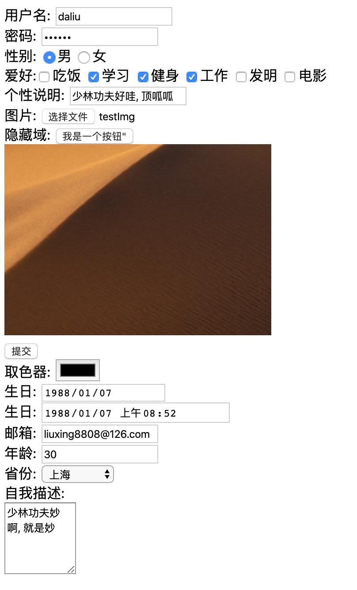

# 表单

```html
<!DOCTYPE html>
<html lang="ch">
<head>
    <meta charset="UTF-8">
    <title>Title</title>
</head>
<body>
    <!--
        action: 指定提交数据的URL
        method: 指定提交方式GET/POST
        表单项中的数据要想被提交, 必须指定其name属性, 用于作为提交表单项的key
        如果表单项没有name, 表单项不会被提交
    -->
    <form action="postAction/login" method="GET">
        用户名: <input name="username" /><br />
        密码: <input name="password" /><br />
        <input type="submit" value="登录">
    </form>
</body>
</html>
```

输入完成提交前和提交后变化如下:  

```
本地: 
file:///Users/liuweizhen/IdeaProjects/EmptyDemo/html/src/helloworld.html
file:///Users/liuweizhen/IdeaProjects/EmptyDemo/html/src/postAction/login?username=zhangsan&password=111

IDEA自带功能: 
http://localhost:63342/EmptyDemo/html/helloworld.html
http://localhost:63342/EmptyDemo/html/postAction/login?username=zhangsan&password=111
```

###常用表单项标签 

- input: 可以通过type属性指定表单项样式
  - type属性: 
    - text: 文本输入框, 默认值(placeholder: 输入前的提示)
    - password: 密码输入框
    - radio: 单选框
    - checkbox: 复选框
    - file: 文件选择框
    - hidden: 隐藏域
    - submit: 提交按钮
    - button: 普通按钮
    - image: 当点击时提交表单(src指定图片路径)
    - color: h5新出, 取色器
    - date: h5新出, 日期, 不含时分秒
    - datetime-local: h5新出, 日期, 含时分秒
    - number: h5新出, 只能填入数字
    - email: 邮箱, 如果邮箱格式不正确, 提交时会自动校验并弹出警告框
    - url: h5新出
    - month: h5新出
- select: 下拉列表
    - option: 列表项
- textarea: 文本域
    - cols: 列数
    - rows: 行数



```html
<!DOCTYPE html>
<html lang="en">
<head>
    <meta charset="UTF-8">
    <title>Title</title>
</head>
<body>
    <form action="#" method="get">
        用户名: <input type="text" name="username" placeholder="请输入用户名" /><br />
        密码: <input type="password" name="password" placeholder="请输入密码" /><br />
        性别: <input type="radio" name="gender" value="mane" checked="checked" />男
              <input type="radio" name="gender" value="female" />女
              <!--
              1. radio是单选框, 因此多个radio的name一致, 如果不一致, 则可以多选
              2. 一般会给每一个radio提供value属性, 表示选中后提交的值(如果不指定但选择了, 则值默认是on)
              -->
              <br />
        爱好:<input type="checkbox" name="hobby" value="eat" />吃饭
             <input type="checkbox" name="hobby" value="learn" checked="checked" />学习
             <input type="checkbox" name="hobby" value="exercise" />健身
             <input type="checkbox" name="hobby" value="work" checked />工作
             <input type="checkbox" name="hobby" value="invention" />发明
             <input type="checkbox" name="hobby" value="movie" />电影<br />
        <!--
        checkbox是多选框
        和radio相同, 可以使用checked="checked"或直接写checked表示默认选中
        -->
        <label for="info">个性说明:</label> <input type="text" placeholder="请输入个性说明" name="personal" id="info" /><br />
        <!--
        label中for属性的值和id的值相同, 是用于描述表单项信息的
        这样当点击到"个性说明"这几个字时, 光标就会自动跑到对应的表单项中准备输入
        -->
        图片: <input type="file" name="file" /><br />
        隐藏域: <input type="hidden" name="hidden" value="aaa" />
        <input type="button" value=我是一个按钮"><br>
        <input type="image" src="images/1.png"><br>
        <input type="submit" value="提交"><br>
        取色器: <input type="color" name="color"><br>
        生日: <input type="date" name="birthday1"><br>
        生日: <input type="datetime-local" name="birthday2"><br>
        邮箱: <input type="email" name="email"><br>
        年龄: <input type="number" name="age"><br>
        省份: <select name="province">
            <option>--请选择--</option>
            <option value="1">北京</option>
            <option value="2">上海</option>
            <option value="3">陕西</option>
            <option value="4">郑州</option>
        </select><br>
        自我描述: <br> <textarea cols="10" rows="5" name="des"></textarea>
    </form>
</body>
</html>
```

```
http://localhost:63342/EmptyDemo/html/InputType.html?username=daliu&password=111111&gender=mane&hobby=learn&hobby=exercise&hobby=work&personal=%E5%B0%91%E6%9E%97%E5%8A%9F%E5%A4%AB%E5%A5%BD%E5%93%87%2C+%E9%A1%B6%E5%91%B1%E5%91%B1&file=testImg.png&hidden=aaa&color=%23000000&birthday1=1988-01-07&birthday2=1988-01-07T08%3A52&email=liuxing8808%40126.com&age=30&province=2&des=%E5%B0%91%E6%9E%97%E5%8A%9F%E5%A4%AB%E5%A6%99%E5%95%8A%2C+%E5%B0%B1%E6%98%AF%E5%A6%99#

username=daliu
password=111111
gender=mane
hobby=learn
hobby=exercise
hobby=work
personal=%E5%B0%91%E6%9E%97%E5%8A%9F%E5%A4%AB%E5%A5%BD%E5%93%87%2C+%E9%A1%B6%E5%91%B1%E5%91%B1
file=testImg.png
hidden=aaa
color=%23000000
birthday1=1988-01-07
birthday2=1988-01-07T08%3A52&email=liuxing8808%40126.com
age=30
province=2&des=%E5%B0%91%E6%9E%97%E5%8A%9F%E5%A4%AB%E5%A6%99%E5%95%8A%2C+%E5%B0%B1%E6%98%AF%E5%A6%99#
```