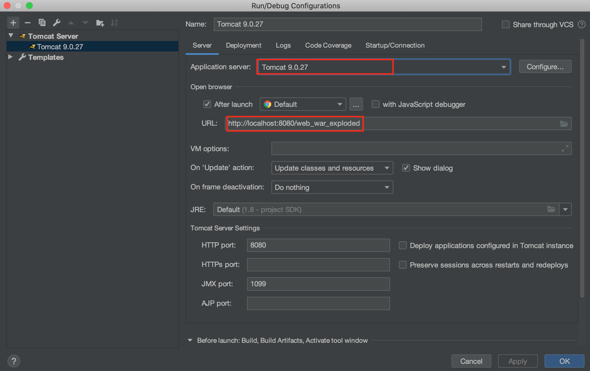
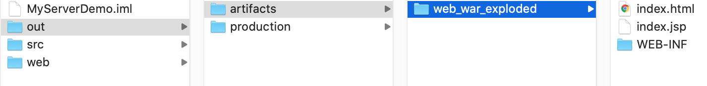
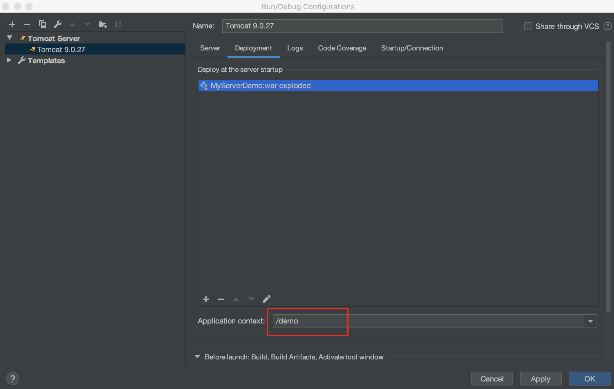

# HelloWorld

参考： 
[https://www.cnblogs.com/xinruyi/p/9360282.html](https://www.cnblogs.com/xinruyi/p/9360282.html)

下面使用IDEA新建第一个Java Web程序

File > New > Project > Java Enterprise > Application Server选择Tomcat Server > Tomcat Home 和 Tomcat base directory 先入tomcat解压所在的目录, 比如 `/Users/daliu-1118/Library/Tomcat/apache-tomcat-9.0.27` > 勾选Create project from template (JavaEE Web Module) > 输入项目名

目录介绍：

- src: 存放java源代码
- web: web资源目录，存储静态资源html/js/css/jsp
  - WEB-INF: 此目录下的文件不可被浏览器直接访问 web.xml
    - web.xml: Web程序的描述文件

在web目录下新建一个index.html：

```html
<!-- web/index.html -->
<html>
    <head>
        <title>This is title</title>
    </head>
    <body>
        Hello World!
    </body>
</html>
```

### 发布JavaWeb项目

**方式1：手动copy web目录**

把整个web目录直接copy到tomcat的webapps目录下：


然后调用 `sudo ./shutdown.sh` 关闭Tomcat, 再使用 `sudo ./startup.sh` 重新打开Tomcat，在浏览器中输入：

```
http://localhost:8080/web/index.html
```

如果把上面copy到tomcat/webapps下的文件夹名字从web改为：MyServer, 则从浏览器访问的地址就应该改为：
```
http://localhost:8080/MyServer/index.html
```

**方式2：配置IDEA**

Run > Edit Configurations... > 配置好Application Server

Run > Run 'Tomcat x.x.x' With Coverage 也可以使用Run > Run 'Tomcat x.x.x'，即不使用Coverage覆盖模式，但这样做之前如果Tomcat已经在运行，即8080端口已被占用，需要调用`sudo ./shutdown.sh`先停掉，再Run




上面由于IDEA的部署(Deployment)使用的是war exploded, 那么Server选项中的URL默认是`http://localhost:8080/web_war_exploded`，这是项目的根目录，浏览器访问时，它会寻找项目根目录下的index.html，也可以修改这个URL，比如修改成：

```
http://localhost:8080/web_war_exploded/index.jsp
```

那么程序一启动打开的就是项目下面的index.jsp页面。

其实这是IDEA做了一些事情，网站的根目录在IDEA下此项目根目录的 out/artifacts/artifacts中：  



### 发布模式

发布模式一般有war模式和war exploded模式：

- war模式：一般的发布模式（完整的项目），将项目打成war包，再发布
- war exploded模式：直接把文件夹、jsp页面、classes等等移到Tomcat部署文件夹里面，进行加载部署，因此这种方式支持热部署，一般我们在开发的时候使用这种方式

上面IDEAE使用的是war exploded模式，使用war explodes模式可以在修改代码或资源之后不重启Tomcat而改变浏览器呈现内容，但需要进行配置：

Run > Edit Configurations > Server > 选择 On frame deactivation为Update classes and resources

这样配置之后，当修改了代码或资源，直接点击浏览器刷新按钮，内容呈现随即也发生变化.

### 新建Artifact配置项目根目录名

配置项目根目录名需要做两件事，1是Artifact, 2是在Deployment中指定Artifact, 比如我们要把项目根目录名改为demo

File > Project Structure ... > Artifacts > Web Application: Exploded > From Modules > 选中项目

这里的Output directory可以不修改，也可以修改Output directory, 代表输出路径，比如我修改为： `/Users/daliu-1118/IdeaProjects/MyServerDemo/out/artifacts/demo，那么如果这样修改后，IDEA就会把包打在这个out/artifacts/demo目录下生成WEB-INF

然后在Deployment中指定
Run > Edit Configurations ... > Deployment > 点击+ > Artifact > 选择artifact， 然后在Application context应用上下文改为demo:



这样Run > Run With Coverage之后，浏览器的访问路径为：`http://localhost:8080/demo/`

### Java Web目录结构

Web程序部署在Tomcat的/webapps下，一个webapps文件夹可以部署多个不同的Web应用，例如webapps/web1、webapps/web2, 访问网址时使用http://localhost:8080/web1、http://localhost:8080/web2   
这两个不同的Web应用分别称为两个Context，路径/web1、web2也称为上下文路径ContextPath   
如果不使用上下文路径，Web应用需要放在webapps/ROOT下，ROOT文件夹下的程序使用http://localhost:8080/访问，不过一般不这么做。

根据Servlet规范，Web程序自己有特定的结构，部署时必须安装这样的结构部署：    

| 文件夹            | 描述                                         |
| :---------------- | :------------------------------------------- |
| /                 | Web应用根目录                                |
| /WEB-INF/         | Tomcat会隐藏该文件夹下所有文件不允许直接访问 |
| /WEB-INF/web.xml  | Web程序最主要的配置文件                      |
| /WEB-INF/classes/ | class类文件都放在该文件夹下面，包括Servlet类 |
| /WEB-INF/lib/     | jar文件都放在该文件夹下面                    |


### Maven支持
注: 如果需要maven依赖，可以右键项目 > Add Framework Support ... > Maven 即可

如果出现错误：idea 源发行版 8 需要目标发行版 1.8，需要设置3个地方：

1. File > Project Structure... > Modules > Sources > Language level > 改成 8-Lambdas, type annotations etc.
2. File > Project Structure ... > Project > Project SDK > 1.8
3. Preferences > Java Compiler > Project bytecode version: 8

如果明明在pom.xml中引入了jar包，但报错：Class XXX Not found, 可以参考：`https://blog.csdn.net/a4507408789/article/details/80234775`
这是因为jar包并未被部署，解决方法：   
File > Project Structure... > Artifacts > WEB-INF > 查看下面是否有lib目录(如果没有lib目录，可自行创建) > 右边的jar包添加到lib目录下 


