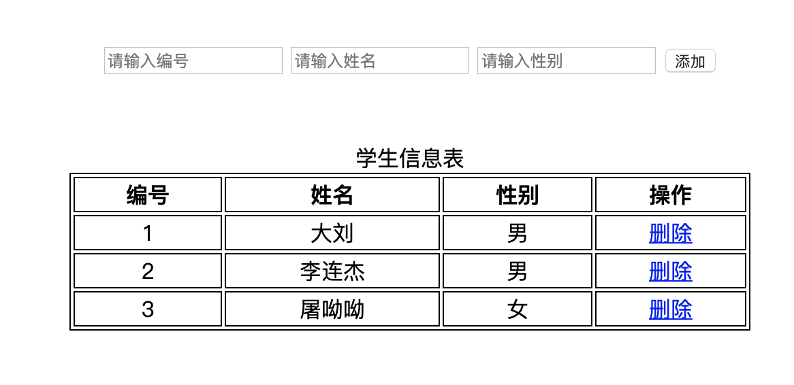

# DOM

### 事件

```js
<body>
    <p onclick="alert('点击了 1');">点击了 1</p>
    <p onclick="clickMe2();">点击了 2</p>
    <p id="xxx">点击了 3</p>

    <script>
        function clickMe2() {
            alert("点击了 2");
        }

        function clickMe3() {
            alert("点击了 3");
        }

        let item = document.getElementById("xxx");
        // OK: item.onclick = clickMe2;
        let f = clickMe3;
        item.onclick = f; // OK
    </script>
</body>
```

### DOM

Document Object Model: 文档对象模型, 将标记语言文档的各个组成部分封装为对象.  
HTML DOM定义了访问和操作HTML和XML文档的标准方法, 可以使用这个对象对标记语言文档进行CRUD的动态操作   

- 核心DOM: 针对任何结构化文档的标准模型  
    - Document: 文档对象
        - 获取
            - window.document
            - document
        - 方法
            1. 获取Element对象
                - getElementById() 根据id属性获取
                - getElementsByClassName() 根据class属性值获取
                - getElementsByName() 根据name属性值获取
                - getElementsByTagName() 根据元素名称获取
            2. 创建其他DOM对象
                - createAttribute(name)
                - createComment()
                - createElement()
                - createTextNode()
            3. 属性
    - Element: 元素对象
        - 获取/创建: document.getElementBy... document.create...
        - removeAttribute(): 删除属性
        - setAttribute(): 设置属性 `xxx.setAttribute("href", "https://www.baidu.com")`
    - Attribute: 属性对象
    - Text: 文本对象
    - Comment: 注释对象
    - Node: 节点对象, 是上面5个的父对象
        - appendChild()
        - removeChild()
        - replaceChild()
        - parentNode: 属性, 表示父节点
- XML DOM: 针对XML文档的标准模型 
- HTML DOM: 针对HTML文档的标准模型
    - innerHTML: 标签体的获取和设置
    - [W3C](https://www.w3school.com.cn/jsref/index.asp)  

-----------

### 案例  



```html
<!DOCTYPE html>
<html lang="en">
<head>
    <meta charset="UTF-8">
    <title>Title</title>
    <script src="1.js"></script>
    <style>
        @import "1.css";
    </style>
</head>
<body>
    <div>
        <input type="text" id="id" placeholder="请输入编号">
        <input type="text" id="name" placeholder="请输入姓名">
        <input type="text" id="gender" placeholder="请输入性别">
        <input type="button" value="添加" id="btn_add" onclick="addStudent();">
    </div>
    <table>
        <caption>学生信息表</caption>
        <tr>
            <th>编号</th>
            <th>姓名</th>
            <th>性别</th>
            <th>操作</th>
        </tr>
        <tr>
            <td>1</td>
            <td>大刘</td>
            <td>男</td>
            <td><a href="javascript:void(0);" onclick="deleteRow(this);">删除</a> </td>
        </tr>
        <tr>
            <td>2</td>
            <td>李连杰</td>
            <td>男</td>
            <td><a href="javascript:void(0);" onclick="deleteRow(this);">删除</a> </td>
        </tr>
        <tr>
            <td>3</td>
            <td>屠呦呦</td>
            <td>女</td>
            <td><a href="javascript:void(0);" onclick="deleteRow(this);">删除</a> </td>
        </tr>
    </table>
</body>
</html>
```

```js
function addStudent2() {
    let id = document.getElementById("id").value;
    let name = document.getElementById("name").value;
    let gender = document.getElementById("gender").value;

    let td_id = document.createElement("td");
    td_id.appendChild(document.createTextNode(id));
    let td_name = document.createElement("td");
    td_name.appendChild(document.createTextNode(name));
    let td_gender = document.createElement("td");
    td_gender.appendChild(document.createTextNode(gender));

    let td_delete = document.createElement("td");
    // <td><a href=">删除</a></td>
    let a = document.createElement("a");
    a.setAttribute("href", "javascript:void(0);");
    a.setAttribute("onclick", "deleteRow(this);");
    a.appendChild(document.createTextNode("删除"));
    td_delete.appendChild(a);

    let tr = document.createElement("tr");
    tr.appendChild(td_id);
    tr.appendChild(td_name);
    tr.appendChild(td_gender);
    tr.appendChild(td_delete);

    let table = document.getElementsByTagName("table")[0];
    table.appendChild(tr);
}

function addStudent() {
    let id = document.getElementById("id").value;
    let name = document.getElementById("name").value;
    let gender = document.getElementById("gender").value;

    let table = document.getElementsByTagName("table")[0];
    table.innerHTML += "<tr>\n" +
        "            <td>" + id + "</td>\n" +
        "            <td>" + name + "</td>\n" +
        "            <td>" + gender + "</td>\n" +
        "            <td><a href=\'javascript:void(0);\' onclick=\'deleteRow(this);\'>删除</a> </td>\n" +
        "        </tr>"
}

// <td><a href="javascript:void(0);" onclick="deleteRow(this);">删除</a> </td>
function deleteRow(obj) {
    let table = obj.parentNode.parentNode.parentNode;
    let tr = obj.parentNode.parentNode;
    table.removeChild(tr);
}
```

```css
table {
    border: 1px solid;
    margin: auto;
    width: 500px;
}

th, td {
    text-align: center;
    border: 1px solid;
}

div {
    text-align: center;
    margin: 50px;
}
````

