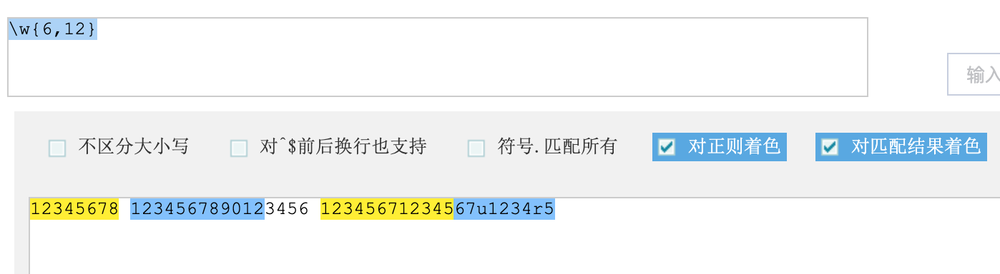
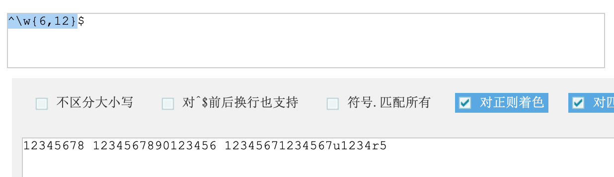

# JS对象

- Function
- Array
- Date
- Math
- RegExp
- Global

###Function  

Function对象是函数对象 

```javascript
// 创建方式1
// var fun = new Function(参数列表, 方法体)
// 下面这种方式不推荐使用
var fun1 = new Function("a", "b", "alert(a+b);");
fun1(3, 4);

// 创建方式2
// 标准写法: function 方法名称(参数列表) { 方法体 }
function fun2(a, b) {
    alert(a + b);
}
fun2(4, 5);

// 创建方式3
// var方法名 = function(参数列表) { 方法体 }
var fun3 = function(a, b) {
    alert(a + b);
}
fun3(10, 20);
```

###属性  
length: 形参个数  

```html
<head>
    <meta charset="UTF-8">
    <title>Title</title>
    <script>
        var fun1 = new Function("a", "b", "alert(a+b);");
        alert(fun1.length); // 2

        // 创建方式2
        // 标准写法: function 方法名称(参数列表) { 方法体 }
        function fun2(a, b) {
            alert(a + b);
        }
        alert(fun2.length); // 2

        // 创建方式3
        // var方法名 = function(参数列表) { 方法体 }
        var fun3 = function(a, b) {
            alert(a + b);
        }
        alert(fun3.length); // 2
    </script>
</head>
```

###形参实参不匹配  

```java
function fun2(a, b) {
    alert(a); // 1
    alert(b); // undefined
}
fun2(1); // OK
```

```javascript
function add(a, b) {
    var sum = 0;
    for (var i=0; i<arguments.length; i++) {
        sum += arguments[i];
    }
    return sum;
}
alert(add(1, 1, 1, 1, 1)); // 5
```

特点: 
- 方法的形参类型和返回类型不用写
- 方法是一个对象, 方法是一个对象, 如果定义相同的方法, 后者覆盖前者. 
- 在JS中, 方法的调用只与方法的名称有关, 与参数列表无关.   
- 在方法声明中有一个隐藏的内置数组对象, arguments代表所有传入的实参

------------------------------------

### Array
1. 创建 
    1. var arr = new Array(元素列表)
    2. var arr = new Array(默认长度)
    3. var arr = [元素列表] 
2. 方法
    - join(分隔符): 将数组中的元素按照指定分隔符拼接为字符串, 如果什么都不传, 默认按逗号分隔
    - toString()
    - pop()
    - shift(): 返回被“位移出”的字符串
    - unshift()
    - delete()
    - splice()
3. 属性
    - length: 数组长度
4. 特点

```javascript
// 数组创建
var arr1 = new Array(1, 2, 3);
var arr2 = new Array(5); // 只有一个数字类型参数, 代表数组长度
var arr3 = [4, 5, 6];
var arr4 = new Array();
var arr5 = [1, "abc", true, {"key":"value"}];

// 取值
document.write("arr1 --> " + arr1 + "<br>"); // arr1 --> 1,2,3
document.write("arr2 --> " + arr2 + "<br>"); // arr2 --> ,,,,
document.write("arr3 --> " + arr3 + "<br>"); // arr3 --> 4,5,6
document.write("arr4 --> " + arr4 + "<br>"); // arr4 -->
document.write("arr5 --> " + arr5 + "<br>"); // arr5 --> 1,abc,true,[object Object]
document.write("arr5[0] --> " + arr5[0] + "<br>"); // arr5[0] --> 1
document.write("arr5[1] --> " + arr5[1] + "<br>"); // arr5[1] --> abc
document.write("arr5[2] --> " + arr5[2] + "<br>"); // arr5[2] --> true
document.write("arr5[3] --> " + arr5[3] + "<br>"); // arr5[3] --> [object Object]
document.write("arr5[4] --> " + arr5[4] + "<br>"); // arr5[4] --> undefined
arr5[10] = "哈哈";
document.write("arr5[10] --> " + arr5[10] + "<br>"); // arr5[10] --> 哈哈
document.write("arr5[9] --> " + arr5[9] + "<br>"); // arr5[9] --> undefined

// length
document.write("arr5.length --> " + arr5.length + "<br>"); // arr5.length --> 11

// join(separator)
document.write(arr5.join() + "<br>"); // 1,abc,true,[object Object],,,,,,,哈哈
document.write(arr5.join("+") + "<br>"); // 1+abc+true+[object Object]+++++++哈哈

// push
arr5.push(11);
document.write(arr5 + "<br>"); // 1,abc,true,[object Object],,,,,,,哈哈,11
```

------------------------------------

###Date 
[W3C_date](https://www.w3school.com.cn/jsref/jsref_obj_date.asp)

------------------------------------

###Math
[W3C_Math](https://www.w3school.com.cn/jsref/jsref_obj_math.asp)  

------------------------------------

###RegExp 
[W3C_RegExp](https://www.w3school.com.cn/jsref/jsref_obj_regexp.asp)

直接量语法: `/pattern/attributes`  
创建 RegExp 对象的语法：`new RegExp(pattern, attributes)`    

1. 单个字符 []
    - `[a]`
    - `[ab]: a或b
    - `[a-z0-9_]`:  a或b或c或d...或z或0或1....或10或下划线_
    - `\d`: 单个数字字符 [0-9]
    - `\w`: 单个单词字符[a-zA-Z0-0]
2. 量词符号
    - `?` : 出现0次或1次
    - `*`: 出现0次或多次
    - `+`: 出现1次或多次
    - `{m,n}`: m <= 出现次数  <=n, `{,n}`表示最多n次, `{m,}`表示最少出现m次
3. 开始结束符
    - `^`: 开始
    - `$`: 开始

```javascript
// 注: 正则表达式字符串中{6,12}不可写成{6, 12}
// 以字符串形式书写正则表达式, 不可写\w, \w会转义, 因此需使用\\w表示字符
var regExp1 = new RegExp("\\w{6,12}");
// 以/.../书写正则表达式, 无须考虑写两个\的问题
var regExp2 = /\w{6,12}/;
var regExp3 = new RegExp("^\\w{6,12}$");
var regExp4 = /^\w{6,12}$/;
var username = "12345678";
alert(regExp1.test(username)); // true
alert(regExp2.test(username)); // true
alert(regExp3.test(username)); // true
alert(regExp4.test(username)); // true

var username2 = "123456789123456789";
alert(regExp1.test(username2)); // true
alert(regExp2.test(username2)); // true
alert(regExp3.test(username2)); // false
alert(regExp4.test(username2)); // false
```

[站长之家](http://tool.chinaz.com/regex/)  
  



------------------------------------

### Global
Global是全局对象, 在Global中封装的方法不需要对象就可以直接调用  
[W3C_Global](https://www.w3school.com.cn/jsref/jsref_obj_global.asp) 

**encode**

```js
let str = "中国";
encodeURITest(str);          // %E4%B8%AD%E5%9B%BD
encodeURIComponentTest(str); // %E4%B8%AD%E5%9B%BD
let str2 = "http://www.baidu.com?wd=中国";
encodeURITest(str2);          // http://www.baidu.com?wd=%E4%B8%AD%E5%9B%BD
encodeURIComponentTest(str2); // http%3A%2F%2Fwww.baidu.com%3Fwd%3D%E4%B8%AD%E5%9B%BD

function encodeURITest(str) {
    var encode = encodeURI(str);
    document.write(str + " --> " + encode + "<br>");
    var decode = decodeURI(encode);
    document.write(encode + " --> " + decode + "<br>");
    document.write("<hr/>");
}
function encodeURIComponentTest(str) {
    var encode = encodeURIComponent(str);
    document.write(str + " --> " + encode + "<br>");
    var decode = decodeURIComponent(encode);
    document.write(encode + " --> " + decode + "<br>");
    document.write("<hr/>");
}
```

**parseInt**

```js
parseIntTest("123");  // 123
parseIntTest("123a"); // 123
parseIntTest("a123"); // NaN

function parseIntTest(str) {
    let number = parseInt(str)
    log(number);
}
function log(str) {
    document.write(str + "<br>");
}
```

**isNaN**  

```js
log(isNaN(2)); // false
log(isNaN(NaN)); // true
log(NaN == NaN); // false
function log(str) {
    document.write(str + "<br>");
}
```

**eval** 

```js
eval("alert(123)");
eval("sayHello()");

function log(str) {
    document.write(str + "<br>");
}

function sayHello() {
    log("Hello");
}
```