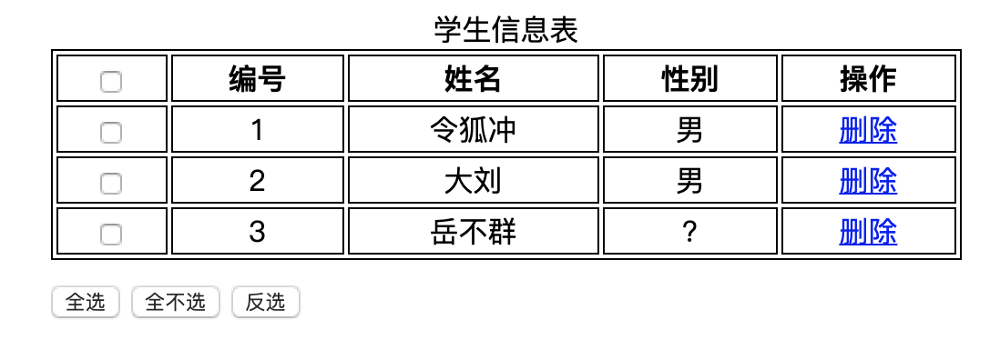

# 事件

- 事件: 单击, 双击, 键盘按下, 鼠标移动...
- 事件源: 组件, 如: 文本输入框, 按钮
- 监听器: 代码
- 注册监听: 将事件, 事件源, 监听器结合一起, 当事件源上发生了某个事件, 则触发执行某个监听器代码 

### 常用事件  
[W3C](https://www.w3school.com.cn/jsref/dom_obj_event.asp)  

### 点击事件 
- onclick: 单击
- ondblclick: 双击

### 焦点事件
- onblur: 失去焦点
- onfocus: 获取焦点

### 加载事件
- onload: 一张图片/页面被加载完成, 一般写成`window.onload`

### 鼠标事件
- onmousedown
- onmouseup
- onmousemove
- onmouseover
- onmouseout

### 键盘事件
- onkeydown
- onkeyup
- onkeypress

### 选中和改变事件
- onselect
- onchange  

### 表单事件
- onsubmit
- onreset

注: 每个事件都有固定的支持的元素, 并不是全部支持, 比如 onselect 事件: 支持该事件的 HTML 标签只有 `<input type="text">, <textarea>`两种  

--------------------

### 阻止表单提交示例  

```html
<form id="form" action="http://www.baidu.com" method="post" onsubmit="return checkForm();">
    <input type="text" id="username" placeholder="请输入用户名">
    <input type="submit" value="提交">
</form>

<script>
function checkForm() {
    let username = document.getElementById("username").value;
    return username.equals("hello");
}
</script>
```

或 

```html
<form id="form" action="http://www.baidu.com" method="post">
    <input type="text" id="username" placeholder="请输入用户名">
    <input type="submit" value="提交">
</form>

<script>
window.onload = function () {
    document.getElementById("form").onsubmit = function(ev) {
        // ev.preventDefault(); // OK
        let username = document.getElementById("username").value;
        let flag = username == "hello";
        return flag;
    }
};
</script>
```

------------------------------

### 表格全选案例  



```html
<!DOCTYPE html>
<html lang="en">
<head>
    <meta charset="UTF-8">
    <title>表格全选</title>
    <style>
        @import "1.css";
    </style>
    <script src="1.js"></script>
</head>
<body>

<table>
    <caption>学生信息表</caption>
    <tr>
        <th><input type="checkbox" name="cb" id="firstCb" onclick="selectFirst(this);"></th>
        <th>编号</th>
        <th>姓名</th>
        <th>性别</th>
        <th>操作</th>
    </tr>

    <tr>
        <td><input type="checkbox" name="cb"></td>
        <td>1</td>
        <td>令狐冲</td>
        <td>男</td>
        <td><a href="javascript:void(0);">删除</a></td>
    </tr>

    <tr>
        <td><input type="checkbox" name="cb"></td>
        <td>2</td>
        <td>大刘</td>
        <td>男</td>
        <td><a href="javascript:void(0);">删除</a></td>
    </tr>

    <tr>
        <td><input type="checkbox" name="cb"></td>
        <td>3</td>
        <td>岳不群</td>
        <td>?</td>
        <td><a href="javascript:void(0);">删除</a></td>
    </tr>
</table>
<div>
    <input type="button" id="selectAll" value="全选" onclick="selectAll();">
    <input type="button" id="unSelectAll" value="全不选" onclick="unSelectAll();">
    <input type="button" id="reverseSelectAll" value="反选" onclick="reverseSelectAll()">
</div>
</body>
</html>
```

```js
function selectAll() {
    let list = document.getElementsByName("cb");
    for (let i = 0; i < list.length; i++) {
        list[i].checked = true;
    }
}

function unSelectAll() {
    let list = document.getElementsByName("cb");
    for (let i = 0; i < list.length; i++) {
        list[i].checked = false;
    }
}

function reverseSelectAll() {
    let list = document.getElementsByName("cb");
    for (let i = 0; i < list.length; i++) {
        let item = list[i];
        item.checked = !item.checked;
    }
}

function selectFirst(obj) {
    // let obj = document.getElementById("firstCb");
    let list = document.getElementsByName("cb");
    for (let i = 0; i < list.length; i++) {
        let item = list[i];
        // item.checked = firstItem.checked;
        item.checked = obj.checked;
    }
}

window.onload = function () {
    let trs = document.getElementsByTagName("tr");
    for (let i = 0; i < trs.length; i++) {
        let item = trs[i];
        item.onmouseover = function() {
            item.className = "over";
        };
        item.onmouseout = function() {
            item.className = "out";
        }
    }
}
```

```css
table{
    border: 1px solid;
    width: 500px;
    margin-left: 30%;
}

td,th{
    text-align: center;
    border: 1px solid;
}
div{
    margin-top: 10px;
    margin-left: 30%;
}

.over{
    background-color: pink;
}
.out{
    background-color: white;
}
```

