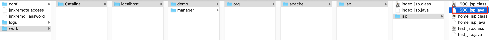

# 内置对象

JSP内置对象是指在JSP页面中不需要创建，直接可以使用的对象，一共有9个，为了清晰的了解底层的原理, 可以看下Tomcat把jsp翻译成的java文件，先写一个JSP页面：

**/jsp/500.jsp**

```jsp
<%@ page contentType="text/html;charset=UTF-8" language="java" %>
<%@ page isErrorPage="true" %>
<html>
<head>
    <title>Title</title>
</head>
<body>
    <h1>服务器正忙...</h1>
    <%
        // 由于使用了isErrorPage="true"，因此可以使用内置对象exception
        String message = exception.getMessage();
        // out: JSP内置对象，JspWriter类型
        out.print(message);
    %>
</body>
</html>
```

然后运行，可以通过IDEA的Log, 找到CATALINA_BASE 目录，
CATALINA_BASE: /Users/daliu/Library/Caches/IntelliJIdea2019.3/tomcat/MyDemo
然后进入
/MyDemo/work/Catalina/localhost/demo/org/apache/jsp/



这是它的源代码：  

```java
/*
 * Generated by the Jasper component of Apache Tomcat
 * Version: Apache Tomcat/9.0.27
 * Generated at: 2020-01-14 10:04:55 UTC
 * Note: The last modified time of this file was set to
 *       the last modified time of the source file after
 *       generation to assist with modification tracking.
 */
package org.apache.jsp.jsp;

import javax.servlet.*;
import javax.servlet.http.*;
import javax.servlet.jsp.*;

public final class _500_jsp extends org.apache.jasper.runtime.HttpJspBase
    implements org.apache.jasper.runtime.JspSourceDependent,
                 org.apache.jasper.runtime.JspSourceImports {

  private static final javax.servlet.jsp.JspFactory _jspxFactory =
          javax.servlet.jsp.JspFactory.getDefaultFactory();

  private static java.util.Map<java.lang.String,java.lang.Long> _jspx_dependants;

  private static final java.util.Set<java.lang.String> _jspx_imports_packages;

  private static final java.util.Set<java.lang.String> _jspx_imports_classes;

  static {
    _jspx_imports_packages = new java.util.HashSet<>();
    _jspx_imports_packages.add("javax.servlet");
    _jspx_imports_packages.add("javax.servlet.http");
    _jspx_imports_packages.add("javax.servlet.jsp");
    _jspx_imports_classes = null;
  }

  private volatile javax.el.ExpressionFactory _el_expressionfactory;
  private volatile org.apache.tomcat.InstanceManager _jsp_instancemanager;

  public java.util.Map<java.lang.String,java.lang.Long> getDependants() {
    return _jspx_dependants;
  }

  public java.util.Set<java.lang.String> getPackageImports() {
    return _jspx_imports_packages;
  }

  public java.util.Set<java.lang.String> getClassImports() {
    return _jspx_imports_classes;
  }

  public javax.el.ExpressionFactory _jsp_getExpressionFactory() {
    if (_el_expressionfactory == null) {
      synchronized (this) {
        if (_el_expressionfactory == null) {
          _el_expressionfactory = _jspxFactory.getJspApplicationContext(getServletConfig().getServletContext()).getExpressionFactory();
        }
      }
    }
    return _el_expressionfactory;
  }

  public org.apache.tomcat.InstanceManager _jsp_getInstanceManager() {
    if (_jsp_instancemanager == null) {
      synchronized (this) {
        if (_jsp_instancemanager == null) {
          _jsp_instancemanager = org.apache.jasper.runtime.InstanceManagerFactory.getInstanceManager(getServletConfig());
        }
      }
    }
    return _jsp_instancemanager;
  }

  public void _jspInit() {
  }

  public void _jspDestroy() {
  }

  // !!! request
  // !!! response
  public void _jspService(final javax.servlet.http.HttpServletRequest request, final javax.servlet.http.HttpServletResponse response)
      throws java.io.IOException, javax.servlet.ServletException {

    // !!! pageContext
    final javax.servlet.jsp.PageContext pageContext;

    // !!! session
    javax.servlet.http.HttpSession session = null;

    // !!! exception
    java.lang.Throwable exception = org.apache.jasper.runtime.JspRuntimeLibrary.getThrowable(request);
    if (exception != null) {
      response.setStatus(javax.servlet.http.HttpServletResponse.SC_INTERNAL_SERVER_ERROR);
    }
    // !!! application
    final javax.servlet.ServletContext application;

    // !!! config
    final javax.servlet.ServletConfig config;

    // !!! out
    javax.servlet.jsp.JspWriter out = null;

    // !!! page
    final java.lang.Object page = this;

    javax.servlet.jsp.JspWriter _jspx_out = null;
    javax.servlet.jsp.PageContext _jspx_page_context = null;


    try {
      response.setContentType("text/html;charset=UTF-8");
      pageContext = _jspxFactory.getPageContext(this, request, response,
      			null, true, 8192, true);
      _jspx_page_context = pageContext;
      application = pageContext.getServletContext();
      config = pageContext.getServletConfig();
      session = pageContext.getSession();
      out = pageContext.getOut();
      _jspx_out = out;

      out.write("\n");
      out.write("\n");
      out.write("<html>\n");
      out.write("<head>\n");
      out.write("    <title>Title</title>\n");
      out.write("</head>\n");
      out.write("<body>\n");
      out.write("    <h1>服务器正忙...</h1>\n");
      out.write("    ");

        // 由于使用了isErrorPage="true"，因此可以使用内置对象exception
        String message = exception.getMessage();
        // out: JSP内置对象，JspWriter类型
        out.print(message);
    
      out.write("\n");
      out.write("</body>\n");
      out.write("</html>\n");
    } catch (java.lang.Throwable t) {
      if (!(t instanceof javax.servlet.jsp.SkipPageException)){
        out = _jspx_out;
        if (out != null && out.getBufferSize() != 0)
          try {
            if (response.isCommitted()) {
              out.flush();
            } else {
              out.clearBuffer();
            }
          } catch (java.io.IOException e) {}
        if (_jspx_page_context != null) _jspx_page_context.handlePageException(t);
        else throw new ServletException(t);
      }
    } finally {
      _jspxFactory.releasePageContext(_jspx_page_context);
    }
  }
}
```

上面我们使用了`// !!!`标识这9个对象，可见：  

| 对象名        | 类型                  | 含义          												 |
| :------------ | :------------- | :------------ |
| pageContext   | PageContext           | 域对象，当前页面共享数据               |
| request       | HttpServletRequest    | 域对象, 一次请求访问的多个资源(转发forward也是同一个)    |
| session       | HttpSession           | 域对象，一次会话的多个请求              |
| application   | ServletContext        | 域对象，应用程序, 多个用户共享, 唯一 |
| response      | HttpServletResponse   | 响应对象        											|
| page          | Object (this)         | 当前页面Servlet对象，即this        		 |
| out           | JspWriter             | 输出对象        											|
| config        | ServletConfig         | 配置对象        											|
| exception     | Throwable             | JSP中配置了isErrorPage=true就存在此对象 |

其中前4*个是*JSP页面中的域对象   

**pageContext**  
域对象，当前页面共享数据, 出了当前JSP页面，不可使用.
通过pageContext还可以获取其他8个内置对象

- pageContext.getPage() --> page
- pageContext.getRequest() --> request
- pageContext.getResponse() --> response
- pageContext.getServletContext() --> application
- pageContext.getServletConfig() --> config
- pageContext.getSession() --> session
- pageContext.getException() --> exception
- pageContext.getOut() --> out

示例： 

```jsp
<body>
    <h1>Hello world!</h1>
    <%
      pageContext.setAttribute("msg", "大刘测试");
    %>

    <%= pageContext.getAttribute("msg") %>
</body>
```

**request** 
域对象，一次请求访问的多个资源，比如使用了转发，服务器内部跳转，就可以访问多个资源

**session**   
域对象，一次会话的多个请求

**application**  
域对象，针对App内，所有用户间共享数据

**out**
JspWriter输出对象, 注: 通过内置对象out的输出, 定义在位置和输出位置一致, 而response.getWriter().write输出位置总是在out.write输出之前, 这是Tomcat的机制决定的, Tomcat给client响应时会先去找response输出缓冲区中的数据, 然后才会找out缓冲区数据; 因此在JSP中, 不建议使用response.getWriter()进行输出, 而是直接使用out对象