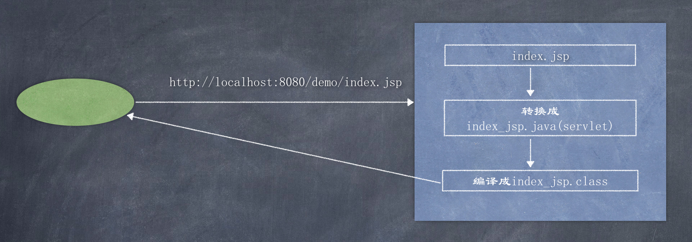

# 工作原理

JSP是一种Servlet, 但是与HttpServlet的工作方式不太一样。HttpServlet是先由源代码编译为class文件后部署到服务器下的，先编译后部署。而JSP则是先部署源代码后编译为class文件的，先部署后编译。JSP会在客户端第一次请求JSP文件时被编译为HttpJspPage类（Servlet接口的一个子类），该类会被服务器临时存放在服务器工作目录里面。

举例说明JSP的编译过程：

客户端第一次请求greeting.jsp，Tomcat先将greeting.jsp转化为标准的Java源代码greeting_jsp.java, 存放在服务器目录下，并将greeting_jsp.java编译为类文件greeting_jsp.class. 该class文件便是JSP对应的Servlet, 编译完成后再运行class文件来响应客户端请求。以后客户端访问greeting.jsp时，服务器将不再重新编译JSP文件，而是直接调用greeting.jsp.class来响应客户端请求。    

由于JSP只会在客户端第一次请求的时候被编译，因此第一次请求JSP时会感觉比较慢。而之后的请求因为不会编译JSP，所以速度就快多了。 如果将Tomcat保存的JSP编译后的class文件删除，Tomcat也会重新编译JSP。  

Tomcat能够自动检测到JSP程序的改动，如果检测到发生了改动，Tomcat会在下次客户端请求JSP时重新编译JSP，而不需要重启Tomcat. 这种检测功能默认开启的，也可以在web.xml中关掉。  



我们使用IDEA建一web项目, 在web目录下生成index.jsp文件:  

```jsp
<%@ page contentType="text/html;charset=UTF-8" language="java" %>
<html>
  <head>
    <title>$Title$</title>
  </head>
  <body>
    <%
      System.out.println("hello jsp! this is java code");
    %>
    <h1>This is html code</h1>
  </body>
</html>
```

运行项目并访问`http://localhost:8080/demo/index.jsp`, 通过IDEA的控制台找到`CATALINA_BASE:         /Users/liuweizhen/Library/Caches/IntelliJIdea2019.3/tomcat/Unnamed_LearServlet`  
Tomcat下有一个work目录, 用于存放运行时产生的一些资源文件, 当访问jsp文件时, IDEA也生成了一个work目录存放运行时产生的资源文件:  


查看这个index_jsp.java源码: 

```java
package org.apache.jsp;

import javax.servlet.*;
import javax.servlet.http.*;
import javax.servlet.jsp.*;

public final class index_jsp extends org.apache.jasper.runtime.HttpJspBase
    implements org.apache.jasper.runtime.JspSourceDependent,
                 org.apache.jasper.runtime.JspSourceImports {
    ...
    ...
    public void _jspService(final javax.servlet.http.HttpServletRequest request, final javax.servlet.http.HttpServletResponse response)
      throws java.io.IOException, javax.servlet.ServletException {
      ...
      ...
      out.write("\n");
      out.write("\n");
      out.write("<html>\n");
      out.write("  <head>\n");
      out.write("    <title>$Title$</title>\n");
      out.write("  </head>\n");
      out.write("  <body>\n");
      out.write("    ");

      System.out.println("hello jsp! this is java code");
    
      out.write("\n");
      out.write("    <h1>This is html code</h1>\n");
      out.write("  </body>\n");
      out.write("</html>\n");
      ...
      ...
    }
}
```

类`org.apache.jasper.runtime.HttpJspBase`是Tomcat的源码中的类, 我们找到这个类:  

apache-tomcat-8.5.53-src/java/org/apache/jasper/runtime/HttpJspBase.java  

```java
public abstract class HttpJspBase extends HttpServlet implements HttpJspPage {

    private static final long serialVersionUID = 1L;

    protected HttpJspBase() {
    }

    @Override
    public final void init(ServletConfig config)
        throws ServletException
    {
        super.init(config);
        jspInit();
        _jspInit();
    }

    @Override
    public String getServletInfo() {
        return Localizer.getMessage("jsp.engine.info", Constants.SPEC_VERSION);
    }

    @Override
    public final void destroy() {
        jspDestroy();
        _jspDestroy();
    }

    /**
     * Entry point into service.
     */
    @Override
    public final void service(HttpServletRequest request, HttpServletResponse response)
        throws ServletException, IOException
    {
        _jspService(request, response);
    }
...
```

可以看到 HttpJspBase extends HttpServlet, 这个JSP的本质, 它实质上就是Servlet