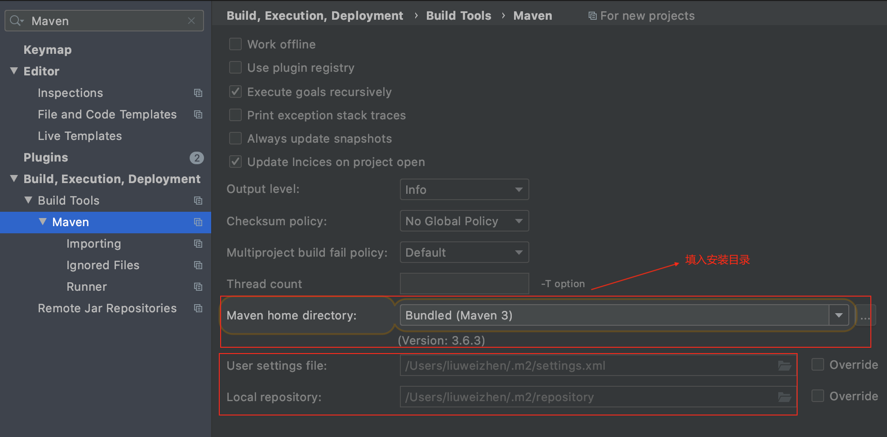
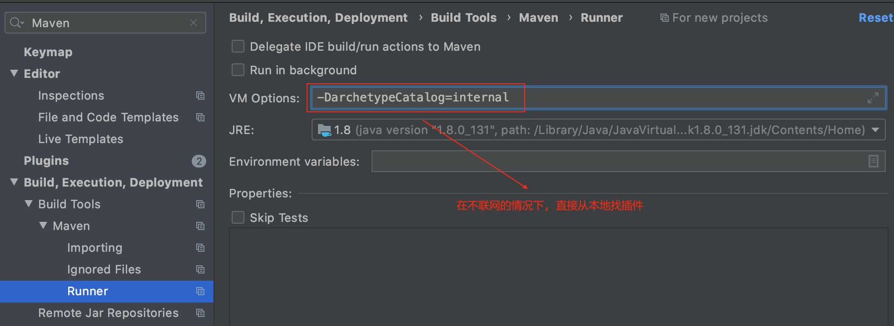
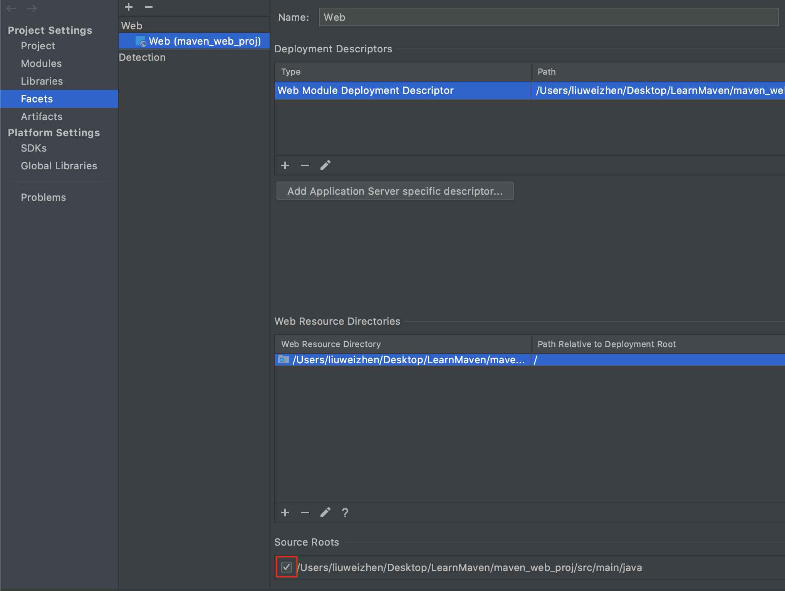
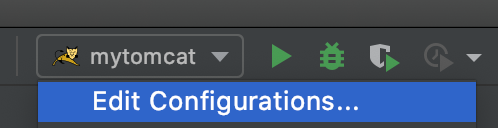
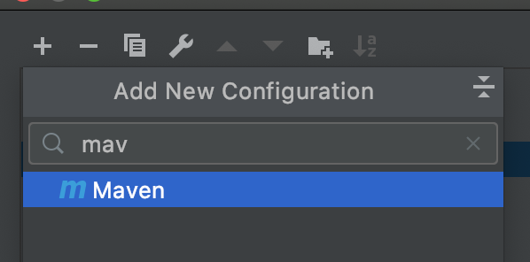
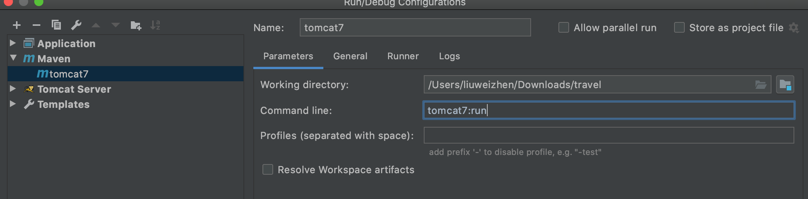
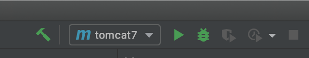

IDEA集成

`-DarchetypeCatalog=internal`

### 使用Maven骨架(也叫模板)创建Maven工程  

IDEA为maven提供好的创建java工程的骨架:
org.apache.maven.archetypes:maven-archetype-quickstart

File > New > Project > Maven > 勾选Create from archetype > 选择 org.apache.maven.archetypes:maven-archetype-quickstart > Next ...

根据maven标准文件结构, 如果未出现resources, 可以在main下和test下分别添加文件夹, 然后右键 > Mark Directory as > Resources Root

### 不使用Maven骨架创建Maven工程 

File > New > Project > Maven > 不勾选Create from archetype > Next > ...

如果只是创建基于Maven的java工程, 而不是web工程, 推荐不使用骨架 

### 使用Maven骨架创建web工程  

File > New > Project > Maven > 勾选 Create from archetype > 选择IDEA为maven提供好的创建java web工程的骨架 org.apache.maven.archetypes:maven-archetype-webapp > Next > ...

在main下新建名为java的文件夹并右键 > Mark Directory as > Source Root

遇到的问题: 右键java > new > 没有出现servlet选项, 解决方法参照[这里](https://blog.csdn.net/romsen3410/article/details/104595074)  

### Maven 命令配置   

如果运行web项目时, 不想输入`mvn tomcat:run`, 则可以如下配置:

1. Edit Configurations...

2. Add Maven

3. 输入名字和命令, 比如此处我的配置为tomcat7

4. 在界面上启动和停止操作

