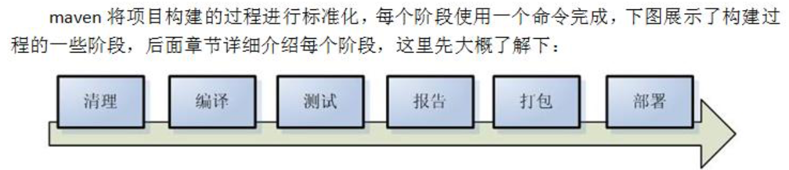

# Maven

Maven 口语化意思是专家, 它是一个项目管理工具，它包含了一个项目对象模 型 (POM:Project Object Model)，一组标准集合，一个项目生命周期(Project Lifecycle)，一个依赖管 理系统(Dependency Management System)，和用来运行定义在生命周期阶段(phase)中插件(plugin)目标 (goal)的逻辑  

### 依赖管理  
Maven的依赖管理就是一个管理jar包的过程, 项目中只是在pom.xml中引入jar包的坐标, 而真正的jar包在仓库中  
通过 pom.xml 文件配置要引入的 jar 包的坐标，再读取坐标并到仓库中加载 jar 包，这 样我们就可以直接使用 jar 包了，为了解决这个过程中速度慢的问题，maven 中也有索引的概念，通 过建立索引，可以大大提高加载 jar 包的速度，使得我们认为 jar 包基本跟放在本地的工程文件中再 读取出来的速度是一样的。这个过程就好比我们查阅字典时，为了能够加快查找到内容，书前面的 目录就好比是索引，有了这个目录我们就可以方便找到内容了，一样的在 maven 仓库中有了索引我 们就可以认为可以快速找到 jar 包  

### 一键构建
项目从编译、测试、运行、打包、安装 ，部署整个过程都交给 maven 进行管理，这个过程称为构建



```
mvn tomcat:run # 构建完成
```