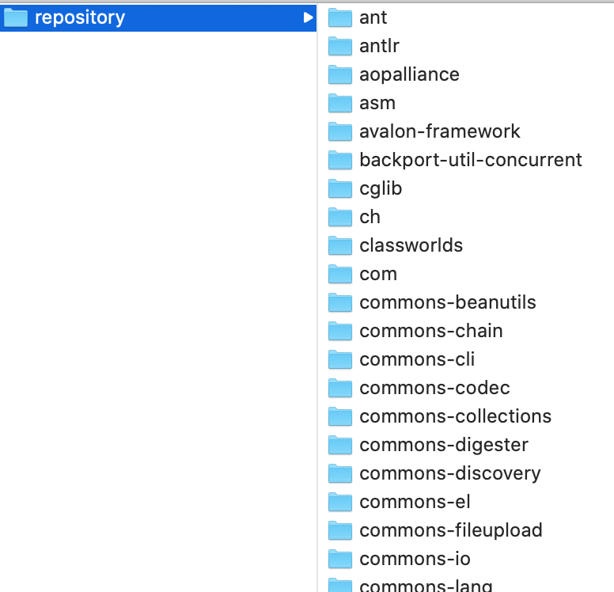

# 安装和配置

### 1. 下载和解压
[Apache Maven](http://maven.apache.org/index.html)  

比如我下载的是`apache-maven-3.6.3-bin.tar.gz`
然后解压  

### 2. 配置

主要就是配置环境变量  

以Windows为例:  
我的电脑 > 右键 > 属性 > 高级系统设置 > 环境变量 > 在系统变量中新建: 

- 变量名: `MAVEN_HOME`
- 变量值: `刚maven解压的根目录, 比如: C:\my_java\apache-maven-3.6.3`

然后编辑系统变量中的 `Path` > 新建 > 
```
%MAVEN_HOME\bin%
```

需要注意的是, Maven需要使用环境变量中的JAVA_HOME, 因此需要事先配好JAVA_HOME环境变量  

以Mac为例:  

MAC OS X环境配置的加载顺序 
```
# 系统级别
/etc/profile
/etc/paths 

# 用户级别
~/.bash_profile 
~/.bash_login 
~/.profile 

~/.bashrc
```
所以只需要编辑文件`~/.bash_profile`即可: 

```
vim ~/.bash_profile
# 添加:
# maven
export MAVEN_HOME=/usr/local/apache-maven-3.6.3 # 解压的目录
export PATH=$PATH:${MAVEN_HOME}/bin

# 保存退出, 然后
source ~/.bash_profile
```

测试maven是否安装成功, 可直接在命令行上键入: 

```
mvn -v

% mvn -v
Apache Maven 3.6.3 (cecedd343002696d0abb50b32b541b8a6ba2883f)
Maven home: /usr/local/apache-maven-3.6.3
Java version: 1.8.0_131, vendor: Oracle Corporation, runtime: /Library/Java/JavaVirtualMachines/jdk1.8.0_131.jdk/Contents/Home/jre
Default locale: zh_CN, platform encoding: UTF-8
OS name: "mac os x", version: "10.15.3", arch: "x86_64", family: "mac"
```

遇到的问题: 在Mac OS下的`~/.bash_profile`下配置了环境变量, 但发现只在当前命令窗口有效, 新开一个窗口无效
产生问题的原生: mac下采用zsh代替bash，而zsh加载的是 ~/.zshrc文件，而 ‘.zshrc’ 文件中并没有定义任务环境变量   
解决方法: 
```
vim ~/.zshrc
# 在最后一行添加:
source ~/.bash_profile
```

### 仓库
Maven会根据pom.xml中的jar包坐标去仓库下载jar包, 那么仓库在哪里呢?  

在刚才解压的路径 `/usr/local/apache-maven-3.6.3` 下找到conf/settings.xml, 有段话:  
```
  <!-- localRepository
   | The path to the local repository maven will use to store artifacts.
   |
   | Default: ${user.home}/.m2/repository
  <localRepository>/path/to/local/repo</localRepository>
  -->
```

即用户目录下/.m2/repository, 打开它: `open ~/.m2/repository`
即这个repository就是默认本地仓库的位置, 不过可以通过`<localRepository>`重新指定本地仓库位置



仓库分三类: 本地仓库, 远程仓库(私服), 中央仓库, 默认情况下会先从本地仓库找jar包, 如果本地没有, 在联网状态下会从中央仓库下载jar包, 在公司中, 启动一个maven工程, 会从本地找jar包, 没有的话从私服下jar包, 如是私服中也没有, 可以从中央仓库下载, 也可以从本地上传


中央仓库放置了几乎所有开源的jar包, 不可能本地把所有中央仓库jar包全同步到本地, 所以一般会创建一个自己的私服

