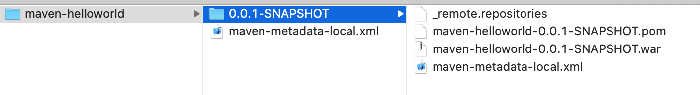

# 常用命令

- mvn clean: 删除target
- mvn compile: 下载编译时用到的jar包, 编译项目(把src/main下面的java代码编译, 放在target目录下)
- mvn test: 下载test时用到的jar包, 把src/test下的java文件编译到target/test-classes, 同时也会编译src/main下面的java代码
- mvn package: 下载打包时用到的jar包, 编译src/main下的java代码和src/test下的java代码, 打一个war包放入target中(如果pom.xml中指定了`<packaging>war</packaging>`)
- mvn install: 执行mvn package之后, 把项目安装到本地仓库(包括war包)

假如工程pom.xml配置为:
```
<groupId>cn.com.maven</groupId>
<artifactId>maven-helloworld</artifactId>
<version>0.0.1-SNAPSHOT</version>
<packaging>war</packaging>
<name>第一个maven工程</name>
<description>第一个maven工程</description>
```
则`mvn instal`l就会放入~/.m2/repository/cn/com/maven/maven-helloworld/



