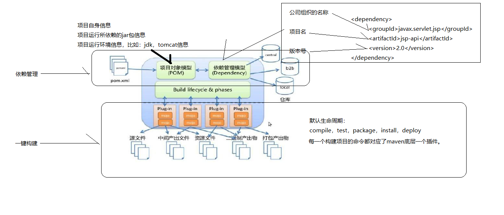

# 生命周期

- 清除 clean
- 编译 compile
- 测试 test
- 打包 package
- 安装 install
- 发布 deploy

其中每一个命令对应了一个Maven的插件

### 清理生命周期
clean

### 默认生命周期
编译 > 测试 > 打包 > 安装 > 发布
每执行后面一项, 会自动先执行前面的步骤

### 站点生命周期

### 模型 



### 示例:  
```
<project xmlns="http://maven.apache.org/POM/4.0.0" xmlns:xsi="http://www.w3.org/2001/XMLSchema-instance"
	xsi:schemaLocation="http://maven.apache.org/POM/4.0.0 http://maven.apache.org/xsd/maven-4.0.0.xsd">
	<modelVersion>4.0.0</modelVersion>
	<groupId>cn.itcast.maven</groupId>
	<artifactId>maven-helloworld</artifactId>
	<version>0.0.1-SNAPSHOT</version>
	<packaging>war</packaging>
	<name>第一个maven工程</name>
	<description>第一个maven工程</description>
	
	<!-- 添加servlet-api，jsp-api -->
	<dependencies>
		<dependency>
			<groupId>junit</groupId>
			<artifactId>junit</artifactId>
			<version>4.9</version>
			<scope>test</scope>
		</dependency>

		<dependency>
			<groupId>javax.servlet.jsp</groupId>
			<artifactId>jsp-api</artifactId>
			<version>2.0</version>
			<scope>provided</scope>
		</dependency>
		<dependency>
			<groupId>javax.servlet</groupId>
			<artifactId>servlet-api</artifactId>
			<version>2.5</version>
			<scope>provided</scope>
		</dependency>
	</dependencies>
	<build>
		<!-- 配置了很多插件 -->
		<plugins>
			<plugin>
				<groupId>org.apache.maven.plugins</groupId>
				<artifactId>maven-compiler-plugin</artifactId>
				<configuration>
					<source>1.7</source>
					<target>1.7</target>
					<encoding>UTF-8</encoding>
				</configuration>
			</plugin>
		<plugin> 
                <groupId>org.apache.tomcat.maven</groupId>
                <artifactId>tomcat7-maven-plugin</artifactId>
                <version>2.1</version>
                <configuration>
                    <port>9090</port>
                    <path>/mgr</path>
                    <uriEncoding>UTF-8</uriEncoding>
                    <server>tomcat7</server>
                </configuration>
            </plugin>

		</plugins>
	</build>
</project>
```

一个jar包的坐标至少由三个基本项组成:
1. 公司组织名称: groupId
2. 项目名: artifactId
3. 版本号: version