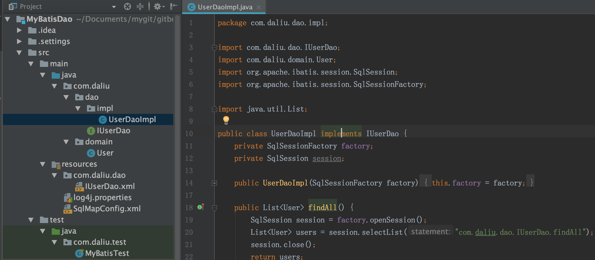

# DAO层开发

一般使用MyBatis都是使用代理dao的方式,使用MyBatis实现的代理dao对象操作数据库. 但也可以自己实现dao实现类   

`./demos/MyBatisDao`   

  

```xml
<!--pom.xml-->
<?xml version="1.0" encoding="UTF-8"?>
<project xmlns="http://maven.apache.org/POM/4.0.0"
         xmlns:xsi="http://www.w3.org/2001/XMLSchema-instance"
         xsi:schemaLocation="http://maven.apache.org/POM/4.0.0 http://maven.apache.org/xsd/maven-4.0.0.xsd">
    <modelVersion>4.0.0</modelVersion>

    <groupId>com.daliu</groupId>
    <artifactId>CRUD</artifactId>
    <version>1.0-SNAPSHOT</version>
    <packaging>jar</packaging>

    <dependencies>
        <dependency>
            <groupId>org.mybatis</groupId>
            <artifactId>mybatis</artifactId>
            <version>3.4.5</version>
        </dependency>
        <dependency>
            <groupId>mysql</groupId>
            <artifactId>mysql-connector-java</artifactId>
            <version>5.1.6</version>
        </dependency>
        <dependency>
            <groupId>junit</groupId>
            <artifactId>junit</artifactId>
            <version>4.10</version>
        </dependency>
    </dependencies>
</project>
```  

```xml
<!--resources/SqlMapConfig.xml-->
<?xml version="1.0" encoding="UTF-8" ?>

<!DOCTYPE configuration
        PUBLIC "-//mybatis.org/DTD Config 3.0//EN"
        "http://mybatis.org/dtd/mybatis-3-config.dtd">
<configuration>
    <environments default="mysql">
        <!--主配置环境，全局配置环境-->
        <environment id="mysql">
            <!--配置事务类型-->
            <transactionManager type="JDBC"></transactionManager>
            <!--配置数据源，即连接池-->
            <dataSource type="POOLED">
                <!--配置连接数据库的4个基本信息-->
                <property name="driver" value="com.mysql.jdbc.Driver"/>
                <property name="url" value="jdbc:mysql://localhost:3306/daliu"/>
                <property name="username" value="root"/>
                <property name="password" value="110"/>
            </dataSource>
        </environment>
    </environments>

    <!--配置映射文件的位置-->
    <mappers>
        <mapper resource="com/daliu/dao/IUserDao.xml"></mapper>
    </mappers>
</configuration>
```

```xml
<!--resources/com.daliu.dao.IUserDao.xml-->
<?xml version="1.0" encoding="UTF-8" ?>
<!DOCTYPE mapper
        PUBLIC "-//mybatis.org/DTD Mapper 3.0//EN"
        "http://mybatis.org/dtd/mybatis-3-mapper.dtd">
<mapper namespace="com.daliu.dao.IUserDao">
    <!--查询所有-->
    <select id="findAll" resultType="com.daliu.domain.User">
        select * from user;
    </select>
    <!--保存-->
    <insert id="saveUser" parameterType="com.daliu.domain.User">
        insert into user(username, address, sex, birthday) values(#{username}, #{address}, #{sex}, #{birthday})
        <!--注：#{address}默认执行的是getAddress()方法-->
    </insert>
    <!--更新-->
    <update id="updateUser" parameterType="com.daliu.domain.User">
        update user set username = #{username}, address = #{address}, sex = #{sex}, birthday = #{birthday} where id = #{id}
    </update>
    <!--删除用户-->
    <delete id="deleteUser" parameterType="java.lang.Integer"> <!--Integer, Int, int都可以-->
        delete from user where id = #{uid}
        <!--这里的{}中的uid只是起到占位符的意义，写什么都可以
        注：dao方法中deleteuser(Integer userId)中只有一个参数，而且是基本类型或基本类型包装类型，这种情况下占位符可以随意写-->
    </delete>
    <!--根据id查询用户-->
    <select id="findById" parameterType="int" resultType="com.daliu.domain.User">
        select * from user where id = #{uid}
    </select>
    <!--根据名称模糊查询-->
    <select id="findByName" parameterType="string" resultType="com.daliu.domain.User">
        select * from user where username like #{name}
        <!--mybatis翻译为: select * from user where username like ?-->
    </select>
    <!--聚合函数，查询总用户数-->
    <select id="findTotal" resultType="int">
        select count(id) from user <!--也可以 select count(*) from user-->
    </select>
</mapper>
```

```java
// com.daliu.domain.User.java
package com.daliu.domain;

import java.io.Serializable;
import java.util.Date;

public class User implements Serializable {
    private Integer id;
    private String username;
    private String sex;
    private String address;
    private Date birthday;

    public User() {

    }

    public User(String username, String sex, String address, Date birthday) {
        this.username = username;
        this.sex = sex;
        this.address = address;
        this.birthday = birthday;
    }

    public Integer getId() {
        return id;
    }
    public void setId(Integer id) {
        this.id = id;
    }
    public String getUsername() {
        return username;
    }
    public void setUsername(String username) {
        this.username = username;
    }
    public String getSex() {
        return sex;
    }
    public void setSex(String sex) {
        this.sex = sex;
    }

    public String getAddress() {
        return address;
    }
    public void setAddress(String address) {
        this.address = address;
    }
    public Date getBirthday() {
        return birthday;
    }
    public void setBirthday(Date birthday) {
        this.birthday = birthday;
    }

    @Override
    public String toString() {
        return "User{"
                + "id=" + id
                + ", username=" + username
                + ", address=" + address
                + ", sex=" + sex
                + ", birthday=" + birthday
                + "}";
    }
}
```

```java
// com.daliu.dao.IUserDao.java
package com.daliu.dao;

import java.util.List;
import com.daliu.domain.User;

public interface IUserDao {
    /// 查询全部
    List<User> findAll();
    /// 保存User
    void saveUser(User user);
    /// 更新User
    void updateUser(User user);
    /// 删除User
    void deleteUser(Integer id);
    /// 根据id查询User
    User findById(Integer userId);
    /// 根据名称模糊查询
    List<User> findByName(String username);
    /// 聚合函数，查询总用户数
    int findTotal();
}
```

```java
// com.daliu.dao.impl.UserDaoImpl.java
package com.daliu.dao.impl;

import com.daliu.dao.IUserDao;
import com.daliu.domain.User;
import org.apache.ibatis.session.SqlSession;
import org.apache.ibatis.session.SqlSessionFactory;

import java.util.List;

public class UserDaoImpl implements IUserDao {
    private SqlSessionFactory factory;
    private SqlSession session;

    public UserDaoImpl(SqlSessionFactory factory) {
        this.factory = factory;
    }

    public List<User> findAll() {
        SqlSession session = factory.openSession();
        List<User> users = session.selectList("com.daliu.dao.IUserDao.findAll"); // 参数就是能获取配置信息的key
        session.close();
        return users;
    }

    public void saveUser(User user) {
        SqlSession session = factory.openSession();
        session.insert("com.daliu.dao.IUserDao.saveUser", user);
        session.commit();
        session.close();
    }

    public void updateUser(User user) {
        SqlSession session = factory.openSession();
        session.update("com.daliu.dao.IUserDao.updateUser", user);
        session.commit();
        session.close();
    }

    public void deleteUser(Integer id) {
        SqlSession session = factory.openSession();
        session.delete("com.daliu.dao.IUserDao.deleteUser", id);
        // session.update("com.daliu.dao.IUserDao.deleteUser", id); // OK
        session.commit();
        session.close();
    }

    public User findById(Integer userId) {
        SqlSession session = factory.openSession();
        User user = session.selectOne("com.daliu.dao.IUserDao.findById", userId);
        session.commit();
        session.close();
        return user;
    }

    public List<User> findByName(String username) {
        SqlSession session = factory.openSession();
        List<User> users = session.selectList("com.daliu.dao.IUserDao.findByName", username);
        session.close();
        return users;
    }

    public List<User> findByName2(String username) {
        return null;
    }

    public int findTotal() {
         SqlSession session = factory.openSession();
         int count = session.selectOne("com.daliu.dao.IUserDao.findTotal");
         return count;
    }
}
```

```java
// test/com.daliu.test.MyBatisTest.java
package com.daliu.test;

import com.daliu.dao.IUserDao;
import com.daliu.dao.impl.UserDaoImpl;
import com.daliu.domain.User;
import org.apache.ibatis.io.Resources;
import org.apache.ibatis.session.SqlSessionFactory;
import org.apache.ibatis.session.SqlSessionFactoryBuilder;
import org.junit.After;
import org.junit.Before;
import org.junit.Test;

import java.io.InputStream;
import java.util.Date;
import java.util.List;

public class MyBatisTest {
    private InputStream in;
    private IUserDao userDao;

    @Before
    public void init() throws Exception {
        in = Resources.getResourceAsStream("SqlMapConfig.xml");
        SqlSessionFactory factory = new SqlSessionFactoryBuilder().build(in);
        userDao = new UserDaoImpl(factory);
    }

    @After
    public void destory() throws Exception {
        in.close();
    }

    @Test
    public void testFindAll() throws Exception {
        List<User> users = userDao.findAll();
        for (User user : users) {
            System.out.println(user);
        }
    }

    @Test
    public void testSave() {
        User user = new User("钟山燕", "女", "上海市青浦区", new Date());
        userDao.saveUser(user);
        System.out.println(user);
    }

    @Test
    public void testUpdate() {
        User user = new User("钟山燕", "女", "海南省三亚市", new Date());
        user.setId(12);
        userDao.updateUser(user);
    }

    @Test
    public void testDelete() {
        userDao.deleteUser(10);
    }

    @Test
    public void testFindOne() {
        User user = userDao.findById(2);
        System.out.println(user);
    }

    @Test
    public void testFindByName() {
        List<User> users = userDao.findByName("%三%");
        for (User user :
                users) {
            System.out.println(user);
        }
    }

    @Test
    public void testFindTotal() {
        int count = userDao.findTotal();
        System.out.println(count);
    }
}
```