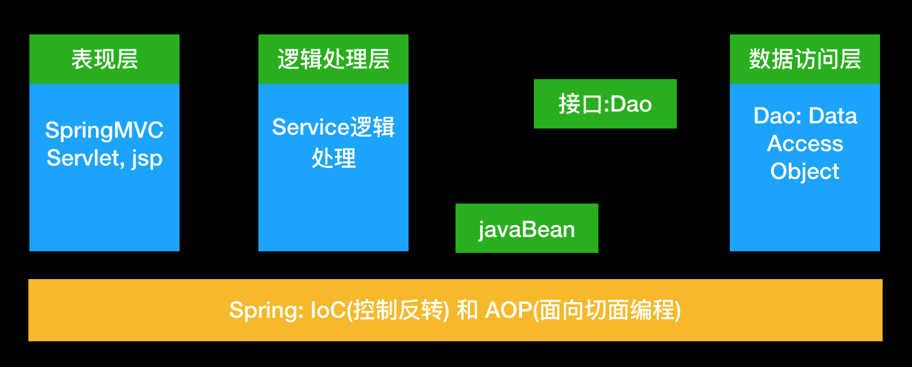

# gitbook-daliu-mybatis
MyBatis学习备记

Spring的JdbcTemplate和Apache的DBUtils是对JDBC的简单封装, 并不能称为框架, 而MyBatis和Hibernate是持久层ROM(Object Relation Mapping)框架, Mybatis是一个半自动化的持久层框架. 屏蔽了jdbc api底层的细节, 使开发者只需关注sql语句本身.

[https://mybatis.org/mybatis-3/zh/getting-started.html](https://mybatis.org/mybatis-3/zh/getting-started.html)

