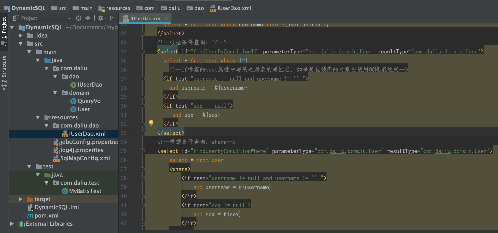

# 动态SQL语句

Dynamic SQL  

MyBatis基于XML配置的动态SQL语句主要有四个标签:

MyBatis employs powerful OGNL based expressions to eliminate most of the other elements: 

- if
- choose(when, otherwise)
- trim(where, set)
- foreach

demo示例: `./demos/DynamicSQL`

  

```xml
<!--pom.xml-->
<?xml version="1.0" encoding="UTF-8"?>
<project xmlns="http://maven.apache.org/POM/4.0.0"
         xmlns:xsi="http://www.w3.org/2001/XMLSchema-instance"
         xsi:schemaLocation="http://maven.apache.org/POM/4.0.0 http://maven.apache.org/xsd/maven-4.0.0.xsd">
    <modelVersion>4.0.0</modelVersion>

    <groupId>com.daliu</groupId>
    <artifactId>DynamicSQL</artifactId>
    <version>1.0-SNAPSHOT</version>

    <packaging>jar</packaging>

    <dependencies>
        <dependency>
            <groupId>org.mybatis</groupId>
            <artifactId>mybatis</artifactId>
            <version>3.4.5</version>
        </dependency>
        <dependency>
            <groupId>mysql</groupId>
            <artifactId>mysql-connector-java</artifactId>
            <version>5.1.6</version>
        </dependency>
        <dependency>
            <groupId>junit</groupId>
            <artifactId>junit</artifactId>
            <version>4.10</version>
        </dependency>
    </dependencies>
</project>
```

```xml
<!--resources/jdbcConfig.properties-->
jdbc.driver=com.mysql.jdbc.Driver
jdbc.url=jdbc:mysql://localhost:3306/daliu
jdbc.username=root
jdbc.password=110
```

```xml
<!--resources/SqlMapConfig.xml-->
<?xml version="1.0" encoding="UTF-8"?>
<project xmlns="http://maven.apache.org/POM/4.0.0"
         xmlns:xsi="http://www.w3.org/2001/XMLSchema-instance"
         xsi:schemaLocation="http://maven.apache.org/POM/4.0.0 http://maven.apache.org/xsd/maven-4.0.0.xsd">
    <modelVersion>4.0.0</modelVersion>

    <groupId>com.daliu</groupId>
    <artifactId>DynamicSQL</artifactId>
    <version>1.0-SNAPSHOT</version>

    <packaging>jar</packaging>

    <dependencies>
        <dependency>
            <groupId>org.mybatis</groupId>
            <artifactId>mybatis</artifactId>
            <version>3.4.5</version>
        </dependency>
        <dependency>
            <groupId>mysql</groupId>
            <artifactId>mysql-connector-java</artifactId>
            <version>5.1.6</version>
        </dependency>
        <dependency>
            <groupId>junit</groupId>
            <artifactId>junit</artifactId>
            <version>4.10</version>
        </dependency>
    </dependencies>

</project>
```

```java
// com.daliu.domain.User.java
package com.daliu.domain;

import java.io.Serializable;
import java.util.Date;

public class User implements Serializable {
    private Integer id;
    private String username;
    private String sex;
    private String address;
    private Date birthday;

    public User() {

    }

    public User(String username, String sex, String address, Date birthday) {
        this.username = username;
        this.sex = sex;
        this.address = address;
        this.birthday = birthday;
    }

    public Integer getId() {
        return id;
    }
    public void setId(Integer id) {
        this.id = id;
    }
    public String getUsername() {
        return username;
    }
    public void setUsername(String username) {
        this.username = username;
    }
    public String getSex() {
        return sex;
    }
    public void setSex(String sex) {
        this.sex = sex;
    }

    public String getAddress() {
        return address;
    }
    public void setAddress(String address) {
        this.address = address;
    }
    public Date getBirthday() {
        return birthday;
    }
    public void setBirthday(Date birthday) {
        this.birthday = birthday;
    }

    @Override
    public String toString() {
        return "User{"
                + "id=" + id
                + ", username=" + username
                + ", address=" + address
                + ", sex=" + sex
                + ", birthday=" + birthday
                + "}";
    }
}
```

```java
// com.daliu.domain.QueryVo.java
package com.daliu.domain;

import java.util.List;

public class QueryVo {
    private User user;
    private List<Integer> ids;
    public User getUser() {
        return user;
    }
    public void setUser(User user) {
        this.user = user;
    }
    public List<Integer> getIds() {
        return ids;
    }
    public void setIds(List<Integer> ids) {
        this.ids = ids;
    }
}
```

```java
// com.daliu.dao.IUserDao.java
package com.daliu.dao;

import java.util.List;

import com.daliu.domain.QueryVo;
import com.daliu.domain.User;

public interface IUserDao {
    /// 查询全部
    List<User> findAll();
    /// 根据id查询User
    User findById(Integer userId);
    /// 根据名称模糊查询
    List<User> findByName(String username);
    /// 根据queryVo中的条件查询用户
    List<User> findUserByVo(QueryVo vo);
    /// 根据传入的参数条件查询, if
    List<User> findUserByConditionIf(User user);
    /// 根据传入的参数条件查询, where
    List<User> findUserByConditionWhere(User user);
    /// 根据传入的参数条件查询, foreach
    List<User> findUserInIds(QueryVo queryVo);
}
```

```xml
<!--resources/com/daliu/dao/IUserDao.xml-->
<?xml version="1.0" encoding="UTF-8" ?>
<!DOCTYPE mapper
        PUBLIC "-//mybatis.org/DTD Mapper 3.0//EN"
        "http://mybatis.org/dtd/mybatis-3-mapper.dtd">
<mapper namespace="com.daliu.dao.IUserDao">
    <!--查询所有-->
    <select id="findAll" resultType="com.daliu.domain.User">
        select * from user;
    </select>
    <!--根据id查询用户-->
    <select id="findById" parameterType="int" resultType="com.daliu.domain.User">
        select * from user where id = #{uid}
    </select>
    <!--根据名称模糊查询-->
    <select id="findByName" parameterType="string" resultType="com.daliu.domain.User">
        select * from user where username like #{name}
        <!--mybatis翻译为: select * from user where username like ?-->
    </select>
    <!--根据queryVo的条件查询用户-->
    <select id="findUserByVo" parameterType="com.daliu.domain.QueryVo" resultType="com.daliu.domain.User">
      select * from user where username like #{user.username}
    </select>
    <!--根据条件查询: if-->
    <select id="findUserByConditionIf" parameterType="com.daliu.domain.User" resultType="com.daliu.domain.User">
      select * from user where 1=1
        <!--if标签的test属性中写的是对象的属性名, 如果是包装类的对象要使用OGNL表达式-->
      <if test="username != null and username != '' ">
        and username = #{username}
      </if>
      <if test="sex != null">
         and sex = #{sex}
      </if>
    </select>
    <!--根据条件查询: where-->
    <select id="findUserByConditionWhere" parameterType="com.daliu.domain.User" resultType="com.daliu.domain.User">
        select * from user
        <where>
            <if test="username != null and username != '' ">
                and username = #{username}
            </if>
            <if test="sex != null">
                and sex = #{sex}
            </if>
        </where>
    </select>

    <!--根据条件查询: foreach-->
    <select id="findUserInIds" parameterType="com.daliu.domain.QueryVo" resultType="com.daliu.domain.User">
        select * from user
        <where>
          <if test="ids != null and ids.size()>0">
              <!--第一个id是user.id属性, 第二个item="uid", 这里的uid是遍历每个元素的代表, 和下面的#{uid}-->
              <foreach collection="ids" open="and id in (" close=")" item="uid" separator=","> 
                  #{uid} <!--这里的id对应上面声明的item, 由上面的item=决定的-->
              </foreach>
          </if>
        </where>
        <!--
        collection: 要遍历的集合元素
        open: 开始部分
        close: 结束部分
        item: 遍历集合的每个元素
        seperator: 分隔符
        -->
    </select>

    <!--抽取重复的sql语句-->
    <sql id="defaultUser">
        select * from user
    </sql>

    <select id="findAll2" resultType="com.daliu.domain.User">
        <include refid="defaultUser"></include> <!--这后面可以加其他sql语句-->
    </select>
</mapper>
```

测试:  

```java
// com.daliu.test.MyBatisTest.java
package com.daliu.test;

import com.daliu.dao.IUserDao;
import com.daliu.domain.QueryVo;
import com.daliu.domain.User;
import org.apache.ibatis.io.Resources;
import org.apache.ibatis.session.SqlSession;
import org.apache.ibatis.session.SqlSessionFactory;
import org.apache.ibatis.session.SqlSessionFactoryBuilder;
import org.junit.After;
import org.junit.Before;
import org.junit.Test;

import java.io.InputStream;
import java.util.ArrayList;
import java.util.Arrays;
import java.util.List;

public class MyBatisTest {
    private InputStream in;
    private SqlSession sqlSession;
    private IUserDao userDao;
    private SqlSessionFactory factory;

    @Before
    public void init() throws Exception {
        in = Resources.getResourceAsStream("SqlMapConfig.xml");
        factory = new SqlSessionFactoryBuilder().build(in);
        sqlSession = factory.openSession();
        userDao = sqlSession.getMapper(IUserDao.class);
    }

    @After
    public void destory() throws Exception {
        sqlSession.commit();
        sqlSession.close();
        in.close();
    }

    @Test
    public void testFindAll() throws Exception {
        List<User> users = userDao.findAll();
        for (User user : users) {
            System.out.println(user);
        }
    }

    @Test
    public void testFindOne() {
        User user = userDao.findById(2);
        System.out.println(user);
    }

    @Test
    public void testFindByName() {
        /// 查询名字中包含"龙"的user
        List<User> users = userDao.findByName("%龙%");
        for (User user : users) {
            System.out.println(user);
        }
    }

    @Test
    public void testFindByQueryVo() {
        QueryVo vo = new QueryVo();
        User user = new User();
        user.setUsername("%龙%");
        vo.setUser(user);
        List<User> users = userDao.findUserByVo(vo);
        for (User u : users) {
            System.out.println(u);
        }
    }

    @Test
    public void testFindByConditionIf() {
        User user = new User();
        user.setUsername("老王");
        // user.setSex("女");
        List<User> users = userDao.findUserByConditionIf(user);
        for (User u : users) {
            System.out.println(u);
        }
    }

    @Test
    public void testFindByConditionWhere() {
        User user = new User();
        user.setUsername("老王");
        // user.setSex("女");
        List<User> users = userDao.findUserByConditionWhere(user);
        for (User u : users) {
            System.out.println(u);
        }
    }

    @Test
    public void findUserInIds() {
        QueryVo vo = new QueryVo();
        vo.setIds(new ArrayList<Integer>(Arrays.asList(1, 2, 3)));
        List<User> users = userDao.findUserInIds(vo);
        for (User user : users) {
            System.out.println(user);
        }
    }
}
```