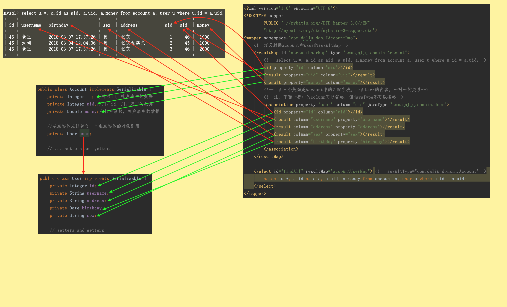

# 一对一


```
mysql> select * from user;
+----+--------------+---------------------+------+-----------------+
| id | username     | birthday            | sex  | address         |
+----+--------------+---------------------+------+-----------------+
| 41 | 老王         | 2018-02-27 17:47:08 | 男   | 北京            |
| 42 | 小二王       | 2018-03-02 15:09:37 | 女   | 北京金燕龙      |
| 43 | 小二王       | 2018-03-04 11:34:34 | 女   | 北京金燕龙      |
| 45 | 大刘         | 2018-03-04 12:04:06 | 男   | 北京金燕龙      |
| 46 | 老王         | 2018-03-07 17:37:26 | 男   | 北京            |
| 48 | 小马宝莉     | 2018-03-08 11:44:00 | 女   | 北京修正        |
+----+--------------+---------------------+------+-----------------+
6 rows in set (0.00 sec)

mysql> select * from account;
+----+------+-------+
| ID | UID  | MONEY |
+----+------+-------+
|  1 |   46 |  1000 |
|  2 |   45 |  1000 |
|  3 |   46 |  2000 |
+----+------+-------+

mysql> select u.*, a.id as aid, a.uid, a.money from account a, user u where u.id = a.uid;
+----+----------+---------------------+------+-----------------+-----+------+-------+
| id | username | birthday            | sex  | address         | aid | uid  | money |
+----+----------+---------------------+------+-----------------+-----+------+-------+
| 46 | 老王     | 2018-03-07 17:37:26 | 男   | 北京            |   1 |   46 |  1000 |
| 45 | 大刘     | 2018-03-04 12:04:06 | 男   | 北京金燕龙      |   2 |   45 |  1000 |
| 46 | 老王     | 2018-03-07 17:37:26 | 男   | 北京            |   3 |   46 |  2000 |
+----+----------+---------------------+------+-----------------+-----+------+-------+
```

下面使用Java把`select u.*, a.id as aid, a.uid, a.money from account a, user u where u.id = a.uid;`得到的数据加到Account中, 其中Account中有一个user对象  

**pom.xml**
```xml
<?xml version="1.0" encoding="UTF-8"?>
<project xmlns="http://maven.apache.org/POM/4.0.0"
         xmlns:xsi="http://www.w3.org/2001/XMLSchema-instance"
         xsi:schemaLocation="http://maven.apache.org/POM/4.0.0 http://maven.apache.org/xsd/maven-4.0.0.xsd">
    <modelVersion>4.0.0</modelVersion>

    <groupId>com.daliu</groupId>
    <artifactId>OneToManyDemo</artifactId>
    <version>1.0-SNAPSHOT</version>
    <packaging>jar</packaging>

    <dependencies>
        <dependency>
            <groupId>org.mybatis</groupId>
            <artifactId>mybatis</artifactId>
            <version>3.4.5</version>
        </dependency>
        <dependency>
            <groupId>mysql</groupId>
            <artifactId>mysql-connector-java</artifactId>
            <version>5.1.6</version>
        </dependency>
        <dependency>
            <groupId>log4j</groupId>
            <artifactId>log4j</artifactId>
            <version>1.2.12</version>
        </dependency>
        <dependency>
            <groupId>junit</groupId>
            <artifactId>junit</artifactId>
            <version>4.10</version>
            <scope>test</scope>
        </dependency>
    </dependencies>
</project>
```

**resources/SqlMapConfig.xml**
```xml
<?xml version="1.0" encoding="UTF-8"?>
<!DOCTYPE configuration
        PUBLIC "-//mybatis.org//DTD Config 3.0//EN"
        "http://mybatis.org/dtd/mybatis-3-config.dtd">

<!-- mybatis的主配置文件 -->
<configuration>
    <!--配置mysql的环境-->
    <environments default="mysql">
        <environment id="mysql">
            <transactionManager type="JDBC"></transactionManager>
            <dataSource type="POOLED">
                <property name="driver" value="com.mysql.jdbc.Driver" />
                <property name="url" value="jdbc:mysql://localhost:3306/daliu" />
                <property name="username" value="root" />
                <property name="password" value="110" />
            </dataSource>
        </environment>
    </environments>

    <!-- 每个dao独立的映射配置文件 -->
    <mappers>
        <mapper resource="com/daliu/dao/IUserDao.xml" />
        <mapper resource="com/daliu/dao/IAccountDao.xml" />
    </mappers>
</configuration>
```

**com.daliu.domain.Account.java**
```java
package com.daliu.domain;

import java.io.Serializable;

public class Account implements Serializable {
    private Integer id; //帐号id, 帐户表中的数据
    private Integer uid;//用户id, 用户表中的数据
    private Double money;//帐户余额, 帐户表中的数据

    //从表实体应该包含一个主表实体的对象引用
    private User user;

    // getters and setters
}
```

**com.daliu.domain.User.java**
```java
package com.daliu.domain;

import java.io.Serializable;
import java.util.Date;

public class User implements Serializable {
    private Integer id;
    private String username;
    private String address;
    private Date birthday;
    private String sex;
    
    // getters and setters
}
```

**com.daliu.dao.IAccountDao.java**
```java
package com.daliu.dao;

import com.daliu.domain.Account;
import java.util.List;

public interface IAccountDao {
    /**
     * 查询所有帐户, 并且带有用户名和地址信息
     * @return
     */
    List<Account> findAll();
}
```

**resources/com/daliu/dao/IAccountDao.xml**
```xml
<?xml version="1.0" encoding="UTF-8"?>
<!DOCTYPE mapper
        PUBLIC "-//mybatis.org//DTD Mapper 3.0//EN"
        "http://mybatis.org/dtd/mybatis-3-mapper.dtd">
<mapper namespace="com.daliu.dao.IAccountDao">
    <!--定义封装account和user的resultMap-->
    <resultMap id="accountUserMap" type="com.daliu.domain.Account">
        <!-- select u.*, a.id as aid, a.uid, a.money from account a, user u where u.id = a.uid;-->
        <id property="id" column="aid"></id>
        <result property="uid" column="uid"></result>
        <result property="money" column="money"></result>
        <!--上面三个数据是Account中的匹配字段, 下面User的内容, 一对一的关系-->
        <!--注: 下面一行中的column可以省略, 但javaType不可以省略-->
        <association property="user" column="uid" javaType="com.daliu.domain.User">
            <id property="id" column="uid"></id>
            <result column="username" property="username"></result>
            <result column="address" property="address"></result>
            <result column="sex" property="sex"></result>
            <result column="birthday" property="birthday"></result>
        </association>
    </resultMap>

    <select id="findAll" resultMap="accountUserMap"> <!-- resultType="com.daliu.domain.Account"-->
        select u.*, a.id as aid, a.uid, a.money from account a, user u where u.id = a.uid;
    </select>
</mapper>
```

**测试类**

```java
package com.daliu.test;

import com.daliu.dao.IAccountDao;
import com.daliu.dao.IUserDao;
import com.daliu.domain.Account;
import com.daliu.domain.User;
import org.apache.ibatis.io.Resources;
import org.apache.ibatis.session.SqlSession;
import org.apache.ibatis.session.SqlSessionFactory;
import org.apache.ibatis.session.SqlSessionFactoryBuilder;
import org.junit.After;
import org.junit.Before;
import org.junit.Test;
import java.io.InputStream;
import java.util.List;

public class MyBatisTest {
    private InputStream in;
    private SqlSession sqlSession;
    private IAccountDao accountDao;
    private IUserDao userDao;

    @Before
    public void init() throws Exception {
        in = Resources.getResourceAsStream("SqlMapConfig.xml");
        SqlSessionFactory factory = new SqlSessionFactoryBuilder().build(in);
        sqlSession = factory.openSession(true);
        accountDao = sqlSession.getMapper(IAccountDao.class);
        userDao = sqlSession.getMapper(IUserDao.class);
    }

    @After
    public void destroy() throws Exception {
        sqlSession.close();
        in.close();
    }

    @Test
    public void testFindAll() {
        List<Account> accounts = accountDao.findAll();
        for (Account account : accounts) {
            System.out.println(account);
        }
    }
}
```


