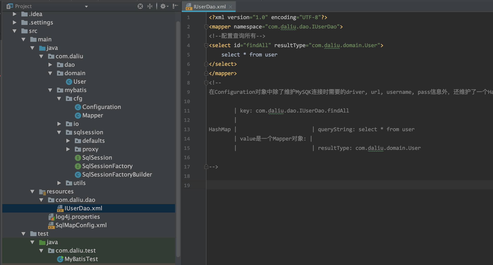

# 自定义Mybatis

网上一张分析图: 


源码位于当前目录下 ./demos/CustomMyBatis



### 1. 本地数据库表格准备 

```sql
create table user (
    id int(11) not null auto_increment,
    username varchar(32) not null comment '用户名称',
    birthday datetime default null comment '生日',
    sex char(1) default null comment '性别',
    address varchar(256) default null comment '地址',
    primary key(id)
);
```

```sql
insert into user values(null, '刘威振', '1988-02-01 08:23:12', '1', '河南郑州');
insert into user values(null, '李小龙', '1968-02-01 07:23:12', '1', '香港');
insert into user values(null, '李连杰', '1967-02-01 07:23:22', '1', '山东烟台');
insert into user values(null, '成龙', '1967-02-01 02:23:22', '1', '四川成都');
insert into user values(null, '刘德华', '1937-02-01 01:23:22', '1', '湖北武汉');
```

### 2. 配置文件

```xml
<!--pom.xml-->
<?xml version="1.0" encoding="UTF-8"?>
<project xmlns="http://maven.apache.org/POM/4.0.0"
         xmlns:xsi="http://www.w3.org/2001/XMLSchema-instance"
         xsi:schemaLocation="http://maven.apache.org/POM/4.0.0 http://maven.apache.org/xsd/maven-4.0.0.xsd">
    <modelVersion>4.0.0</modelVersion>

    <groupId>cn.com.daliu</groupId>
    <artifactId>CustomMyBatis</artifactId>
    <version>1.0-SNAPSHOT</version>
    <build>
        <plugins>
            <plugin>
                <groupId>org.apache.maven.plugins</groupId>
                <artifactId>maven-compiler-plugin</artifactId>
                <configuration>
                    <source>1.6</source>
                    <target>1.6</target>
                </configuration>
            </plugin>
        </plugins>
    </build>

    <packaging>jar</packaging>

    <dependencies>
        <dependency>
            <groupId>mysql</groupId>
            <artifactId>mysql-connector-java</artifactId>
            <version>5.1.6</version>
        </dependency>
        <dependency>
            <groupId>log4j</groupId>
            <artifactId>log4j</artifactId>
            <version>1.2.12</version>
        </dependency>
        <dependency>
            <groupId>junit</groupId>
            <artifactId>junit</artifactId>
            <version>4.10</version>
        </dependency>
        <dependency>
            <groupId>dom4j</groupId>
            <artifactId>dom4j</artifactId>
            <version>1.6.1</version>
        </dependency>
        <dependency>
            <groupId>jaxen</groupId>
            <artifactId>jaxen</artifactId>
            <version>1.1.6</version>
        </dependency>
    </dependencies>

</project>
```

```xml
<!--resources/SqlMapConfig.xml-->
<?xml version="1.0" encoding="UTF-8" ?>

<configuration>
    <!--https://mybatis.org/mybatis-3/zh/getting-started.html-->
    <!--enviroments的default值必须和environment的id值完全一致-->
    <environments default="mysql">
        <!--主配置环境，全局配置环境-->
        <environment id="mysql">
            <!--配置事务类型-->
            <transactionManager type="JDBC"></transactionManager>
            <!--配置数据源，即连接池-->
            <dataSource type="POOLED">
                <!--配置连接数据库的4个基本信息-->
                <property name="driver" value="com.mysql.jdbc.Driver"/>
                <property name="url" value="jdbc:mysql://localhost:3306/daliu"/>
                <property name="username" value="root"/>
                <property name="password" value="110"/>
            </dataSource>
        </environment>
    </environments>

    <!--映射配置环境-->
    <!--每个dao独立的配置文件-->
    <mappers>
        <mapper resource="com/daliu/dao/IUserDao.xml" />
    </mappers>
</configuration>
```

```xml
<!--resources/com/daliu/dao/IUserDao.xml-->
<?xml version="1.0" encoding="UTF-8"?>
<mapper namespace="com.daliu.dao.IUserDao">
<!--配置查询所有-->
<select id="findAll" resultType="com.daliu.domain.User">
    select * from user
</select>
</mapper>
<!--
在Configuration对象中除了维护MySQK连接时需要的driver, url, username, pass信息外，还维护了一个HashMap

        | key: com.daliu.dao.IUserDao.findAll
        |
HashMap |                        | queryString: select * from user
        | value是一个Mapper对象:  |
        |                        | resultType: com.daliu.domain.User

-->
```

### 3. java编码

```java
// -- com.daliu.dao.IUserDao.java -- 
package com.daliu.dao;

import com.daliu.domain.User;

import java.util.List;

public interface IUserDao {
    List<User> findAll();
}
```

```java
// -- comdaliu.domain.User.java --
package com.daliu.domain;

import java.io.Serializable;
import java.util.Date;
public class User implements Serializable{
    private Integer id;
    private String username;
    private Date birthday;
    private String sex;
    private String address;

    public Integer getId() {
        return id;
    }

    public void setId(Integer id) {
        this.id = id;
    }

    public String getUsername() {
        return username;
    }

    public void setUsername(String username) {
        this.username = username;
    }

    public Date getBirthday() {
        return birthday;
    }

    public void setBirthday(Date birthday) {
        this.birthday = birthday;
    }

    public String getSex() {
        return sex;
    }

    public void setSex(String sex) {
        this.sex = sex;
    }

    public String getAddress() {
        return address;
    }

    public void setAddress(String address) {
        this.address = address;
    }

    @Override
    public String toString() {
        return "User{" +
                "id=" + id +
                ", username='" + username + '\'' +
                ", birthday=" + birthday +
                ", sex='" + sex + '\'' +
                ", address='" + address + '\'' +
                '}';
    }
}
```

```java
// -- com.daliu.mybatis.cfg.Configuration.java --
package com.daliu.mybatis.cfg;

import java.util.HashMap;
import java.util.Map;

/**
 * 自定义Mybatis的配置类
 */
public class Configuration {
    private String driver;
    private String url;
    private String username;
    private String password;

    private Map<String, Mapper> mappers = new HashMap<String, Mapper>();

    public String getDriver() {
        return driver;
    }

    public void setDriver(String driver) {
        this.driver = driver;
    }

    public String getUrl() {
        return url;
    }

    public void setUrl(String url) {
        this.url = url;
    }

    public String getUsername() {
        return username;
    }

    public void setUsername(String username) {
        this.username = username;
    }

    public String getPassword() {
        return password;
    }

    public void setPassword(String password) {
        this.password = password;
    }

    public Map<String, Mapper> getMappers() {
        return mappers;
    }

    public void setMappers(Map<String, Mapper> mappers) {
        // 追加, 而不是使用this.mapper=mapper覆盖
        this.mappers.putAll(mappers);
    }
}
```

```java
// -- com.daliu.mybatis.cfg.Mapper.java --
package com.daliu.mybatis.cfg;

/**
 * 用于封装执行的SQL语句和结果类型的全限定类名, 对应:
 *  <mapper namespace="com.daliu.dao.IUserDao">
        <!--配置查询所有-->
        <select id="findAll" resultType="com.daliu.domain.User">
            select * from user
        </select>
    </mapper>
 */
public class Mapper {
    /// SQL语句
    private String queryString;

    /// 实体类的全限定类名
    private String resultType;

    public String getQueryString() {
        return queryString;
    }

    public void setQueryString(String queryString) {
        this.queryString = queryString;
    }

    public String getResultType() {
        return resultType;
    }

    public void setResultType(String resultType) {
        this.resultType = resultType;
    }
}
```

```java
// -- com.daliu.mybatis.io.Resources.java --
package com.daliu.mybatis.io;

import java.io.InputStream;

public class Resources {
    /**
     * 根据传入的参数,获取一个字节输入流
     * @param filePath
     * @return
     */
    public static InputStream getResourceAsStream(String filePath) {
        return Resources.class.getClassLoader().getResourceAsStream(filePath);
    }
}
```

**com.daliu.mybatis.sqlsession.proxy.MapperProxy.java**

```java
package com.daliu.mybatis.sqlsession.proxy;

import com.daliu.mybatis.cfg.Mapper;
import com.daliu.mybatis.utils.Executor;

import java.lang.reflect.InvocationHandler;
import java.lang.reflect.Method;
import java.sql.Connection;
import java.util.Map;

public class MapperProxy implements InvocationHandler {
    // key是全限定类名+方法名
    private Map<String, Mapper> mappers;

    private Connection conn;

    public MapperProxy(Map<String, Mapper> mappers, Connection conn) {
        this.mappers = mappers;
        this.conn = conn;
    }

    /**
     * 用于对方法进行增强, 我们的增强就是调用selectList方法
     * @param proxy
     * @param method
     * @param args
     * @return
     * @throws Throwable
     */
    @Override
    public Object invoke(Object proxy, Method method, Object[] args) throws Throwable {
        // 1. 获取方法名
        String methodName = method.getName();
        // 2. 获取方法所在类的名称
        String className = method.getDeclaringClass().getName();
        // 3. 组合key
        String key = className + "." + methodName;
        // 4. 获取mapper中的Mapper对象
        Mapper mapper = mappers.get(key);
        // 5. 判断是否
        if (mapper == null) {
            throw new IllegalArgumentException("传入的参数有误"); // 它是RuntimeException
        }
        // 6. 调用工具类执行查询所有
        return new Executor().selectList(mapper, conn);
    }
}
```

```java
// -- com.daliu.mybatis.sqlsession.defaults.DefaultSqlSession.java --
package com.daliu.mybatis.sqlsession.defaults;

import com.daliu.mybatis.cfg.Configuration;
import com.daliu.mybatis.sqlsession.SqlSession;
import com.daliu.mybatis.sqlsession.proxy.MapperProxy;
import com.daliu.mybatis.utils.DataSourceUtil;

import java.lang.reflect.Proxy;
import java.sql.Connection;

public class DefaultSqlSession implements SqlSession {
    private Configuration cfg;
    private Connection connection;

    public DefaultSqlSession(Configuration cfg) {
        this.cfg = cfg;
        connection = DataSourceUtil.getConnection(cfg);
    }

    /**
     * 创建代理对象
     * @param daoInterfaceClass dao的接口字节码class
     * @param <T>
     * @return
     */
    @Override
    public <T> T getMapper(Class<T> daoInterfaceClass) {
        return (T) Proxy.newProxyInstance(daoInterfaceClass.getClassLoader(),
                new Class[]{daoInterfaceClass},new MapperProxy(cfg.getMappers(),connection));
    }

    /**
     * 释放资源
     */
    @Override
    public void close() {
        if (connection != null) {
            try {
                connection.close();
            } catch (Exception ex) {
                ex.printStackTrace();
            }
        }
    }
}
```

```java
// -- com.daliu.mybatis.sqlsession.defaults.DefaultSqlSessionFactory.java --
package com.daliu.mybatis.sqlsession.defaults;

import com.daliu.mybatis.cfg.Configuration;
import com.daliu.mybatis.sqlsession.SqlSession;
import com.daliu.mybatis.sqlsession.SqlSessionFactory;

public class DefaultSqlSessionFactory implements SqlSessionFactory {
    private Configuration cfg;
    public DefaultSqlSessionFactory(Configuration cfg) {
        this.cfg = cfg;
    }

    /**
     * 创建一个新的操作数据库对象()
     * @return
     */
    public SqlSession openSession() {
        return new DefaultSqlSession(cfg);
    }
}
```

```java
// -- com.daliu.mybatis.sqlsession.proxy.SqlSession.java --
package com.daliu.mybatis.sqlsession;

/**
 * 自定义Mybatis中和数据库交互的核心类
 * 它里面可以创建dao接口的代理对象
 */
public interface SqlSession {
    // 泛型要求先声明再使用
    // 声明在返回值之前

    /**
     * 根据参数创建一个代理对象
     * @param daoInterfaceClass dao的接口字节码class
     * @param <T>
     * @return
     */
    <T> T getMapper(Class<T> daoInterfaceClass);

    /**
     * 释放资源
     */
    void close();
}
```

```java
// -- com.daliu.mybatis.sqlsession.proxy.SqlSessionFactory.java --
package com.daliu.mybatis.sqlsession;

public interface SqlSessionFactory {
    /// 打开一个新的SqlSession对象
    SqlSession openSession();
}
```

```java
// -- com.daliu.mybatis.sqlsession.proxy.SqlSessionFactoryBuilder.java --
package com.daliu.mybatis.sqlsession;

import com.daliu.mybatis.cfg.Configuration;
import com.daliu.mybatis.sqlsession.defaults.DefaultSqlSessionFactory;
import com.daliu.mybatis.utils.XMLConfigBuilder;

import java.io.InputStream;

/**
 * 用于创建SqlSessionFactory对象
 */
public class SqlSessionFactoryBuilder {
    /**
     * 根据配置文件(SqlMapConfig.xml)创建SqlSessionFactory工厂
     * @param config 配置文件流
     * @return
     */
    public SqlSessionFactory build(InputStream config) {
        Configuration cfg = XMLConfigBuilder.loadConfiguration(config);
        return new DefaultSqlSessionFactory(cfg);
    }
}
```

```java
// -- com.daliu.mybatis.utils.DataSourceUtil.java --
package com.daliu.mybatis.utils;

import com.daliu.mybatis.cfg.Configuration;

import java.sql.Connection;
import java.sql.DriverManager;

/**
 * 创建数据源
 */
public class DataSourceUtil {
    /**
     * 获取一个连接
     * @param cfg
     * @return
     */
    public static Connection getConnection(Configuration cfg) {
        try {
            Class.forName(cfg.getDriver());
            Connection conn = DriverManager.getConnection(cfg.getUrl(), cfg.getUsername(), cfg.getPassword());
            if (conn == null) {
                System.out.println("connection is null!!!!!");
            }
            return conn;
        } catch (Exception ex) {
            throw new RuntimeException(ex);
        }
    }
}
```

**com.daliu.mybatis.utils.Executor.java**

```java
package com.daliu.mybatis.utils;

import com.daliu.mybatis.cfg.Mapper;
import java.beans.PropertyDescriptor;
import java.lang.reflect.Method;
import java.sql.Connection;
import java.sql.PreparedStatement;
import java.sql.ResultSet;
import java.sql.ResultSetMetaData;
import java.util.ArrayList;
import java.util.List;

/**
 * 负责执行SQL语句，并且封装结果集
 */
public class Executor {

    public <E> List<E> selectList(Mapper mapper, Connection conn) {
        PreparedStatement pstm = null;
        ResultSet rs = null;
        try {
            //1.取出mapper中的数据
            String queryString = mapper.getQueryString();//select * from user
            String resultType = mapper.getResultType();//com.dao.domain.User
            Class domainClass = Class.forName(resultType);
            //2.获取PreparedStatement对象
            pstm = conn.prepareStatement(queryString);
            //3.执行SQL语句，获取结果集
            rs = pstm.executeQuery();
            //4.封装结果集
            List<E> list = new ArrayList<E>();//定义返回值
            while(rs.next()) {
                //实例化要封装的实体类对象
                E obj = (E)domainClass.newInstance();

                //取出结果集的元信息：ResultSetMetaData
                ResultSetMetaData rsmd = rs.getMetaData();
                //取出总列数
                int columnCount = rsmd.getColumnCount();
                //遍历总列数
                for (int i = 1; i <= columnCount; i++) {
                    //获取每列的名称，列名的序号是从1开始的
                    String columnName = rsmd.getColumnName(i);
                    //根据得到列名，获取每列的值
                    Object columnValue = rs.getObject(columnName);
                    //给obj赋值：使用Java内省机制（借助PropertyDescriptor实现属性的封装）
                    PropertyDescriptor pd = new PropertyDescriptor(columnName,domainClass);//要求：实体类的属性和数据库表的列名保持一种
                    //获取它的写入方法
                    Method writeMethod = pd.getWriteMethod();
                    //把获取的列的值，给对象赋值
                    writeMethod.invoke(obj,columnValue);
                }
                //把赋好值的对象加入到集合中
                list.add(obj);
            }
            return list;
        } catch (Exception e) {
            throw new RuntimeException(e);
        } finally {
            release(pstm,rs);
        }
    }


    private void release(PreparedStatement pstm,ResultSet rs){
        if(rs != null){
            try {
                rs.close();
            }catch(Exception e){
                e.printStackTrace();
            }
        }

        if(pstm != null){
            try {
                pstm.close();
            }catch(Exception e){
                e.printStackTrace();
            }
        }
    }
}
```

```java
// -- com.daliu.mybatis.utils.XMLConfigBuilder.java --

package com.daliu.mybatis.utils;
import com.daliu.mybatis.cfg.Configuration;
import com.daliu.mybatis.cfg.Mapper;
import com.daliu.mybatis.io.Resources;
import org.dom4j.Attribute;
import org.dom4j.Document;
import org.dom4j.Element;
import org.dom4j.io.SAXReader;

import java.io.IOException;
import java.io.InputStream;
import java.lang.reflect.Method;
import java.lang.reflect.ParameterizedType;
import java.lang.reflect.Type;
import java.util.HashMap;
import java.util.List;
import java.util.Map;

/**
 *  用于解析配置文件
 */
public class XMLConfigBuilder {
    /**
     * 解析主配置文件，把里面的内容填充到DefaultSqlSession所需要的地方
     * 使用的技术：
     *      dom4j+xpath
     *  这里的InputStream config对象是全局配置文件Sq.
     */
    public static Configuration loadConfiguration(InputStream config){
        try{
            //定义封装连接信息的配置对象（mybatis的配置对象）
            Configuration cfg = new Configuration();

            //1.获取SAXReader对象
            SAXReader reader = new SAXReader();
            //2.根据字节输入流获取Document对象
            Document document = reader.read(config);
            //3.获取根节点
            Element root = document.getRootElement();
            //4.使用xpath中选择指定节点的方式，获取所有property节点
            List<Element> propertyElements = root.selectNodes("//property");
            //5.遍历节点
            for(Element propertyElement : propertyElements){
                //判断节点是连接数据库的哪部分信息
                //取出name属性的值
                String name = propertyElement.attributeValue("name");
                if("driver".equals(name)){
                    //表示驱动
                    //获取property标签value属性的值
                    String driver = propertyElement.attributeValue("value");
                    cfg.setDriver(driver);
                }
                if("url".equals(name)){
                    //表示连接字符串
                    //获取property标签value属性的值
                    String url = propertyElement.attributeValue("value");
                    cfg.setUrl(url);
                }
                if("username".equals(name)){
                    //表示用户名
                    //获取property标签value属性的值
                    String username = propertyElement.attributeValue("value");
                    cfg.setUsername(username);
                }
                if("password".equals(name)){
                    //表示密码
                    //获取property标签value属性的值
                    String password = propertyElement.attributeValue("value");
                    cfg.setPassword(password);
                }
            }
            //取出mappers中的所有mapper标签，判断他们使用了resource还是class属性
            List<Element> mapperElements = root.selectNodes("//mappers/mapper");
            /** 对应看SqlMapConfig.xml文件中的:
                <mappers>
                    <mapper resource="cn/com/dao/IUserDao.xml" />
                </mappers>
             */
            //遍历集合
            for(Element mapperElement : mapperElements){
                //判断mapperElement使用的是哪个属性
                Attribute attribute = mapperElement.attribute("resource");
                if(attribute != null){
                    System.out.println("使用的是XML");
                    //表示有resource属性，用的是XML
                    //取出属性的值
                    String mapperPath = attribute.getValue();//获取属性的值"com/daliu/dao/IUserDao.xml"
                    System.out.println("😍😍😍😍😍😍😍😍😍😍 mapperPath: " + mapperPath);
                    //把映射配置文件的内容获取出来，封装成一个map
                    Map<String,Mapper> mappers = loadMapperConfiguration(mapperPath);
                    if (mappers == null) {
                        System.out.println("🤣🤣🤣🤣🤣🤣🤣🤣🤣🤣");
                    }
                    //给configuration中的mappers赋值
                    cfg.setMappers(mappers);
                }else{
//                    System.out.println("使用的是注解");
//                    //表示没有resource属性，用的是注解
//                    //获取class属性的值
//                    String daoClassPath = mapperElement.attributeValue("class");
//                    //根据daoClassPath获取封装的必要信息
//                    Map<String,Mapper> mappers = loadMapperAnnotation(daoClassPath);
//                    //给configuration中的mappers赋值
//                    cfg.setMappers(mappers);
                }
            }
            //返回Configuration
            return cfg;
        }catch(Exception e){
            throw new RuntimeException(e); // error here
        }finally{
            try {
                config.close();
            }catch(Exception e){
                e.printStackTrace();
            }
        }

    }

    /**
     * 根据传入的参数，解析XML，并且封装到Map中
     * @param mapperPath    映射配置文件的位置
     * @return  map中包含了获取的唯一标识（key是由dao的全限定类名和方法名组成）
     *          以及执行所需的必要信息（value是一个Mapper对象，里面存放的是执行的SQL语句和要封装的实体类全限定类名）
     */
    private static Map<String,Mapper> loadMapperConfiguration(String mapperPath)throws IOException {
        InputStream in = null;
        try{
            //定义返回值对象
            Map<String,Mapper> mappers = new HashMap<String, Mapper>();
            //1.根据路径获取字节输入流
            in = Resources.getResourceAsStream(mapperPath);
            //2.根据字节输入流获取Document对象
            SAXReader reader = new SAXReader();
            Document document = reader.read(in);
            //3.获取根节点
            Element root = document.getRootElement();
            //4.获取根节点的namespace属性取值
            String namespace = root.attributeValue("namespace");//是组成map中key的部分
            //5.获取所有的select节点
            List<Element> selectElements = root.selectNodes("//select");
            //6.遍历select节点集合
            for(Element selectElement : selectElements){
                //取出id属性的值      组成map中key的部分
                String id = selectElement.attributeValue("id");
                //取出resultType属性的值  组成map中value的部分
                String resultType = selectElement.attributeValue("resultType");
                //取出文本内容            组成map中value的部分
                String queryString = selectElement.getText();
                //创建Key
                String key = namespace+"."+id;
                //创建Value
                Mapper mapper = new Mapper();
                mapper.setQueryString(queryString);
                mapper.setResultType(resultType);
                //把key和value存入mappers中
                mappers.put(key,mapper);
            }
            return mappers;
        }catch(Exception e){
            throw new RuntimeException(e);
        }finally{
            in.close();
        }
    }

    /**
     * 根据传入的参数，得到dao中所有被select注解标注的方法。
     * 根据方法名称和类名，以及方法上注解value属性的值，组成Mapper的必要信息
     * @param daoClassPath
     * @return
     */
//    private static Map<String,Mapper> loadMapperAnnotation(String daoClassPath)throws Exception{
//        //定义返回值对象
//        Map<String,Mapper> mappers = new HashMap<String, Mapper>();
//
//        //1.得到dao接口的字节码对象
//        Class daoClass = Class.forName(daoClassPath);
//        //2.得到dao接口中的方法数组
//        Method[] methods = daoClass.getMethods();
//        //3.遍历Method数组
//        for(Method method : methods){
//            //取出每一个方法，判断是否有select注解
//            boolean isAnnotated = method.isAnnotationPresent(Select.class);
//            if(isAnnotated){
//                //创建Mapper对象
//                Mapper mapper = new Mapper();
//                //取出注解的value属性值
//                Select selectAnno = method.getAnnotation(Select.class);
//                String queryString = selectAnno.value();
//                mapper.setQueryString(queryString);
//                //获取当前方法的返回值，还要求必须带有泛型信息
//                Type type = method.getGenericReturnType();//List<User>
//                //判断type是不是参数化的类型
//                if(type instanceof ParameterizedType){
//                    //强转
//                    ParameterizedType ptype = (ParameterizedType)type;
//                    //得到参数化类型中的实际类型参数
//                    Type[] types = ptype.getActualTypeArguments();
//                    //取出第一个
//                    Class domainClass = (Class)types[0];
//                    //获取domainClass的类名
//                    String resultType = domainClass.getName();
//                    //给Mapper赋值
//                    mapper.setResultType(resultType);
//                }
//                //组装key的信息
//                //获取方法的名称
//                String methodName = method.getName();
//                String className = method.getDeclaringClass().getName();
//                String key = className+"."+methodName;
//                //给map赋值
//                mappers.put(key,mapper);
//            }
//        }
//        return mappers;
//    }
}
```