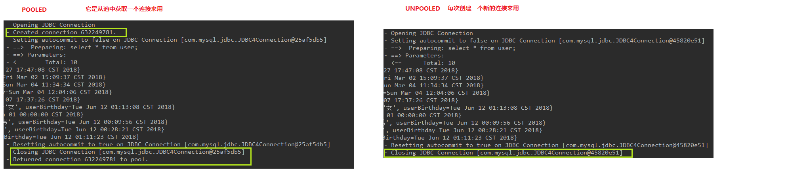

# 连接池和事务控制

```xml
<!--resources/SqlMapConfig.xml-->
<environments default="mysql">
    <!--主配置环境，全局配置环境-->
    <environment id="mysql">
        <!--配置事务类型-->
        <transactionManager type="JDBC"></transactionManager>
        <!--配置数据源，type表示连接池
        取值为:
        POOLED: 采用传统的javax.sql.DataSource规范中的连接池, MyBatis中有针对此规范的实现
        UNPOOLED: 采用传统的获取连接的方式, 也实现了javax.sql.DataSource接口,但并没有使用池的思想 
        JNDI: 采用服务器提供的JNDI技术实现获取DataSource对象, 不同的服务器能拿到的DataSource对象不同, 注: 如果不是web或maven的war工程,不可使用. tomcat服务器使用的连接池就是dbcp连接池
        -->
        <dataSource type="POOLED">
            ...
        </dataSource>
    </environment>
</environments>
```

dataSource设置为POOLED和UNPOOLED, 可以看到Console打印效果:


源码可以参见
```java
org.apache.ibatis.datasource.unpooled.UnpooledDataSource implements DataSource
org.apache.ibatis.datasource.unpooled.UnpooledDataSource implements DataSource
```

这两个类都实现了`javax.sql.DataSource`接口  

mybatis_pooled的过程: 


### 事务

事务的四大特性 ACID  [Ref](https://blog.csdn.net/dengjili/article/details/82468576)
- A: Atomicity 原子性, 原子性是指事务是一个不可分割的工作单位，事务中的操作要么都发生，要么都不发生
- C: Consistency 一致性, 事务前后数据的完整性必须保持一致
- I: Isolation, 隔离性, 事务的隔离性是多个用户并发访问数据库时，数据库为每一个用户开启的事务，不能被其他事务的操作数据所干扰，多个并发事务之间要相互隔离
- D: Durability, 持久性, 持久性是指一个事务一旦被提交，它对数据库中数据的改变就是永久性的，接下来即使数据库发生故障也不应该对其有任何影响 

MyBatis通过sqlSession对象的commit方法和rollback方法实现事务的提交和回滚.    

```java
public interface SqlSessionFactory {

  SqlSession openSession(); // 相当于openSession(false), 即关闭自动提交
  SqlSession openSession(boolean autoCommit);
  SqlSession openSession(Connection connection);
  SqlSession openSession(TransactionIsolationLevel level);
  SqlSession openSession(ExecutorType execType);
  SqlSession openSession(ExecutorType execType, boolean autoCommit);
  SqlSession openSession(ExecutorType execType, TransactionIsolationLevel level);
  SqlSession openSession(ExecutorType execType, Connection connection);

  Configuration getConfiguration();
}
```
注: 实际开发中不建议打开自动提交, 因为如果一个业务用到了多个SqlSession, 每个sqlSession都是自动提交, 事务不宜控制.  
