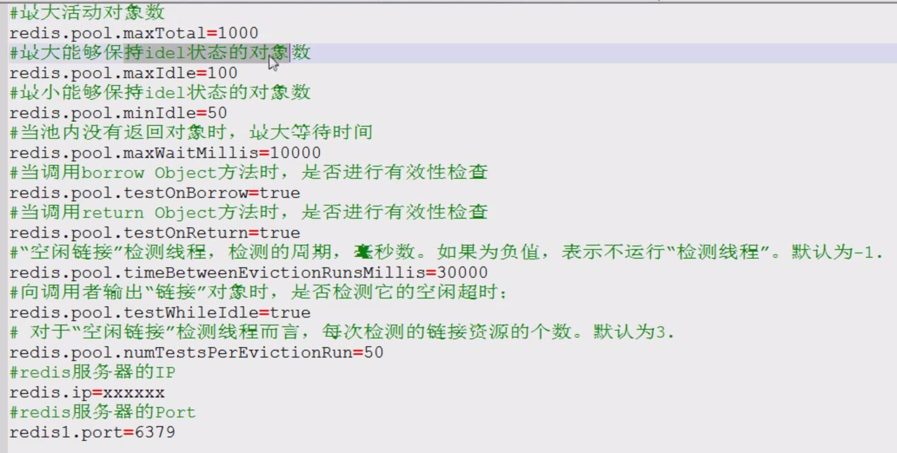

# Jedis连接池

```java
@Test
// jedis连接池
public void test7() {
    // JedisPool jedisPool = new JedisPool();
    JedisPoolConfig config = new JedisPoolConfig();
    config.setMaxTotal(50);
    config.setMaxIdle(10);
    JedisPool jedisPool = new JedisPool(config,"localhost", 6379);
    Jedis jedis = jedisPool.getResource();
    jedis.set("hehe", "heihei");
    jedis.close(); // 归还到连接池中
}
```



### 封装一个简单的连接池类

```java
package cn.daliu.jedis.util;

import redis.clients.jedis.Jedis;
import redis.clients.jedis.JedisPool;
import redis.clients.jedis.JedisPoolConfig;

import java.io.IOException;
import java.io.InputStream;
import java.util.Properties;

public class JedisPoolUtils {
    public static JedisPool jedisPool;

    static {
        InputStream is = JedisPoolUtils.class.getClassLoader().getResourceAsStream("jedis.properties");
        Properties prop = new Properties();
        try {
            prop.load(is);
        } catch (IOException e) {
            e.printStackTrace();
        }
        JedisPoolConfig config = new JedisPoolConfig();
        config.setMaxTotal(Integer.parseInt(prop.getProperty("maxTotal")));
        config.setMaxIdle(Integer.parseInt(prop.getProperty("maxIdle")));

        jedisPool = new JedisPool(config, prop.getProperty("host"), Integer.parseInt(prop.getProperty("port")));
    }

    public static Jedis getJedis() {
        return jedisPool.getResource();
    }
}

@Test
// 连接池工具类封装
public void test7() {
    Jedis jedis = JedisPoolUtils.getJedis();
    jedis.set("hello", "world");
    jedis.close();
}
```

**src/jedids.properties**

```
host=127.0.0.1
port=6379
maxTotal=50
maxIdle=10
```