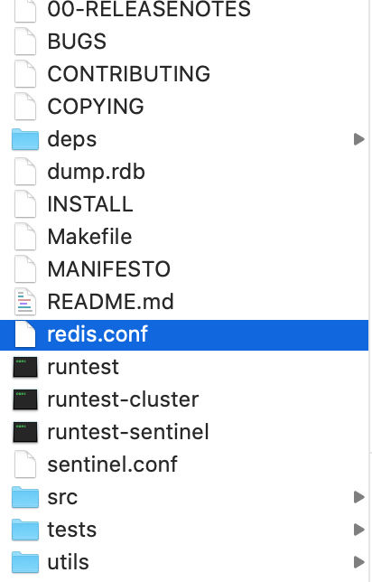

# 持久化

Redis持久化机制:
1. RDB: 默认方式, 在一定的间隔时间中, 检测key的变化情况, 持久化数据
2. AOF: 日志记录的方式, 可以记录每一条命令的操作, 每一次操作后持久化数据, 效率不如RDB高

### RDB

编辑 `/usr/local/redis-5.0.4/redis.conf`



```
save 900 1 # after 900 sec (15 min) if at least 1 key changed
save 300 10 # after 300 sec (5 min) if at least 10 keys changed
save 60 10000 # after 60 sec if at least 10000 keys changed
```

如果我们把 `save 60 10000` 改为:  `save 10 5`, 表示 after 10 sec if at least 5 keys changed, 然后指定此配置文件启动server:

```
redis-server redis.conf
```

### kill 进程 
但是经实验, 如果在redis-cli中调用了shutdown会触发redis保存数据, redis-server log如下:  

```
# User requested shutdown...
* Saving the final RDB snapshot before exiting.
* DB saved on disk
# Redis is now ready to exit, bye bye...
```

因此我们不使用正常的shutdown, 而是查找到redis的进程id, kiss掉进程  

```
# ps -axu 本机名|grep 程序名
% ps -axu liuweizhen|grep redis
501 70237 ??         0:36.89 src/redis-server 127.0.0.1:21371 
501 76312 ttys000    0:00.00 grep redis

# 然后kill -9
% kill -9 70237

# 不过在启动redis server时, 它会告诉我们pid和端口号:
          _.-``__ ''-._                                             
      _.-``    `.  `_.  ''-._           Redis 5.0.4 (00000000/0) 64 bit
  .-`` .-```.  ```\/    _.,_ ''-._                                   
 (    '      ,       .-`  | `,    )     Running in standalone mode
 |`-._`-...-` __...-.``-._|'` _.-'|     Port: 6379  # 端口号
 |    `-._   `._    /     _.-'    |     PID: 76355 # 进程id
  `-._    `-._  `-./  _.-'    _.-'                                   
 |`-._`-._    `-.__.-'    _.-'_.-'|                                  
 |    `-._`-._        _.-'_.-'    |           http://redis.io        
  `-._    `-._`-.__.-'_.-'    _.-'                                   
 |`-._`-._    `-.__.-'    _.-'_.-'|                                  
 |    `-._`-._        _.-'_.-'    |                                  
  `-._    `-._`-.__.-'_.-'    _.-'                                   
      `-._    `-.__.-'    _.-'                                       
          `-._        _.-'                                           
              `-.__.-' 
              
# 由于redis-server的端口号一般是6379, 也可以通过端口号查找到进程id
% lsof -i:6379
redis-ser 76355 liuweizhen    6u  IPv4 0x6c7d5861d5dfe99d      0t0  TCP localhost:6379 (LISTEN)
# 同样得到进程id 76355
```

kill 掉redis-server的进程后, 可以看到redis-server提示: `zsh: killed     redis-server redis.conf`

测试的正确流程是: 
1. 开启 redis-server: `redis-server redis.conf`
2. 快速在 redis-cli中添加数据: `set username daliu`
3. 调用kill命令杀掉进程: `kill -9 [resis-server进程id]`
4. 再次开启 redis-server: `redis-server redis.conf`
5. 再次在redis-cli中查看数据: `get username`, 可以看数结果为nil

--------------------------------------------------------------------------------------------

### 实验修改redis-conf的影响:

```
save 900 20
save 300 10
# save 60 10000
save 20 5 # 新添加
```

```
% redis-server redis.conf 
127.0.0.1:6379> set username 1
OK
127.0.0.1:6379> set username 2
OK
127.0.0.1:6379> set username 3
OK
127.0.0.1:6379> set username 4
OK
127.0.0.1:6379> set username 5
OK
127.0.0.1:6379> set username 6
OK

# 这时候会看到redis-server提示:
5 changes in 20 seconds. Saving...
* Background saving started by pid 76548
* DB saved on disk
* Background saving terminated with success
```

RDB对应的操作进入文件dump.rdb中

### AOF

同样是配置redis.conf, 找到:

```
appendonly no
# The name of the append only file (default: "appendonly.aof")
# If unsure, use "everysec".

# appendfsync always #  每一次操作都进行持久化
appendfsync everysec # 每隔一秒进行一次持久化
# appendfsync no # 不进行持久化
```

```
appendonly no # 把no改为yes表示启用AOF
```

```
redis-server redis.conf # 启动server
redis-cli # 启动client
127.0.0.1:6379> set name zhangsan
OK
# 这时候可以看到在/usr/local/redis-5.0.4/下多了一个appendonly.aof文件
```


