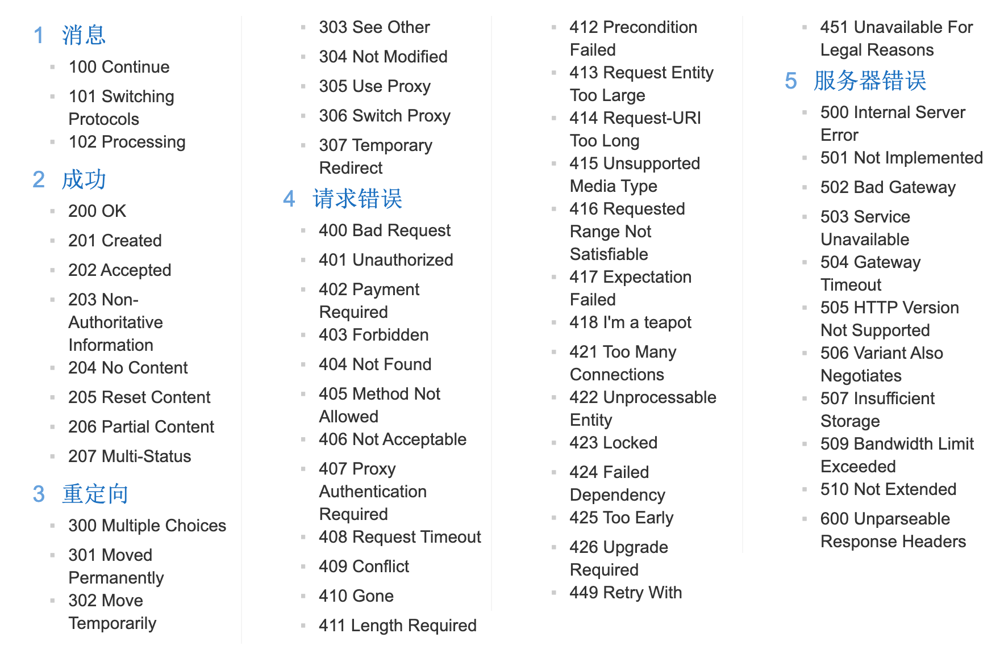

# Response

数据格式: 
1. 响应行
  - 格式: 协议/版本 响应状态码 状态码描述
  - 状态码: 服务器告诉客户端本次响应状态, 一般为3位数字
      - 1xx: 服务器接收客户端消息, 但没有接收完成, 等待一段时间发, 发送1xx状态码询问客户端 
      - 2xx: 成功, 常见200
      - 3xx: 重定向, 常见302  304(Not Modified, 告诉client访问自己的缓存)
      - 4xx: 客户端错误, 常见404(Not Found, 请求的路径没有对应的资源)   405(Method Not Found, 请求方式不支持, 比如不支持GET, 却使用了GET请求)
      - 5xx: 服务端错误, 常见500(Internal Server Error)
        
2. 响应头
  - 格式: 头名称 : 值
  - Content-Type: 服务器告诉客户端本次响应体的数据格式和编码格式
  - Content-Length: 内容字节个数
  - Content-disposition: 告诉客户端以什么格式打开响应体数据, 默认in-line: 在当前页面内打开 attachment: 以附件形式打开响应体(比如用于文件下载)
3. 响应空行
4. 响应体: 传输过来的内容数据

```
HTTP/1.1 200 OK // 响应行
Date: Tue, 17 Mar 2020 13:29:26 GMT // 响应头
Content-Type: text/html
Transfer-Encoding: chunked
Connection: keep-alive
Expires: Tue, 17 Mar 2020 13:32:26 GMT
Server: CCTV_WebServer
Cache-Control: max-age=180
X-UA-Compatible: IE=Edge
Content-Encoding: gzip
...
// 响应空行
<html> // 响应体
  ... 
</htm>
```

### Response对象
- 设置响应行中的状态码: setStatus(int sc)
- 设置响应头: setHeader(String name, String value)
- 设置响应体:
  - 获取输出流, 输出到客户端
    - 字符输出流: PrintWriter getWriter()
    - 字节输出流: ServletOutputStream getOutputStream() 

### 示例: 输出字符流数据

```java
response.getWriter().print(...)
```

### 乱码问题  

```java
package com.daliu.servlet;

import javax.servlet.ServletException;
import javax.servlet.annotation.WebServlet;
import javax.servlet.http.HttpServlet;
import javax.servlet.http.HttpServletRequest;
import javax.servlet.http.HttpServletResponse;
import java.io.IOException;
import java.io.PrintWriter;

@WebServlet("/helloServlet")
public class HelloServlet extends HttpServlet {
    protected void doPost(HttpServletRequest request, HttpServletResponse response) throws ServletException, IOException {
        // 乱码的本质原因: 编解码使用的码表(字符集)不是同一个
        // 浏览器默认编码一般和电脑的操作系统相关, 比如中文状态下, 一般是GBK(GB2312)
        // 而response.getWriter()获取到的输出流的编码默认为ISO-8859-1
        // 因此在获取流之前需要设置流的编码, 并告诉浏览器发送的消息体的编码, 建议浏览器使用该编码进行解码
        // response.setCharacterEncoding("UTF-8");
        // response.setHeader("content-type", "text/html;charset=utf-8");
        response.setContentType("text/html;charset=utf-8");
        PrintWriter out = response.getWriter();
        out.println("你好 servlet");
        // response在响应后会自动销毁, 它获取的流也会自动被关闭掉
    }

    protected void doGet(HttpServletRequest request, HttpServletResponse response) throws ServletException, IOException {
        doPost(request, response);
    }
}
```

注: 经试验, 只写`response.setCharacterEncoding("GBK");`浏览器显示没有乱码, 而如果只写`response.setCharacterEncoding("UTF-8");`浏览器依然显示乱码, 即本机浏览器编码为GBK, 但如果只写`response.setCharacterEncoding`用以阻止乱码现象并不友好, 因为这需要事先知道浏览器的编码. 因此一般会加上`response.setContentType`来告诉浏览器消息体内容, 以便浏览器正确的解码. 

### 示例: 输出字节流数据

```java
protected void doPost(HttpServletRequest request, HttpServletResponse response) throws ServletException, IOException {
    response.setContentType("text/html;charset=utf-8");
    ServletOutputStream out = response.getOutputStream();
    out.write("你好 hello".getBytes("utf-8"));
}
```


