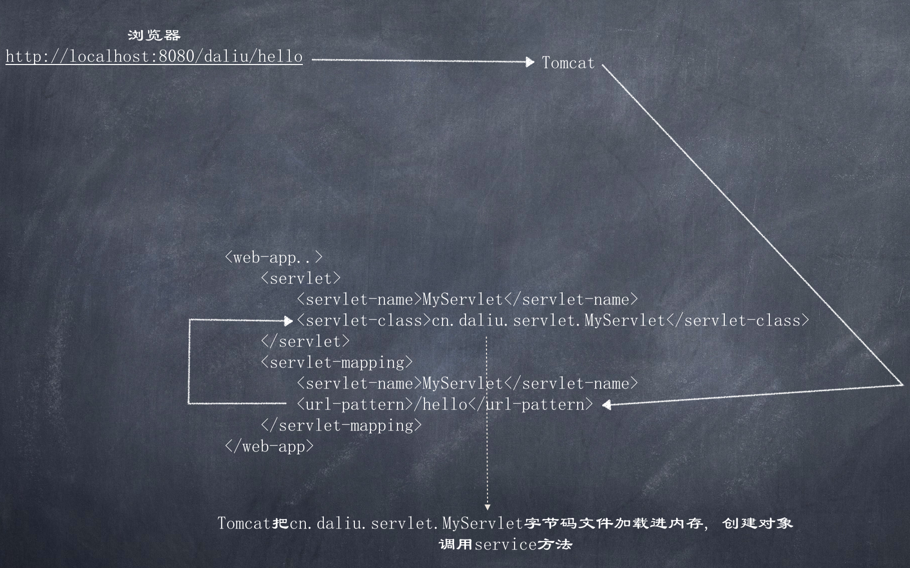
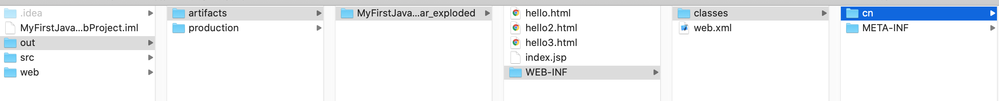

# Servlet

Servlet是server applet的简写, 翻译为服务端小程序, Servlet是Java原始web编程的方式，在不使用任何框架的情况下，使用原始servlet方式做web编程更能体现底层   

当浏览器请求动态资源时, 由Tomcat执行Java servlet, Tomcat之所以可以执行Servlet, 是因为Servlet有它的规范, 或者叫规则, 而规则在Java里可以理成成接口, Servlet本身就是接口, 它定义了Java类被识别的规则, 比如javax.servlet.http.HttpServlet就实现了Servlet接口. 如果我们自定义一个类, 实现Servlet接口, 复写其方法, 那么Tomcat也可以调用  

>  public interface Servlet
> Defines methods that all servlets must implement.
> A servlet is a small Java program that runs within a Web server. Servlets receive and respond to requests from Web clients, usually across HTTP, the HyperText Transfer Protocol.

> To implement this interface, you can write a generic servlet that extends javax.servlet.GenericServlet or an HTTP servlet that extends javax.servlet.http.HttpServlet.

> This interface defines methods to initialize a servlet, to service requests, and to remove a servlet from the server. These are known as life-cycle methods and are called in the following sequence:

> The servlet is constructed, then initialized with the init method.
Any calls from clients to the service method are handled.
The servlet is taken out of service, then destroyed with the destroy method, then garbage collected and finalized.
In addition to the life-cycle methods, this interface provides the getServletConfig method, which the servlet can use to get any startup information, and the getServletInfo method, which allows the servlet to return basic information about itself, such as author, version, and copyright… ...

下面我们自定义一个实现Servlet的Class:  

**cn.daliu.servlet.MyServlet.java** 
```java
package cn.daliu.servlet;

import javax.servlet.*;
import java.io.IOException;

public class MyServlet implements Servlet {
    @Override
    public void init(ServletConfig servletConfig) throws ServletException {

    }

    @Override
    public ServletConfig getServletConfig() {
        return null;
    }

    @Override
    // 提供服务的方法
    public void service(ServletRequest servletRequest, ServletResponse servletResponse) throws ServletException, IOException {
        System.out.println("Hello servlet");
        servletResponse.getWriter().println("hello world!");
    }

    @Override
    public String getServletInfo() {
        return null;
    }

    @Override
    public void destroy() {

    }
}
```

另外, 需要在web.xml中配置此servlet  

```xml
<?xml version="1.0" encoding="UTF-8"?>
<web-app xmlns="http://xmlns.jcp.org/xml/ns/javaee"
         xmlns:xsi="http://www.w3.org/2001/XMLSchema-instance"
         xsi:schemaLocation="http://xmlns.jcp.org/xml/ns/javaee http://xmlns.jcp.org/xml/ns/javaee/web-app_4_0.xsd"
         version="4.0">
    <servlet>
        <servlet-name>MyServlet</servlet-name>
        <servlet-class>cn.daliu.servlet.MyServlet</servlet-class>
    </servlet>
    <servlet-mapping>
        <servlet-name>MyServlet</servlet-name>
        <url-pattern>/hello</url-pattern>
    </servlet-mapping>
</web-app>
```

那么浏览器访问`http://localhost:8080/hello`就会出现"hello world"  

-------------------------------------------------------------------------------------

### Servlet执行流程 

  

在IDEA中可以看到部署内容:  




