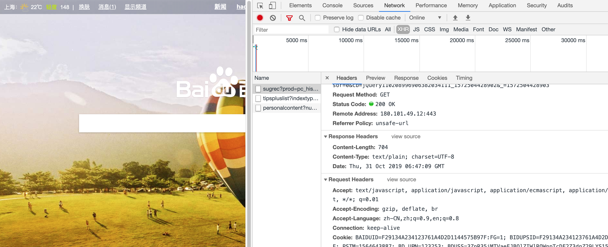
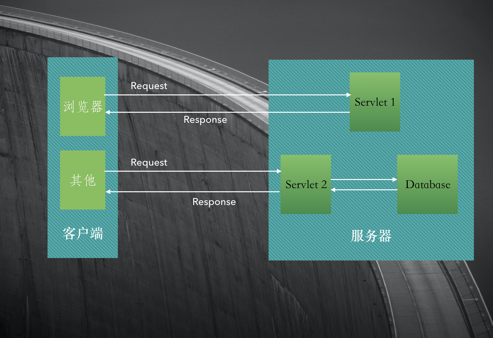
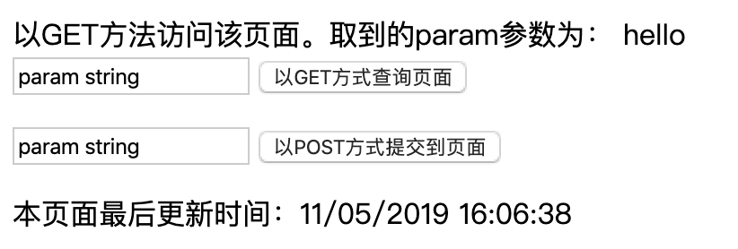

# Servlet剖析



网站展现页面分动、静态, 最早期的动态网站使用CGI实现页面的动态生成，比如访问www.aaa.com/cgi/hell.cgi，通过执行Web服务器调用执行CGI目录下的hello.cgi程序，动态生成HTML页面输出，最后由WEB服务器通过网络将生成的HTML页面返回给客户端。CGI程序在服务器端执行，并可以和Web服务器在同一个主机上，最流行的CGI语言是Perl和Shell脚本，也可以使用C/C++以及Java等语言进行编写。  
虽然CGI实现了网站的动态性，但是CGI存在很多不足：

- 需要为每个请求启动一个操作CGI程序的系统进程
- 需要为每个请求加载和运行一个CGI程序
- 需要重复编写处理网络协议的代码

如果使用Java编写CGI程序，执行效率更低下，因为要执行一个Java编写的CGI程序，除了首先需要启动一个系统进程之外，还要在进程中启动一个JVM，然后才能在JVM中执行Java CGI程序，为了解决CGI这个问题，Java推出了Servlet规范，只需要启动一个操作系统进程以及一个JVM映象即可。
Sun公司在上世纪90年代末就发布了基于Servlet的Web服务器。为了确保加载的各个类之间不起冲突，已经建立了一个称为Java Servlet API(应用程序接口)的编码标准。现在基本上所有的服务器都遵循这个编码标准，所以Servlet有很好的移植性。  
现在的Web服务器（比如Tomcat）已经集成了Servlet容器，Servlet容器负责管理加载、卸载、重新加载和执行Servlet代码等操作。

由于Tomcat实现了HTTP传协议的服务器软件，当浏览器请求http://...时，浏览器提交的请求是遵循HTTP协议的文本，这段文本由服务器Tomcat接收并解析，封装成了HpptServletRequest类型的request对象。所有的HTTP头数据都可以通过request相应的方法查询到。  
Tomcat同时把输出流封装成HpptServletResponse类型的response对象，通过设置response属性就可以控制输出的内容。然后Tomcat把request、response作为参数，调用Servlet的相应方法，例如doGet(request, response)、 doPost(request, response)

Servlet是一种实现了javax.servlet.Servlet接口的类。Servlet接口规定了特定方法来处理特定的请求。开发者只需要实现Servlet的相关方法，用户访问Web程序时，Tomcat会计用这些方法完成业务处理。



### 编写Servlet

直接实现javax.servlet.Servlet接口比较麻烦，在JDK的javax.servlet.*, javax.servlet.http.*包下提供了对Servlet的支持，比如HttpServlet

示例：  

```java
// -- com.daliu.servlet.FirstServlet.java
package com.daliu.servlet;

import javax.servlet.ServletException;
import javax.servlet.http.HttpServlet;
import javax.servlet.http.HttpServletRequest;
import javax.servlet.http.HttpServletResponse;
import java.io.IOException;
import java.io.PrintWriter;

public class FirstServlet extends HttpServlet {
    @Override
    /**
     * 以GET方式访问页面时执行该函数
     * 执行doGet前会先执行getLastModified，如果浏览器发现getLastModified返回的数值与上次访问时返回的数值相同
     * 则认为该文档没有更新，浏览器采用缓存而不执行doGet
     * 如果getLastModified返回-1, 则认为是时刻更新的，总是执行该函数
     */
    protected void doGet(HttpServletRequest req, HttpServletResponse resp) throws ServletException, IOException {
        this.log("执行doGet...方法"); // 调用Servlet自带的日志输出信息到控制台
        this.execute(req, resp);
    }

    @Override
    /**
     * 返回该Servlet生成的文档的更新时间。对GET方式访问有效
     * 返回的时间为相对于1970年1月1日08:00:00的毫秒数
     * 如果为-1则认为是实时更新
     * 默认为-1
     */
    protected long getLastModified(HttpServletRequest req) {
        this.log("执行getLastModified方法...");
        return -1;
        // return super.getLastModified(req);
    }

    @Override
    protected void doPost(HttpServletRequest req, HttpServletResponse resp) throws ServletException, IOException {
        this.log("执行doPost方法...");
        this.execute(req, resp);
    }

    private void execute(HttpServletRequest request, HttpServletResponse response) throws ServletException, IOException {
        response.setCharacterEncoding("UTF-8"); // 设置response编码方式
        request.setCharacterEncoding("UTF-8");  // 设置request编码方式
        // 访问该Servlet的URI:
        String requestURI = request.getRequestURI();
        // 请求方式，GET 或者 POST
        String method = request.getMethod();
        // 获取客户端提交的参数param值
        String param = request.getParameter("param");
        response.setContentType("text/html"); // 设置响应文档类型为HTML类型
        PrintWriter out = response.getWriter();
        out.println("<!DOCTYPE HTML PUBLIC \"-//W3C//DTD HTML 4.0.1 Transitional//EN\"");
        out.println("<html>");
        out.println(" <body>");
        out.println("以" + method + "方法访问该页面。取到的param参数为： " + param + "<br />");
        out.println("<form action=" + requestURI + " method='get'>");
        out.println("   <input type='text' name='param' value='param string' />");
        out.println("   <input type='submit' value='以GET方式查询页面'" + requestURI + "<br />");
        out.println("</form>");
        out.println("<form action='" + requestURI + "' method=' post'>");
        out.println("   <input type='text' name='param' value='param string' />");
        out.println("   <input type='submit' value='以POST方式提交到页面'" + requestURI + "' />");
        out.println("</form>");

        // 由客户端浏览器读取该文档的更新时间
        out.println("<script>document.write('本页面最后更新时间：'+ document.lastModified); </script>");
        out.println(" </body");
        out.println("</html>");
        out.flush();
        out.close();
    }
}
```

```
// -- WEB-INF/web.xml --
<?xml version="1.0" encoding="UTF-8"?>
<web-app xmlns="http://java.sun.com/xml/ns/javaee"
           xmlns:xsi="http://www.w3.org/2001/XMLSchema-instance"
           xsi:schemaLocation="http://java.sun.com/xml/ns/javaee
		  http://java.sun.com/xml/ns/javaee/web-app_4_0.xsd"
           version="4.0">
    <servlet>
        <servlet-name>FirstServlet</servlet-name>
        <servlet-class>com.daliu.servlet.FirstServlet</servlet-class>
        <!--Servlet中可以使用
        getServletContext().getInitParam(String paramName)
        获取配置的初始化参数值-->
        <init-param>
            <param-name>message</param-name>
            <param-value>Welcome to FirstServlet</param-value>
        </init-param>
        <init-param>
            <param-name>encoding</param-name>
            <param-value>utf-8</param-value>
        </init-param>
        <!--load-on-startup配置该Servlet的加载方式，可选值0或1
        如果配置为1，Tomcat会在启动时加载Servlet，
        否则，Tomcat会在第一次请求该Servlet时才加载此Servlet-->
        <load-on-startup>1</load-on-startup>
    </servlet>
    
    <servlet-mapping>
        <servlet-name>FirstServlet</servlet-name>
        <url-pattern>/servlet/FirstServlet</url-pattern>
    </servlet-mapping>
</web-app>
```



<url-pattern>中允许使用通配符`*`与`?`，其中`*`代表任意长度的字符串,` ?`代表任意字符  
比如<url-pattern>路径配置为/servlet/FirstServlet.*，
就可以使用http://localhost:8080:ContextName/servlet/FirstServlet.xxx访问FirstServlet
从Java EE5起，<servlet-mapping>标签可以配置多个<url-pattern>，比如：

```xml
<servlet-mappine>
    <servlet-name>FirstServlet</servlet-name>
    <url-pattern>/servlet/FirstServlet</url-pattern>
    <url-pattern>/servlet/FirstServlet.asp</url-pattern>
    <url-pattern>/servlet/FirstServlet.jsp</url-pattern>
    <url-pattern>/servlet/FirstServlet.php</url-pattern>
    <url-pattern>/servlet/FirstServlet.aspx</url-pattern>
</servlet-mapping>
```

在web.xml中可以配置多个servlet:

```
<?xml version="1.0" encoding="UTF-8"?>
<web-app xmlns="http://java.sun.com/xml/ns/javaee"
           xmlns:xsi="http://www.w3.org/2001/XMLSchema-instance"
           xsi:schemaLocation="http://java.sun.com/xml/ns/javaee
		  http://java.sun.com/xml/ns/javaee/web-app_4_0.xsd"
           version="4.0">
    <servlet>
        <servlet-name>FirstServlet</servlet-name>
        <servlet-class>com.daliu.servlet.FirstServlet</servlet-class>
        <!--Servlet中可以使用
        getServletContext().getInitParam(String paramName)
        获取配置的初始化参数值-->
        <init-param>
            <param-name>message</param-name>
            <param-value>Welcome to FirstServlet</param-value>
        </init-param>
        <init-param>
            <param-name>encoding</param-name>
            <param-value>utf-8</param-value>
        </init-param>
        <!--load-on-startup配置该Servlet的加载方式，可选值0或1
        如果配置为1，Tomcat会在启动时加载Servlet，
        否则，Tomcat会在第一次请求该Servlet时才加载此Servlet-->
        <load-on-startup>1</load-on-startup>
    </servlet>
    <servlet-mapping>
        <servlet-name>FirstServlet</servlet-name>
        <url-pattern>/servlet/FirstServlet</url-pattern>
    </servlet-mapping>
    
    <!--配置第2个servlet-->
    <servlet>
        <servlet-name>HelloServlet</servlet-name>
        <servlet-class>com.daliu.servlet.HelloServlet</servlet-class>
    </servlet>
    <servlet-mapping>
        <servlet-name>HelloServlet</servlet-name>
        <url-pattern>/servlet/HelloServlet</url-pattern>
    </servlet-mapping>
</web-app>
```