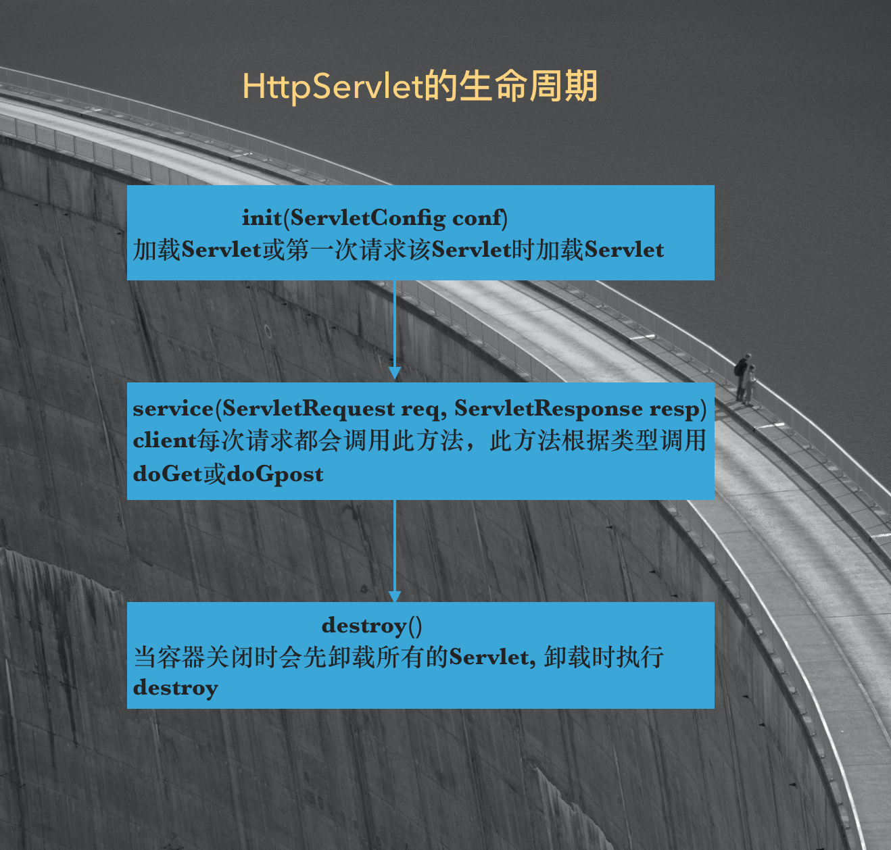

# Servlet生命周期

参见：Java Web整合开发王者归来p81   
代码参见：[](./ServletDemo/)

传统的CGI编程中，用户每请求一次CGI程序，服务器就会开辟一个单独的进程来处理请求，处理完毕再将这个进程销毁。反复开辟销毁进程效率低，占用资源多。   
Servlet解决了这个问题。    

### 自定义一个Servlet

```java
package cn.daliu.servlet;

import javax.servlet.*;
import java.io.IOException;

public class MyServlet implements Servlet {
    @Override
    // 在Servlet被创建时执行, 只执行一次
    // 默认情况下, Servlet在第一次被访问时创建
    // 可以通过配置的方法指定Servlet的创建时机
    // 由于Servlet是单例, 因此多个用户同时访问时, 可能存在线程安全问题
    // 所以一般不要在Servlet中定义成员变量
    public void init(ServletConfig servletConfig) throws ServletException {
        System.out.println("init...");
    }

    @Override
    // 获取ServletConfig对象, 即Servlet的配置对象
    public ServletConfig getServletConfig() {
        return null;
    }

    @Override
    // 提供服务的方法
    // 被一次当Servlet被访问时, 执行
    public void service(ServletRequest servletRequest, ServletResponse servletResponse) throws ServletException, IOException {
        System.out.println("Hello servlet");
        servletResponse.getWriter().println("hello world!");
    }

    @Override
    // 获取Servlet的一些信息, 比如版本, 作者...
    public String getServletInfo() {
        return null;
    }

    @Override
    // 销毁方法, 在Servlet被销毁之前被执行
    public void destroy() {

    }
}
```

```xml
<?xml version="1.0" encoding="UTF-8"?>
<web-app xmlns="http://xmlns.jcp.org/xml/ns/javaee"
         xmlns:xsi="http://www.w3.org/2001/XMLSchema-instance"
         xsi:schemaLocation="http://xmlns.jcp.org/xml/ns/javaee http://xmlns.jcp.org/xml/ns/javaee/web-app_4_0.xsd"
         version="4.0">
    <servlet>
        <servlet-name>MyServlet</servlet-name>
        <servlet-class>cn.daliu.servlet.MyServlet</servlet-class>
        <!--
        默认为-1, 为负数时表示第一次访问时创建,
        改为大于等于0的值表示当服务器启动时创建
        -->
        <load-on-startup>0</load-on-startup>
    </servlet>
    <servlet-mapping>
        <servlet-name>MyServlet</servlet-name>
        <url-pattern>/hello</url-pattern>
    </servlet-mapping>
</web-app>
```

服务器会在启动时(如果load-on-startup为1)或第一次请求Servlet时(如果load-on-startup为0)初始化一个Servlet对象，然后用这个Servlet对象去处理所有客户端请求。服务器关闭时才销毁这个Servlet对象。无论针对此Servlet的请求有多少次，只有这一个Servlet实例。多个客户端并发请求该Servlet时，服务器会启动多个线程分别执行该Servlet的service()方法。   



在Servlet对象的生命周期中，init(ServletConfig conf)方法与destroy()方法均只会被服务器执行一次，在service()在每次客户端请求Servlet时都会被执行。对于Servlet的init(ServletConfig conf)方法，HttpServlet提供了一个更简单的不带参数的替代方法init(). HttpServlet加载时会执行这个不带参数的init方法，因此只需把需要初始化的代码放入init()中就可以了。对于原来的ServletConfig参数，仍然可以通过getServletConfig()方法获取到。  

可以把读了初始化参数init-param放入init()方法里，既保证只读取一次，又保证不影响doGet, doPost, 通过个税计算器Demo演示：  

```java
// -- com.daliu.servlet.LifeCycleServlet.java --
package com.daliu.servlet;

import javax.servlet.ServletConfig;
import javax.servlet.ServletException;
import javax.servlet.ServletRequest;
import javax.servlet.ServletResponse;
import javax.servlet.http.HttpServlet;
import javax.servlet.http.HttpServletRequest;
import javax.servlet.http.HttpServletResponse;
import java.io.IOException;
import java.io.PrintWriter;

@FunctionalInterface
interface CommonHtml {
    public abstract void doIt(PrintWriter out);
}

public class LifeCycleServlet extends HttpServlet {
    /// 个税起征点，从配置文件中读取
    private static double startPoint = 0;

    @Override
    public void init() throws ServletException {
        this.log("执行init()方法 ... ");
        ServletConfig config = this.getServletConfig();
        startPoint = Double.parseDouble(config.getInitParameter("startPoint"));
    }

    @Override
    public void service(ServletRequest req, ServletResponse res) throws ServletException, IOException {
        this.log("执行service()方法 ... ");
        res.setCharacterEncoding("utf-8");
        res.setContentType("text/html;charset=utf-8");
        super.service(req, res);
    }

    @Override
    protected void doGet(HttpServletRequest req, HttpServletResponse resp) throws ServletException, IOException {
        this.log("执行doGet()方法 ...");
        this.setCommonHtml(req, resp, out -> {
            out.println("<form method='post'>");
            out.println("您的工资为：" + "<input type='text' name='income' />" + " 单位：元");
            out.println(" <br /> ");
            out.println("<input type='submit' value='计算个税' />");
            out.println("</form>");
        });
    }

    @Override
    protected void doPost(HttpServletRequest req, HttpServletResponse resp) throws ServletException, IOException {
        this.log("执行doPost()方法 ... ");
        this.setCommonHtml(req, resp, (out) -> {
            try {
                double income = new Double(req.getParameter("income"));
                double charge = income - startPoint; // 超出起征点的部分
                double tax = 0; // 缴纳的税
                // 0, 500, 2000, 5000, 20000, 40000, 60000, 80000, 100000 ...
                //  5%   10%   15%   20%    25%    30%    35%    40%    45%
                // 以3000为例，收的税应为：
                // (3000-2000)*0.15 + (2000-500)*0.1 + 500*0.05 = 150 + 150 + 25 = 325
                // 或者这样计算：
                // 3000*0.15 - (2000-500)*(15%-10%) - 500*(15%-5%) = 450 - 125 = 325
                if (charge <= 0) {
                    tax = 0;
                } else if (charge <= 500) {
                    tax = charge * 0.05;
                } else if (charge > 500 && charge <= 2000) {
                    tax = charge*0.1 - 25;
                } else if (charge > 2000 && charge <= 5000) {
                    tax = charge * 0.15 - 125;
                } else if (charge > 5000 && charge <= 20000) {
                    tax = charge * 0.2 - 375;
                } else if (charge > 20000 && charge <= 40000) {
                    tax = charge * 0.25 - 1375;
                } else if (charge > 40000 && charge <= 60000) {
                    tax = charge * 0.3 - 3375;
                } else if (charge > 60000 && charge <= 80000) {
                    tax = charge * 0.35 - 6375;
                } else if (charge > 80000 && charge <= 100000) {
                    tax = charge * 0.4 - 10375;
                } else {
                    tax = charge * 0.45 - 15375;
                }

                out.println("<p>您的工资为：" + income + "元</p>");
                out.println("<p>应缴税为：" + tax + "元</p>");
                out.println("<hr />");
                out.println("<input type='button' onclick='history.go(-1);' value='返回' />");
            }
            catch (Exception ex) {
                out.println("请输入数值类型 <input type='button' onclick='history.go(-1);' value='返回' />");
            }
        });
    }

    void setCommonHtml(HttpServletRequest req, HttpServletResponse resp, CommonHtml doIt) throws ServletException, IOException {
        PrintWriter out = resp.getWriter();
        out.println("<!DOCTYPE html>");
        out.println("<html>");
        out.println("<head>");
        out.write("<meta http-equiv='content-type' content='text/html;charset=UTF-8'/>");
        out.println("<title>This is title</title>");
        out.println("</head>");
        out.println("<body>");
        if (doIt != null) {
            doIt.doIt(out);
        }
        out.println("</body>");
        out.println("</html>");
        out.flush();
        out.close();
    }
}
```

```xml
<!--web.xml-->
<servlet>
    <servlet-name>LifeCycleServlet</servlet-name>
    <servlet-class>com.daliu.servlet.LifeCycleServlet</servlet-class>
    <init-param>
        <param-name>encoding</param-name>
        <param-value>utf-8</param-value>
        <param-name>startPoint</param-name>
        <param-value>1600</param-value>
    </init-param>
</servlet>
<servlet-mapping>
    <servlet-name>LifeCycleServlet</servlet-name>
    <url-pattern>/servlet/LifeCycleServlet</url-pattern>
</servlet-mapping>
```

