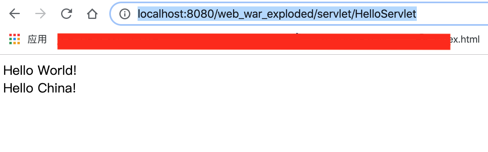
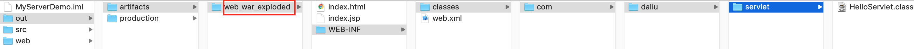
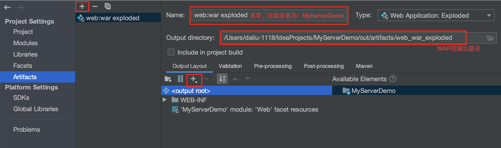
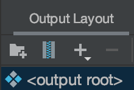
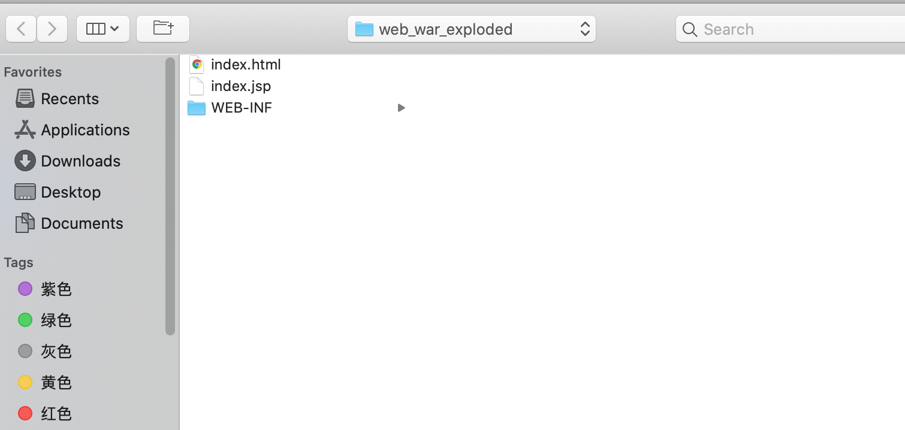
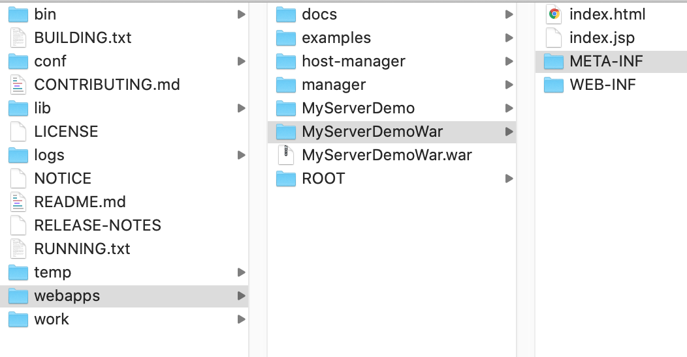

# Servlet示例

File > New > Project > Java Enterprise > 勾选 Create project from template

在src源代码目录下建一package: com.daliu.servlet并建HelloServlet.java

```java
// -- src/com.daliu.servlet.HelloServlet.java --

package com.daliu.servlet;

import javax.servlet.ServletException;
import javax.servlet.http.HttpServlet;
import javax.servlet.http.HttpServletRequest;
import javax.servlet.http.HttpServletResponse;
import java.io.IOException;
import java.io.PrintWriter;

public class HelloServlet extends HttpServlet {
    @Override
    protected void doGet(HttpServletRequest request, HttpServletResponse response) throws ServletException, IOException {
        // super.doGet(req, resp);
        // 设置request编码方式
        request.setCharacterEncoding("UTF-8");
        // 设置response编码方式
        response.setCharacterEncoding("UTF-8");
        // 设置文档类型
        response.setContentType("text/html");
        // 获取用于响应的打印输入字符流
        PrintWriter out = response.getWriter();
        // 输入到客户端
        out.println("<!DOCTYPE html>");
        out.println("<html>");
        out.println("<head>");
        out.println("   <title>DaLiu title</title>");
        out.println("</head>");
        out.println("<body>");
        out.println("   Hello World!<br />");
        out.println("   Hello China!");
        out.println("</body>");
        out.println("</html>");
    }
}
```

为了让这个Servlet得到运行，需要在描述文件web.xml中配置此Servlet，指定URL映射这个Servlet:

```xml
<!-- WEB-INF/web.xml -->
<?xml version="1.0" encoding="UTF-8"?>
<web-app xmlns="http://java.sun.com/xml/ns/javaee"
           xmlns:xsi="http://www.w3.org/2001/XMLSchema-instance"
           xsi:schemaLocation="http://java.sun.com/xml/ns/javaee
		  http://java.sun.com/xml/ns/javaee/web-app_4_0.xsd"
           version="4.0">
    <servlet>
        <servlet-name>HelloServlet</servlet-name>
        <servlet-class>com.daliu.servlet.HelloServlet</servlet-class>
    </servlet>
    
    <servlet-mapping>
        <servlet-name>HelloServlet</servlet-name>
        <url-pattern>/servlet/HelloServlet</url-pattern>
    </servlet-mapping>
</web-app>
```

上面的配置描述文件表示把映射/servlet/HelloServlet匹配到com.daliu.servlet.HelloServlet, Servlet写好了需要重启Tomcat，点IDEA上 Run > Run Tomcat 'x.x.x' with Coverage，然后打开浏览器输入：`http://localhost:8080/web_war_exploded/servlet/HelloServlet` 




### 手动布署

当然也可以手动布署，打开项目根目录/out/artifacts/web_war_exploded



把整个web_war_exploded放入tomcat_path/webapps下，重启Tomcat, 输入：http://localhost:8080/web_war_exploded/servlet/HelloServlet 会得到同样的效果。


### 获取表单内容

下面更新一下HelloServlet.java中的内容，当用户输入姓名是，点击提交，把姓名输出来：

```java
// -- src/com.daliu.servlet.HelloServlet.java --
package com.daliu.servlet;

import javax.servlet.ServletException;
import javax.servlet.http.HttpServlet;
import javax.servlet.http.HttpServletRequest;
import javax.servlet.http.HttpServletResponse;
import java.io.IOException;
import java.io.PrintWriter;

public class HelloServlet extends HttpServlet {
    @Override
    protected void doGet(HttpServletRequest request, HttpServletResponse response) throws ServletException, IOException {
        // super.doGet(req, resp);
        // 设置request编码方式
        request.setCharacterEncoding("UTF-8");
        // 设置response编码方式
        response.setCharacterEncoding("UTF-8");
        // 设置文档类型
        response.setContentType("text/html");
        // 获取用于响应的打印输入字符流
        PrintWriter out = response.getWriter();
        // 输入到客户端
        out.println("<!DOCTYPE html>");
        out.println("<html>");
        out.println("<head>");
        out.println("   <title>DaLiu title</title>");
        out.println("</head>");
        out.println("<body>");

        // 获取URI路径
        /**
         * <form action=[requestURI] method=post>
         *     <input type='submit' />
         * </form>
         *
         * 当在浏览器输入view-source:http://localhost:8080/web_war_exploded/servlet/HelloServlet时
         * request.requestURI即：/web_war_exploded/servlet/HelloServlet
         */
        String requestURI = request.getRequestURI(); // /web_war_exploded/servlet/HelloServlet
        out.println("<form action='" + requestURI + "' method='post'>");
        out.println("请输入你的名字：<input type='text' name='name' />");
        out.println("<input type='submit' />");
        out.println("</form>");

        String name = request.getParameter("name");
        if (name != null && name.trim().length() > 0) {
            out.println("您好，<b>" + name + "</b>. 欢迎来到Java Web世界.");
        }
        out.println("</body>");
        out.println("</html>");
        out.flush();
        out.close();
    }

    @Override
    protected void doPost(HttpServletRequest request, HttpServletResponse response) throws ServletException, IOException {
        // super.doPost(req, resp);
        this.doGet(request, response);
    }
}
```

浏览器访问此Servlet: `http://localhost:8080/web_war_exploded/servlet/HelloServlet` 当在输入框中输入"大刘"，点击提交：



显示网页源代码：

```html

<!DOCTYPE html>
<html>
<head>
   <title>DaLiu title</title>
</head>
<body>
<form action='/web_war_exploded/servlet/HelloServlet' method='post'>
请输入你的名字：<input type='text' name='name' />
<input type='submit' />
</form>
您好，<b>大刘</b>. 欢迎来到Java Web世界.
</body>
</html>
```

### 打war包

在普通的java程序时，我们可以通过打可执行jar包给到其他人，而java web中类似的叫war包，WAR的全称是Web Archieve, 下面我们通过IDEA打WAAR包并放入Tomcat中：

File > Project Structur > Artifacts > + Web Application: Archieve > 选择要打的war包：


然后选择Output Layout下面的+号 > Directory Content




完成后 Build > Build Artifacts... 这样就打成了WAR包，在上面的输出路径中找到这个WAR包，以刚打出的MyServerDemoWar.war为例，把它copy到Tomcat下的webapps下面，调用脚本重启Tomcat，Tomcat会自动解析它下面的war包：



在浏览器中键入：`http://localhost:8080/MyServerDemoWar/servlet/HelloServlet`

即可得到同样效果。


