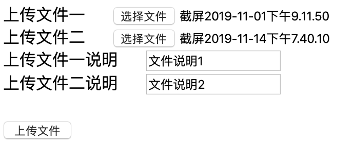
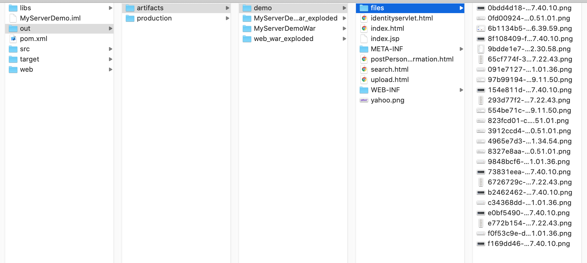

# 文件上传

FORM表单上传文件需要设置enctype属性为`multipart/form-data`使用二进制上传，如果不设置, enctype属性默认为application/x-www-form-urlencoded, 浏览器将使用ASCII向服务器发送数据，导致发送文件失败。

参见：Java Web整合开发王者归来p69   
代码参见：[](./ServletDemo/)

图片上传工具这里使用maven集成Apache的commons-fileupload：

```xml
<!--pom.xml-->
<?xml version="1.0" encoding="UTF-8"?>
<project xmlns="http://maven.apache.org/POM/4.0.0"
         xmlns:xsi="http://www.w3.org/2001/XMLSchema-instance"
         xsi:schemaLocation="http://maven.apache.org/POM/4.0.0 http://maven.apache.org/xsd/maven-4.0.0.xsd">
    <modelVersion>4.0.0</modelVersion>

    <groupId>groupId</groupId>
    <artifactId>MyServerDemo</artifactId>
    <version>1.0-SNAPSHOT</version>

    <!--
    原文链接：https://blog.csdn.net/xyh930929/article/details/78936611
    默认使用的是jdk1.5,如果要指定jdk的版本，需要在pom.xml文件中加入如下配置（修改jdk版本为1.8）
    <properties>
        <maven.compiler.source>1.8</maven.compiler.source>
        <maven.compiler.target>1.8</maven.compiler.target>
    </properties>
    -->
    <!-- https://mvnrepository.com/artifact/commons-fileupload/commons-fileupload -->

    <properties>
        <maven.compiler.source>1.8</maven.compiler.source>
        <maven.compiler.target>1.8</maven.compiler.target>
    </properties>

    <dependencies>
        <!-- https://mvnrepository.com/artifact/commons-fileupload/commons-fileupload -->
        <dependency>
            <groupId>commons-fileupload</groupId>
            <artifactId>commons-fileupload</artifactId>
            <version>1.4</version>
        </dependency>
    </dependencies>
</project>
```

```html
// -- upload.html --
<!DOCTYPE html>
<html lang="en">
<head>
    <meta charset="UTF-8">
    <title>文件上传示例</title>
</head>
<body>
<form action="servlet/UploadSevlet" enctype="multipart/form-data" method="post">
    <div align="center">
        <div align="left">上传文件一&nbsp;&nbsp;&nbsp;&nbsp;
            <input type="file" name="file1" />
        </div>
        <div align="left">上传文件二&nbsp;&nbsp;&nbsp;&nbsp;
            <input type="file" name="file2" />
        </div>
        <div align="left">上传文件一说明&nbsp;&nbsp;&nbsp;&nbsp;
            <input type="text" name="description1" />
        </div>
        <div align="left">上传文件二说明&nbsp;&nbsp;&nbsp;&nbsp;
            <input type="text" name="description2" />
        </div>
    </div>
    <br/>
    <input type="submit" value=" 上传文件 " />
</form>
</body>
</html>
```

```java
package com.daliu.servlet;

import org.apache.commons.fileupload.FileItem;
import org.apache.commons.fileupload.disk.DiskFileItemFactory;
import org.apache.commons.fileupload.servlet.ServletFileUpload;

import javax.servlet.ServletException;
import javax.servlet.http.HttpServlet;
import javax.servlet.http.HttpServletRequest;
import javax.servlet.http.HttpServletResponse;
import java.io.File;
import java.io.IOException;
import java.io.PrintWriter;
import java.util.List;
import java.util.UUID;

/**
 * 这里使用Apache的commons-fileupload工具，可以手动拖入项目(按习惯放入WEB-INF/lib中)并右键Add As Library
 * https://mvnrepository.com/artifact/commons-fileupload/commons-fileupload/1.3.2
 * 使用方法参考：https://www.cnblogs.com/jimisun/p/9419269.html
 * https://blog.csdn.net/sun8112133/article/details/79968573
 */
public class UploadServlet extends HttpServlet {
    @Override
    protected void doGet(HttpServletRequest request, HttpServletResponse response) throws ServletException, IOException {
        request.setCharacterEncoding("UTF-8");
        response.setCharacterEncoding("UTF-8");
        PrintWriter out = response.getWriter();
        out.println("请以POST方式上传文件");
        out.flush();
        out.close();
    }

    private void handleFormField(PrintWriter out, FileItem item) {
        // 获取普通数据项中的name值
        String fieldName = item.getFieldName();

        // 获取普通数据项中的value
        String value = "";
        try {
            value = item.getString("utf-8"); // 以 utf-8的编码格式来解析 value值
        } catch (Exception ex) {
            ex.printStackTrace();
        }
        writeLine(out, fieldName, value);
    }

    private void handleFileField(PrintWriter out, FileItem item) {
        // 获取文件数据项中的文件名
        String fileName = item.getName();
        if (fileName == null || fileName.equals("")) {
            writeLine(out, "error", "无文件名");
            return;
        }
        // 控制只能上传图片
        if (!item.getContentType().startsWith("image")) {
            writeLine(out, "error", "只支持图片上传");
            return;
        }
        writeLine(out, fileName, item.getSize() + " 字节");
        // 保存上传过来的文件
        // 这个files路径是和WEB-INF同一级目录
        String path = this.getServletContext().getRealPath("/files");
        // /Users/daliu-macbook/Documents/.../ServletDemo/out/artifacts/demo/files
        System.out.println("context path: " + path);
        File dir = new File(path);
        if (!dir.exists()) {
            // 创建/files目录
            dir.mkdir();
        }
        String child = UUID.randomUUID() + "_" + fileName;
        File saveFile = new File(dir.toString(), child);
        try {
            item.write(saveFile);
        } catch (Exception ex) {
            writeLine(out, "保存文件异常", saveFile.toString());
            ex.printStackTrace();
        }
        // /Users/daliu-macpro/Documents/...ServletDemo/out/artifacts/demo/filese
        writeLine(out, "成功保存文件：", path + "/" + child);
    }

    private void writeLine(PrintWriter out, String key, String value) {
        out.println("<p>" + " " + key + " : " + value + " </p>");
    }

    @Override
    protected void doPost(HttpServletRequest request, HttpServletResponse response) throws ServletException, IOException {
        // 使用传统的Servlet上传的时候我们可以使用req.getInputStream()来获取文件上传的流，
        // 我们在获取到这个流之后需要手动的针对这个流进行特殊处理去掉流中不必要的开始和结束内容，才能真正的获取到流的内容
        // 这里使用Apache的commons-fileupload操作
        request.setCharacterEncoding("UTF-8");
        response.setCharacterEncoding("UTF-8");
        response.setContentType("text/html");
        PrintWriter out = response.getWriter();
        out.println("<html>");
        out.println("<head>"
                        + "<meta charset=\"UTF-8\">"
                        + "<title>Request servlet</title>" +
                    "</head>");
        out.println("<body>");
        out.println("<p>" + "知道了" + "</p>");
        File file1 = null, file2 = null;
        String description1 = null, description2 = null;
        if (ServletFileUpload.isMultipartContent(request)) {
            // 表单配置了enctype, 值为"multipart/form-data"才能进行文件上传的操作
            // 创建文件上传核心组件
            DiskFileItemFactory factory = new DiskFileItemFactory();
            ServletFileUpload upload = new ServletFileUpload(factory);
            upload.setHeaderEncoding("UTF-8");
            List<FileItem> fileItemList = null;
            try {
                fileItemList = upload.parseRequest(request);
            } catch (Exception ex) {
                System.out.println("parseRequest exception:");
                ex.printStackTrace();
            }
            for (FileItem fileItem : fileItemList) {
                if (fileItem.isFormField()) { // 如果是一个普通表单项
                    this.handleFileField(out, fileItem);
                }
                else {
                    // 保存文件
                    this.handleFileField(out, fileItem);
                }
            }
        }
        else {
            out.println("请配置enctype为multipart/form-data");
        }
        out.println("</body>");
        out.println("</html>");
        out.flush();
        out.close();
    }
}
```



