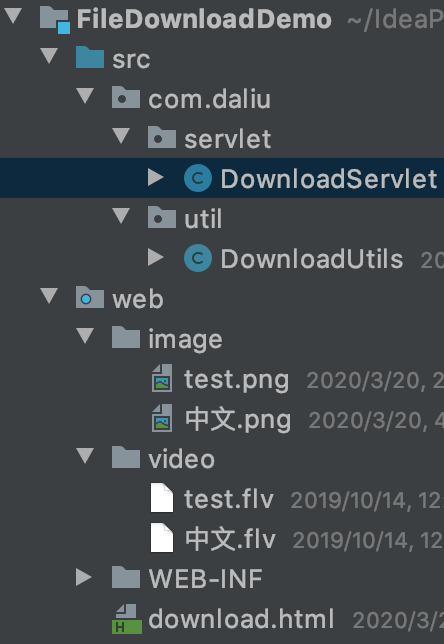

# 文件下载



**download.html**

```html
<!DOCTYPE html>
<html lang="en">
<head>
    <meta charset="UTF-8">
    <title>Title</title>
</head>
<body>
    <!-由于浏览器可以识别展开图片, 因此这种写法直接在浏览器内打开图片-->
    <a href="/demo/image/test.png">图片 1</a>
    <!--一般浏览器会下载视频格式的文件或自动弹出dialog以供选择-->
    <a href="/demo/video/test.flv">视频 1</a><br/>

    <hr />

    <!--
    使用响应头content-disposition设置资源的打开方式:
        content-disposition:attachment;filename=xxx
    -->
    <a href="/demo/downloadServlet?filepath=image/test.png">图片 1</a>
    <a href="/demo/downloadServlet?filepath=video/test.flv">视频 1</a>
</body>
</html>
```

**com.daliu.servlet.DownloadServlet.java**  

```java
package com.daliu.servlet;

import com.daliu.util.DownloadUtils;

import javax.servlet.ServletContext;
import javax.servlet.ServletException;
import javax.servlet.ServletOutputStream;
import javax.servlet.annotation.WebServlet;
import javax.servlet.http.HttpServlet;
import javax.servlet.http.HttpServletRequest;
import javax.servlet.http.HttpServletResponse;
import java.io.FileInputStream;
import java.io.IOException;
import java.net.URLEncoder;

@WebServlet("/downloadServlet")
public class DownloadServlet extends HttpServlet {
    @Override
    protected void doGet(HttpServletRequest request, HttpServletResponse response) throws ServletException, IOException {
        doPost(request, response);
    }

    @Override
    protected void doPost(HttpServletRequest request, HttpServletResponse response) throws ServletException, IOException {
        String filename = request.getParameter("filename");
        // 找到文件的服务器路径, 读进内存
        ServletContext context = getServletContext();
        String realPath = context.getRealPath(filename);
        FileInputStream fis = new FileInputStream(realPath);

        String mimeType = context.getMimeType(filename);

        // 设置response的响应头
        // response.setHeader("content-type", mimeType);
        response.setContentType(mimeType);
        System.out.println("origin filename: " + filename);
        // 如果文件名中中文, 且不做处理: 那么Chrome下载为image__.png, video__.flv
        // 解决中文文件名问题
        String agent = request.getHeader("user-agent");
        System.out.println("encode filename: " + DownloadUtils.getFileName(agent, filename));
        response.setHeader("content-disposition", "attachment;filename=" + DownloadUtils.getFileName(agent, filename));
        //这里filename是弹出提示框的名字
        // 经试验, Chrome浏览器没有弹框, 而是直接下载, 下载的文件名为: image_test.png, 下载的视频为 video_test.flv
        // 将输入流的数据写出到输出流中
        ServletOutputStream outputStream = response.getOutputStream();
        byte[] buff = new byte[1024*8];
        int readLen = 0;
        while ((readLen = fis.read(buff)) != -1) {
            outputStream.write(buff, 0, readLen);
        }
        fis.close();
        outputStream.close();
    }
}
```

**com.daliu.servlet.DownloadUtils.java**  
```java
package com.daliu.util;

import sun.misc.BASE64Encoder;

import java.io.UnsupportedEncodingException;
import java.net.URLEncoder;

public class DownloadUtils {
    public static String getFileName(String agent, String filename) throws UnsupportedEncodingException {
        if (agent.contains("MSIE")) {
            // IE浏览器
            filename = URLEncoder.encode(filename, "utf-8");
        } else if (agent.contains("Firefox")) {
            BASE64Encoder base64Encoder = new BASE64Encoder();
            filename = "=?utf-8B?" + base64Encoder.encode(filename.getBytes("utf-8")) + "?=";
        } else {
            filename = URLEncoder.encode(filename, "utf-8");
        }
        return filename;
    }
}
```

