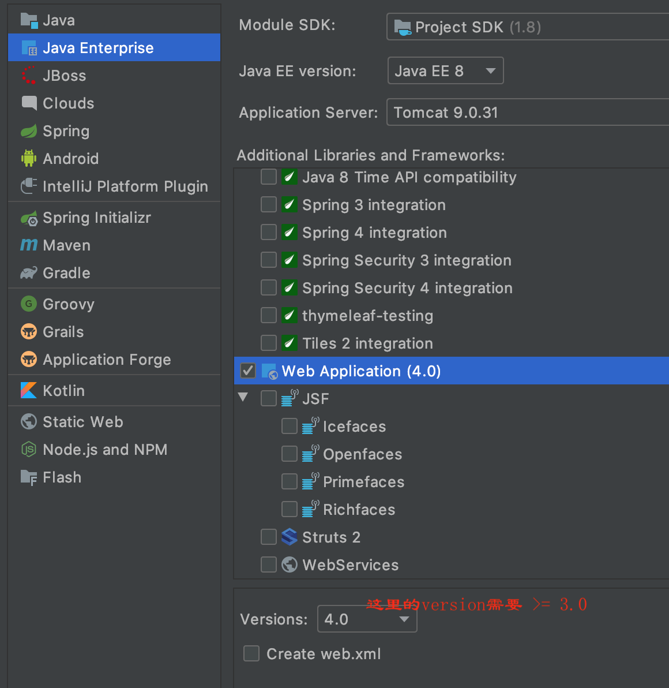

# 注解配置

Servlet3.0之后, 可以使用注解配置Servlet  

1. 创建JavaEE项目, 选择Servlet3.0版本或以上, 可以不创建web.xml
2. 定义一个类实现Servlet接口并复写方法
3. 在类上使用`@WebServlet`注解配置  



```java
package com.daliu.web;

import javax.servlet.*;
import javax.servlet.annotation.WebServlet;
import java.io.IOException;

@WebServlet(urlPatterns = "/demo") 
// 可以配置多个路径: urlPatterns = {"/demo1", "demo2", "demo3"}
// 也可以: @WebServlet(value = "/demo")
// 也可以: @WebServlet("/demo")
/**
注: 路径的配置规则:
  /xxx
  /xxx/yyy
  /xxx/*
  /* 匹配一切
  *.do 以.do结尾的请求, /*.do不合法
*/ 
public class CustomServlet implements Servlet {
    @Override
    public void init(ServletConfig servletConfig) throws ServletException {

    }

    @Override
    public ServletConfig getServletConfig() {
        return null;
    }

    @Override
    public void service(ServletRequest servletRequest, ServletResponse servletResponse) throws ServletException, IOException {
        System.out.println("service is called!");
        servletResponse.getWriter().println("hello world!");
    }

    @Override
    public String getServletInfo() {
        return null;
    }

    @Override
    public void destroy() {

    }
}
```

IDEA修改Code template: 
Editor > File and Code Template > Other > Web > Servlet Annotated Class