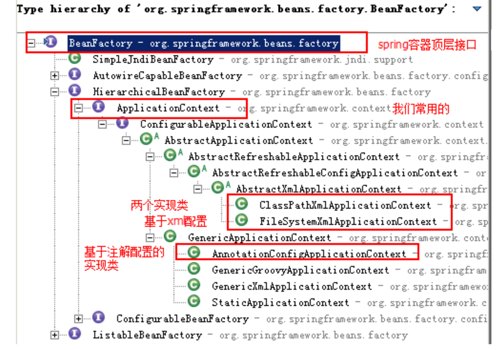
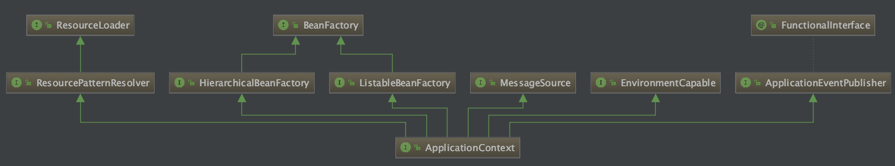
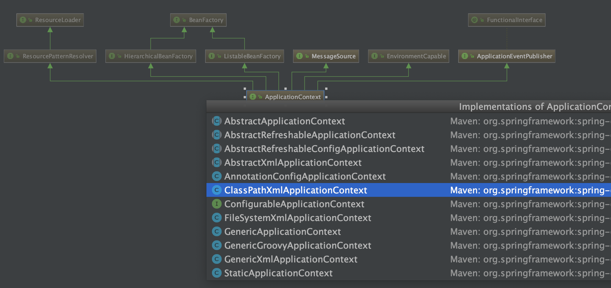

# HelloWorld

```xml
<!-- pom.xml -->
<!--官方文档：https://docs.spring.io/spring/docs/5.2.2.RELEASE/spring-framework-reference/core.html#spring-core -->
<?xml version="1.0" encoding="UTF-8"?>
<project xmlns="http://maven.apache.org/POM/4.0.0"
         xmlns:xsi="http://www.w3.org/2001/XMLSchema-instance"
         xsi:schemaLocation="http://maven.apache.org/POM/4.0.0 http://maven.apache.org/xsd/maven-4.0.0.xsd">
    <modelVersion>4.0.0</modelVersion>

    <groupId>com.daliu</groupId>
    <artifactId>springDemo</artifactId>
    <version>1.0-SNAPSHOT</version>
    <packaging>jar</packaging>

    <dependencies>
        <dependency>
            <groupId>org.springframework</groupId>
            <artifactId>spring-context</artifactId>
            <version>5.0.2.RELEASE</version>
        </dependency>
    </dependencies>
</project>
```

```xml
<!--resources/bean.xml-->
<?xml version="1.0" encoding="UTF-8"?>
<beans xmlns="http://www.springframework.org/schema/beans"
       xmlns:xsi="http://www.w3.org/2001/XMLSchema-instance"
       xsi:schemaLocation="http://www.springframework.org/schema/beans
        https://www.springframework.org/schema/beans/spring-beans.xsd">
    <bean id="hello" class="com.daliu.Hello"></bean>
</beans>
```

```java
// -- com.daliu.Hello.java
package com.daliu;

import org.springframework.context.ApplicationContext;
import org.springframework.context.support.ClassPathXmlApplicationContext;

public class Hello {
    public void sayHello() {
        System.out.println("Hello world!");
    }

    public static void main(String[] args) {
        ApplicationContext context = new ClassPathXmlApplicationContext("bean.xml");
        // Hello hello = (Hello) context.getBean("hello");
        Hello hello = context.getBean("hello", Hello.class);
        hello.sayHello();
    }
}
```

ApplicationContext的实现类:  



右键ApplicationContext > Diagrams > Show Diagrams 可以看到ApplicationContext接口继承了其他接口:  



然后再右键ApplicationContext > Show Implements 可以看到它的实现类:  



其中ApplicationContext的常用实现类有三个:  

- ClassPathXmlApplicationContext: 可以加载类路径下的配置文件
- FileSystemXmlApplicationContext: 可以加载磁盘任意路径下的配置文件(注意需要获取文件访问权限)
- AnnotationConfigApplicationContext: 读取注解创建容器

使用FileSystemXmlApplicationContext示例:   

```java
ApplicationContext context = new FileSystemXmlApplicationContext("file:///Users/liuweizhen/Documents/mygit/gitbook-daliu-javaweb/Spring/springDemo/src/main/resources/bean.xml");
```

但是这种方式并不推荐使用.    


