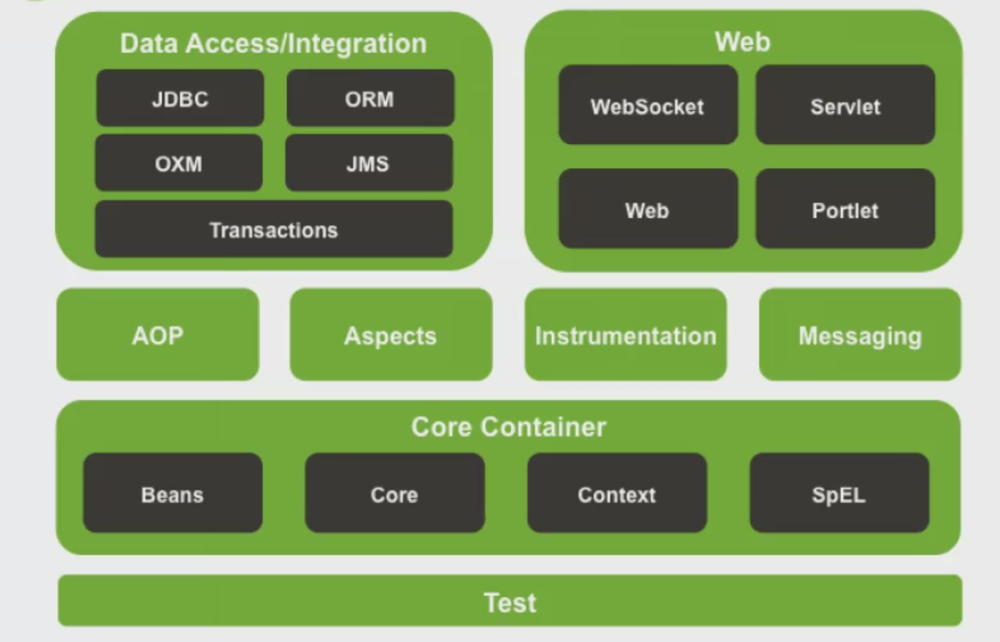

# Spring

Spring(官网: spring.io)是一个轻量级开源框架, 核心思想是:  
1. Ioc: Inverse Of Control: 反转控制
2. AOP: Aspect Oriented Programming: 面向切面编程

并且提供了展现层Spring MVC和持久层Spring  JDBC以及业务层事务管理等众多的企业级应用技术, 还能整合开源世界众多著名的第三方框架和类库.   



### 控制反转

控制反转IoC(Inversion of Control)也可以理解成控制转化, 即把创建对象的权利交给框架, 是框架的重要特性,并非是面向对象的专用术语. 它包括依赖注入(Dependency Injection, 简称DI)和依赖查找(Dependency Lookup)  

按这个思想简单实现一个IOC的示例:  

```java
public class AccountServiceImpl implements IAccountService {
    // private IAccountDao accountDao = new AccountDaoImpl();
    private IAccountDao accountDao = (IAccountDao) BeanFactory.getBean("accountDao"); // 创建对象accountDao的能力交给了工厂类BeanFactory
}
```

```java

/**
 * 创建bean对象的工厂
 * 创建service和dao对象
 *
 * 1. 需要配置文件配置service和dao
 * 2. 通过读取配置文件，反射创建对象
 */
public class BeanFactory {
    private static Properties props;

    // 定义一个Map，用于存放我们要创建的对象，称之为容器
    private static Map<String, Object> beans;

    static {
        try {
            props = new Properties();
            // InputStream in = new FileInputStream()
            InputStream in = BeanFactory.class.getClassLoader().getResourceAsStream("bean.properties");
            props.load(in);
            beans = new HashMap<String, Object>();
            // 取出配置文件中的所有key, 得到枚举对象
            Enumeration keys = props.keys();
            while (keys.hasMoreElements()) {
                String key = keys.nextElement().toString();
                String beanPath = props.getProperty(key);
                Object value = Class.forName(beanPath).newInstance();
                beans.put(key, value);
            }
        }
        catch (Exception ex) {
            throw new ExceptionInInitializerError("初始化properties失败");
        }
    }

    /**
     * 根据bean的名称获取bean对象
     * @param beanName
     * @return
     */
    public static Object getBean(String beanName) {
        return beans.get(beanName);
    }
}
```

```
-- beans.properties --
accountService=com.daliu.service.impl.AccountServiceImpl
accountDao=com.daliu.dao.imp.AccountDaoImpl
```


