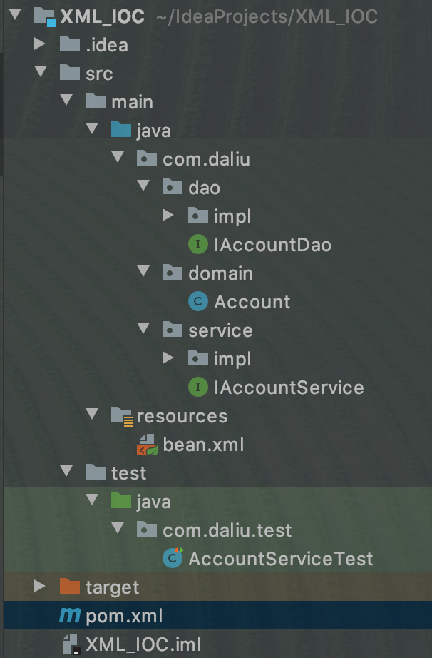

# 基于XML的IOC案例

Demo示例：`./demos/XML_IOC`



**pom.xml**
```xml
<?xml version="1.0" encoding="UTF-8"?>
<project xmlns="http://maven.apache.org/POM/4.0.0"
         xmlns:xsi="http://www.w3.org/2001/XMLSchema-instance"
         xsi:schemaLocation="http://maven.apache.org/POM/4.0.0 http://maven.apache.org/xsd/maven-4.0.0.xsd">
    <modelVersion>4.0.0</modelVersion>

    <groupId>com.daliu</groupId>
    <artifactId>XML_IOC</artifactId>
    <version>1.0-SNAPSHOT</version>

    <packaging>jar</packaging>

    <dependencies>
        <dependency>
            <groupId>org.springframework</groupId>
            <artifactId>spring-context</artifactId>
            <version>5.0.2.RELEASE</version>
        </dependency>
        <dependency>
            <groupId>commons-dbutils</groupId>
            <artifactId>commons-dbutils</artifactId>
            <version>1.4</version>
        </dependency>
        <dependency>
            <groupId>mysql</groupId>
            <artifactId>mysql-connector-java</artifactId>
            <version>8.0.13</version>
        </dependency>
        <dependency>
            <groupId>c3p0</groupId>
            <artifactId>c3p0</artifactId>
            <version>0.9.1.2</version>
        </dependency>
        <dependency>
            <groupId>junit</groupId>
            <artifactId>junit</artifactId>
            <version>4.12</version>
        </dependency>
    </dependencies>
</project>
```

**com.daliu.dao.IAccountDao.java**

```java
package com.daliu.dao;

import com.daliu.domain.Account;

import java.util.List;

/**
 * 帐户持久层接口
 */
public interface IAccountDao {
    /// 查询所有
    List<Account> findAllAccount();
    /// 查询一个
    Account findAccountById(Integer accountId);
    /// 保存
    void saveAccount(Account account);
    /// 更新
    void updateAccount(Account account);
    /// 删除
    void deleteAccount(Integer accountId);
}
```

**com.daliu.dao.impl.AccountDaoImpl.java**
```java
package com.daliu.dao.impl;

import com.daliu.dao.IAccountDao;
import com.daliu.domain.Account;
import org.apache.commons.dbutils.QueryRunner;
import org.apache.commons.dbutils.handlers.BeanHandler;
import org.apache.commons.dbutils.handlers.BeanListHandler;

import java.util.List;

/**
 * 帐户的持久层实现类
 */
public class AccountDaoImpl implements IAccountDao {
    private QueryRunner runner;

    public void setRunner(QueryRunner runner) {
        this.runner = runner;
    }

    public List<Account> findAllAccount() {
        try {
            return runner.query("select * from account", new BeanListHandler<Account>(Account.class));
        } catch (Exception e) {
            throw new RuntimeException(e);
        }
    }

    public Account findAccountById(Integer accountId) {
        try {
            return runner.query("select * from account where id = ?", new BeanHandler<Account>(Account.class), accountId);
        } catch (Exception e) {
            throw new RuntimeException(e);
        }
    }

    public void saveAccount(Account account) {
        try {
            runner.update("insert into account(name, money) values(?,?)", account.getName(), account.getMoney());
        } catch (Exception e) {
            throw new RuntimeException(e);
        }
    }

    public void updateAccount(Account account) {
        try {
            runner.update("update account set name=?, money=? where id=?", account.getName(), account.getMoney(), account.getId());
        } catch (Exception e) {
            throw new RuntimeException(e);
        }
    }

    public void deleteAccount(Integer accountId) {
        try {
            runner.update("delete from account where id=?", accountId);
        } catch (Exception e) {
            throw new RuntimeException(e);
        }
    }
}
```

**com.daliu.domain.Account.java**
```java
package com.daliu.domain;

import java.io.Serializable;

/**
 * 帐户的实体类
 */
public class Account implements Serializable {
    private Integer id;
    private String name;
    private Float money;

    public Integer getId() {
        return id;
    }

    public void setId(Integer id) {
        this.id = id;
    }

    public String getName() {
        return name;
    }

    public void setName(String name) {
        this.name = name;
    }

    public Float getMoney() {
        return money;
    }

    public void setMoney(Float money) {
        this.money = money;
    }

    @Override
    public String toString() {
        return "Account{" +
                "id=" + id +
                ", name='" + name + '\'' +
                ", money=" + money +
                '}';
    }
}
```

**com.daliu.service.IAccountService.java**
```java
package com.daliu.service;

import com.daliu.domain.Account;

import java.util.List;

/**
 * 帐户的业务层接口
 */
public interface IAccountService {
    /// 查询所有
    List<Account> findAllAccount();
    /// 查询一个
    Account findAccountById(Integer accountId);
    /// 保存
    void saveAccount(Account account);
    /// 更新
    void updateAccount(Account account);
    /// 删除
    void deleteAccount(Integer accountId);
}
```

**com.daliu.service.impl.AccountService.java**
```java
package com.daliu.service.impl;

import com.daliu.dao.IAccountDao;
import com.daliu.domain.Account;
import com.daliu.service.IAccountService;

import java.util.List;

/**
 * 帐户业务层实现类
 */
public class AccountServiceImpl implements IAccountService {
    /// 业务层调用持久层
    private IAccountDao accountDao;

    public void setAccountDao(IAccountDao accountDao) {
        this.accountDao = accountDao;
    }

    public List<Account> findAllAccount() {
        return accountDao.findAllAccount();
    }

    public Account findAccountById(Integer accountId) {
        return accountDao.findAccountById(accountId);
    }

    public void saveAccount(Account account) {
        accountDao.saveAccount(account);
    }

    public void updateAccount(Account account) {
        accountDao.updateAccount(account);
    }

    public void deleteAccount(Integer accountId) {
        accountDao.deleteAccount(accountId);
    }
}
```

**resources/bean.xml**
```xml
<?xml version="1.0" encoding="UTF-8"?>
<beans xmlns="http://www.springframework.org/schema/beans"
       xmlns:xsi="http://www.w3.org/2001/XMLSchema-instance"
       xsi:schemaLocation="
        http://www.springframework.org/schema/beans
        https://www.springframework.org/schema/beans/spring-beans.xsd">
    <bean id="accountService" class="com.daliu.service.impl.AccountServiceImpl">
        <!--注入dao对象-->
        <property name="accountDao" ref="accountDao"></property>
    </bean>

    <bean id="accountDao" class="com.daliu.dao.impl.AccountDaoImpl">
        <property name="runner" ref="runner"></property>
    </bean>

    <!--这里配置成prototype-->
    <bean id="runner" class="org.apache.commons.dbutils.QueryRunner" scope="prototype">
        <!--注入数据源-->
        <constructor-arg name="ds" ref="dataSource">
        </constructor-arg>
    </bean>

    <!--配置数据源-->
    <bean id="dataSource" class="com.mchange.v2.c3p0.ComboPooledDataSource">
        <!--注入连接数据库的必备信息-->
<!--        <bean id="dataSource" class="com.mchange.v2.c3p0.ComboPooledDataSource">-->
<!--            &lt;!&ndash;注入连接数据库的必备信息&ndash;&gt;-->
<!--            <property name="driverClass" value="com.mysql.jdbc.Driver"></property>-->
<!--            <property name="jdbcUrl" value="jdbc:mysql://localhost:3306/daliu"></property>-->
<!--            <property name="user" value="root"></property>-->
<!--            <property name="password" value="daliu8807"></property>-->
<!--        </bean>-->
        <!--spring中共有5个特殊字符
        <   &lt;
        >   &gt;
        &   &amp;
        "   &quot;
        '   &apos;
        -->
        <property name="driverClass" value="com.mysql.cj.jdbc.Driver"></property>
        <property name="jdbcUrl" value="jdbc:mysql://localhost:3306/daliu?characterEncoding=utf-8&amp;useSSL=false&amp;serverTimezone=UTC"></property>
        <property name="user" value="root"></property>
        <property name="password" value="daliu8807"></property>
    </bean>
</beans>
```

**test/java/com.daliu.test.AccountServiceTest.java**
```java
package com.daliu.test;

import com.daliu.domain.Account;
import com.daliu.service.IAccountService;
import org.junit.Test;
import org.springframework.context.ApplicationContext;
import org.springframework.context.support.ClassPathXmlApplicationContext;

import java.util.List;

/**
 * 使用Junit单元测试测试
 */
public class AccountServiceTest {
    public IAccountService getAccountService() {
        ApplicationContext context = new ClassPathXmlApplicationContext("bean.xml");
        IAccountService accountService = context.getBean("accountService", IAccountService.class);
        return accountService;
    }

    @Test
    public void testFindAll() {
        IAccountService as = this.getAccountService();
        List<Account> accounts = as.findAllAccount();
        for (Account account : accounts) {
            System.out.println(account);
        }
    }

    @Test
    public void testFindOne() {
        IAccountService as = this.getAccountService();
        Account account = as.findAccountById(1);
        System.out.println(account);
    }

    @Test
    public void testSave() {
        IAccountService as = this.getAccountService();
        Account account = new Account();
        account.setName("大刘");
        account.setMoney(100F);
        as.saveAccount(account);
    }

    @Test
    public void testUpdate() {
        IAccountService as = this.getAccountService();
        Account account = as.findAccountById(1);
        account.setMoney(23456F);
        as.updateAccount(account);
    }

    @Test
    public void testDelete() {
        IAccountService as = this.getAccountService();
        as.deleteAccount(4);
    }
}
```