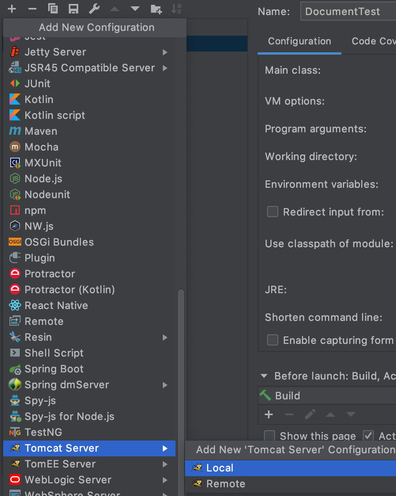
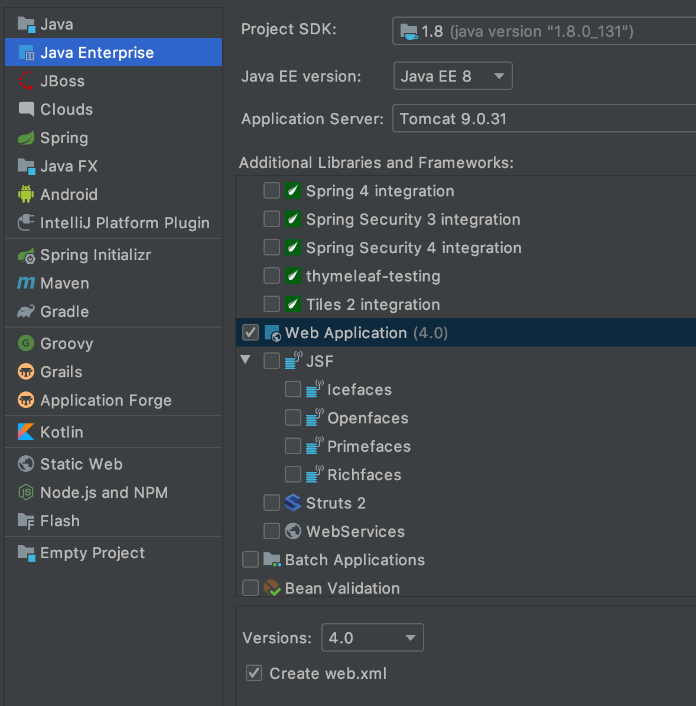

# IDEA集成Tomcat

### 1. 指定Tomcat路径 
Run > Edit Configurations... > 点"+"(Add New Configuration) > Tomcat > Local
然后在配置面板中配置Tomcat的路径, Application server, 比如我配置的是: Users/liuweizhen/Library/Tomcat/apache-tomcat-9.0.31

  

### 2. 创建Web项目  

File > New > Module > Java Enterprise 或者 File > New > Project > Java Enterprise   
注意勾选Web Application和下面的Create web.xml  

  

### 3. 配置虚拟路径Application context
Run > Edit Configurations... > Deployment > Application context, 键入虚拟路径, 比如输入hello, 那么访问web目录下的1.html就是: `http://localhost:8080/hello/1.html`,  如果键入的是`/`, 则访问就变成了:  `http://localhost:8080/1.html`  
注: 如果新增了一个2.html并且访问, 需要重启Tomcat, 除非设置了热部署

### 4. 配置热部署  
Edit Configurations... > Server > On 'Update' action 选择 Update resources, On frame deactivation 选择 Update resources   

注: 如果选择了Update classes and resources, 那么Java代码发生变化后也会重新部署  