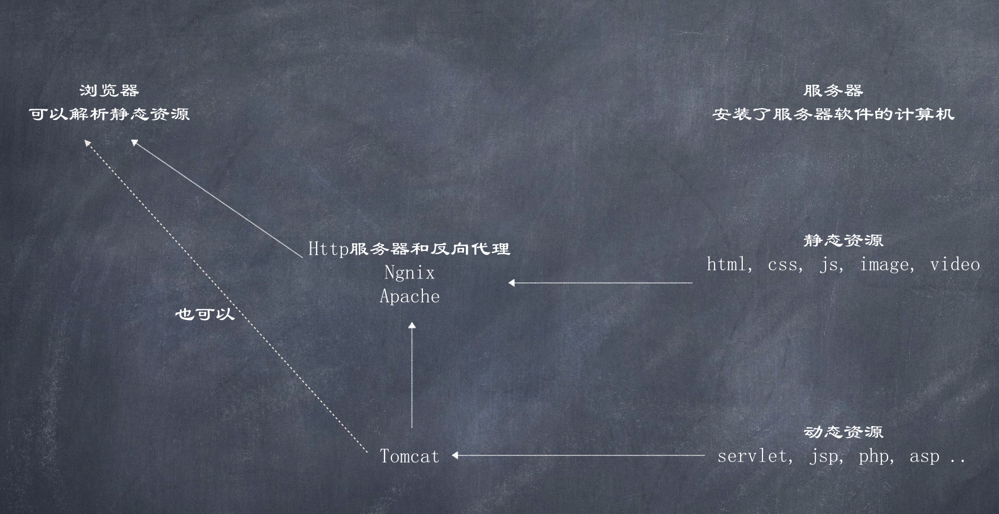

# Tomcat

Tomcat是一款免费的web服务器软件

所以服务器是指安装了服务器软件的计算机, 比如: 
- MySQL服务器即安装MySQL软件的计算机, 连接上MySQL后可以使用MySQL提供的CRUD等操作; 
- Web服务器即安装了Web服务器软件的计算机, 可以使用Web服务器部署web项目, 让用户通过浏览器访问这些项目

对于动态资源, 必须有相应的Web服务器识别

一些常见的Web服务器软件
- webLogic: 属Oracle公司,  支持所有的JavaEE规范, 大型的JavaEE服务器, 收费
- webSphere: 属IBM公司,  支持所有的JavaEE规范, 大型的JavaEE服务器, 收费
- JBOSS: 属JBOSS公司,  支持所有的JavaEE规范, 大型的JavaEE服务器, 收费
- TomCat: 属Apache基金组织, 中小型JavaEE服务器, 不支持全部JavaEE规范, 开源免费

JavaEE: Java语言在企业级开发中使用的技术规范的总和, 一共规定了13项大的规范

