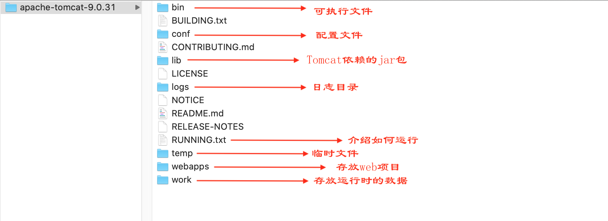

# 安装和使用

以Mac OS机为例

#### 下载和启动Tomcat

1. 下载: 在[这里](https://tomcat.apache.org/download-90.cgi)下载Tomcat, Mac/Linux下载 Core > tar.gz(pgp, sha512) 
2. 解压到指定目录: `open ~/Library`, 把解压后的Tomcat源码放入，比如我放的目录：`/Users/liuweizhen/Library/Tomcat/apache-tomcat-9.0.31`  注: 建议不要有中文和空格
3. 进入bin目录更改启动脚本权限: `cd /Users/liuweizhen/Library/Tomcat/apache-tomcat-9.0.31/bin`，更改sh脚本权限：`sudo chmod 755 *.sh`
4. 启动Tomcat: `sudo ./startup.sh`(windows是双击startup.sh)
5. 测试: 可以打开浏览器 输入:
   -  `localhost:8080` or
   -  `127.0.0.1:8080` or
   -  `内网地址, 比如192.168.1.5`, MAC可通过偏好设置>网络查看, windows通过`ipconfig`查看, Linux通过`ifconfig`查看
5. 关闭Tomcat: 进入bin目录`./shutdown.sh`(windows是shutdown.bat)
6. 卸载Tomcat: 把Tomcat目录删除

```
➜  bin ./startup.sh
Using CATALINA_BASE:   /Users/liuweizhen/Library/Tomcat/apache-tomcat-9.0.31
Using CATALINA_HOME:   /Users/liuweizhen/Library/Tomcat/apache-tomcat-9.0.31
Using CATALINA_TMPDIR: /Users/liuweizhen/Library/Tomcat/apache-tomcat-9.0.31/temp
Using JRE_HOME:        /Library/Java/JavaVirtualMachines/jdk1.8.0_131.jdk/Contents/Home
Using CLASSPATH:       /Users/liuweizhen/Library/Tomcat/apache-tomcat-9.0.31/bin/bootstrap.jar:/Users/liuweizhen/Library/Tomcat/apache-tomcat-9.0.31/bin/tomcat-juli.jar
Tomcat started.
```



### 修改端口号   
如果Tomcat端口号8080被别的进程占用, 可以杀掉别的进程然后再启动Tomcat, 也可以修改Tomcat的端口号: 
- 打开 conf/server.xml
- 编辑端口port的值
```xml
<Connector port="8080" protocol="HTTP/1.1"
               connectionTimeout="20000"
               redirectPort="8443" />
```
有时候会把端口号8080改成80, 因为80是http协议的默认端口, 这样输入网址时可省略端口号.  


Tomcat的端口默认是8080，可以在`tomcat-path/conf/server.xml`中配置：

```xml
<Connector port="8080" protocol="HTTP/1.1" connectionTimeout="20000" redirectPort="8443" />
```

### 运行Tomcat

由于Tomcat运行在本机上，因此可以使用如下方式访问：

- http://localhost:8080
- http://127.0.0.1:8080
- 使用本机IP访问，在MAC OS中通过偏好设置 > 网络中找到IP地址，比如：http://30.16.106.36:8080
- 如果有域名指向该服务器，可以使用域名访问

### 设置虚拟主机

在Tomcat中可以设置虚拟主机，即多个不同域名的网站共存于同一个Tomcat中，修改 `tomcat-path/conf/server.xml`

```xml
<Engine>
    <Host name="www.baidu.comg" appBase="webapps/ren" />
    <Host name="www.google.com" appBase="webapps/stimpy" />
</Engine>
```