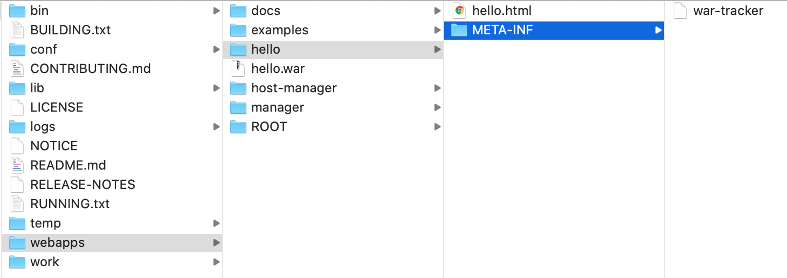
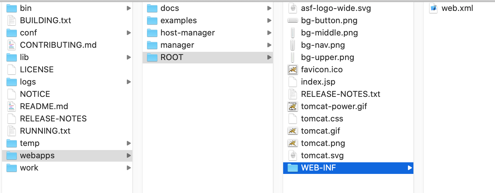
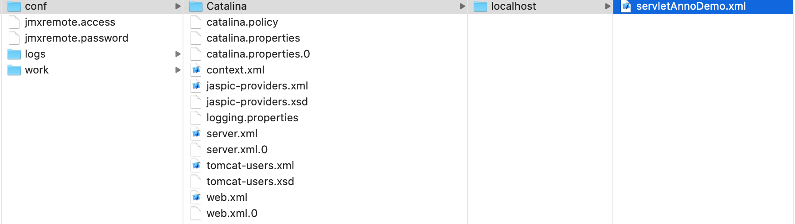
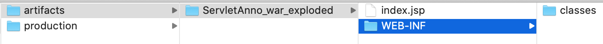

# 部署项目

部署项目方式一般有三种

### 第1种. 直接将项目放到Tomcat的webapp目录下  
比如新建一文件夹hello, 并在此文件夹中新建hello.html: 

```html
<html>
    <head>
        <meta charset="UTF-8"/>
        <title>大刘测试</title>
    </head>
    <body>
    	<font color="red">Hello World!</font>
    </body>
</html>
```

然后在浏览器键入: `http://localhost:8080/hello/hello.html`即可.  

也可以打war包, 比如把上面hello.html压缩并改为hello.war, 然后放在webapps目录下, Tomcat会自动在webapps目录下生成hello目录, 并解压hello.war内容放置于hello目录内, 并且会生成一些辅助文件  
 
这样依然可以访问: `http://localhost:8080/hello/hello.html`
删除项目时只需要删除hello.war, Tomcat会自动也把hello目录删除  

### 第二2种. 配置conf/server.xml, 添加Context

```xml
<Host name="localhost"  appBase="webapps"
            unpackWARs="true" autoDeploy="true">
  <Valve className="org.apache.catalina.valves.AccessLogValve" directory="logs"
         prefix="localhost_access_log" suffix=".txt"
         pattern="%h %l %u %t &quot;%r&quot; %s %b" />

  <!--部署项目, 添加Context-->
  <!--docBase指项目路径, path是虚拟路径-->
  <Context docBase="/Users/liuweizhen/Desktop/hello" path="hahaha" />

</Host>
```
修改了此文件后重启Tomcat,  可以访问: `http://localhost:8080/hahaha/hello.html`  

### 第3种. 进入conf/Catalina/localhost/ 添加xml文件  

在conf/Catlina/localhost/下创建一个xml文件(文件名随意, 比如: aaa.xml) 
添加:  

```
<Context docBase="/Users/liuweizhen/Desktop/hello" />
```
不需要指定虚拟目录, 这种配置方式虚拟目录是xml文件名称aaa, 同样可以访问: `http://localhost:8080/aaa/hello.html`, 而且这种方式不需要重启Tomcat, 这也是推荐的部署方式  

---------------------------------------------------------

### 项目分类 

web项目分为静态项目和动态项目  

Java动态项目的目录结构:  
- 根目录
  - WEB-INF目录
  - web.xml: web项目的配置文件
  - classes: 放置字节码文件
  - lib: 放置依赖的jar包  

以Tomcat内置web项目为例: 
  
由于ROOT项目没有java文件和第三方依赖, 因此它没有classes和lib, 但是WEB-INF是必须存在的  

---------------------------------------------------------

### 注意事项  
IDEA会为每一个Tomcat部署的项目单独建立一份配置文件

运行JavaWeb项目后可以通过控制台Log:  `CATALINA_BASE`找到其对象的值, 比如: 
`/Users/liuweizhen/Library/Caches/IntelliJIdea2019.3/tomcat/Tomcat_9_0_31_LearServlet`  
当我们在IDEA图形界面上作修改时, 这个目录下的相关值也会发生变化.    

  

IDEA就是使用了第3种部署方式:  

```xml
<Context path="/servletAnnoDemo" docBase="/Users/liuweizhen/IdeaProjects/LearServlet/out/artifacts/ServletAnno_war_exploded" />
```

docBase是项目存放目录:  



tomcat真正访问的是"tomcat部署的web项目", IDEA中src下的源代码文件在部署时会放到WEB-INF下的classes目录下, tomcat部署的web项目对应着工作空间项目的web目录下的所有资源;   
WEB-INF目录下的资源不能被浏览器直接访问.  