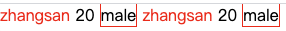

# XML

Extensible Marup Language 可扩展标记语言  
可扩展: 标签都是自定义的 

XML是从1996年开始有其雏形，并向 W3C（全球信息网联盟W3C World Wide Web Consortium）提案，而在1998二月发布为W3C的标准（XML1.0）

```xml
<?xml version='1.0' encoding="GBK" ?> 
<!--
    XML语法相对HTML较严格:
    1. 第一行是文档声明, 如果存在, 必须严格放在第一行, 连前面有空格都不被允许
    2. XML必须有根标签
    3. 属性必须用引号(单引或双引都可以)引起来, <user id="1">, 即这里的1必须引起来
    4. 标签要么是自闭合标签, 比如<br />, 要么必须有对应的结束标签, 以正确关闭
    5. 不同于HTML标签, XML的标签区分大小写
-->
<user id='1'>
    <name>zhangsan</name>
    <age>20</age>
    <gender>male</gender>
</user>
```

-------------------------

XML的组成部分  

- 文档声明
    - 格式: <?xml 属性列表 ?>
    - 属性列表: 
        - version: 版本号
        - encoding: 编码方式, 告知解析引擎当前文档使用的字符集, 默认值: ISO-8859-1
        - standalone: 是否独立, 取值为"yes"或"no", 一般不设置此字段 
- 指令: 主要用于结合CSS
- 标签: XML的标签是自定义的, 区分大小写, 不以数字或标点符号开头, 不包含空格, 不以xml开始
- 属性: 要以引号引起来, id属性值唯一
- 文本 
    - 特殊字符需要转义, 比如`<: &lt; >: &gt;`
    - CDATA区: 在该区域中的数据会被原样展示: 
    ```
    <![CDATA[
    if (a < b) {
    	System.out.println("Ha");
    }
    ]]]>
    ```

关于指令, 是由于XML早期设计的时候预想替换HTML, 但后来主要倾向于定义数据格式, 而指令, 比如: `<?xml-stylesheet type="text/css" href="a.css" ?>`, 这会引入当前目录下a.css文件:  

```xml
<?xml version="1.0" encoding="UTF-8" ?>
<?xml-stylesheet type="text/css" href="a.css" ?>
<users>
    <user id='1'>
        <name>zhangsan</name>
        <age>20</age>
        <gender>male</gender>
    </user>
    <user id='2'>
        <name>zhangsan</name>
        <age>20</age>
        <gender>male</gender>
    </user>
</users>
```

```
/*a.cs*/
name{
    color: red;
}
gender {
    border: red solid 1px;
}
```

浏览器运行效果: 



