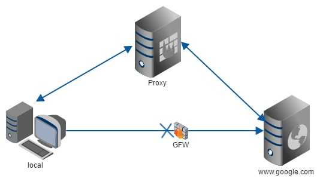

# 服务器搭建

参考： 
[知乎](https://www.zhihu.com/question/24723688)

在搭建服务器之前，需要先理解一些简单的概念  

### 什么是正向代理和反向代理

**正向代理**
[知乎](https://www.zhihu.com/question/24723688)作者写的很好，就直接照搬过来了：

A同学在大众创业、万众创新的大时代背景下开启他的创业之路，目前他遇到的最大的一个问题就是启动资金，于是他决定去找马云爸爸借钱，可想而知，最后碰一鼻子灰回来了，情急之下，他想到一个办法，找关系开后门，经过一番消息打探，原来A同学的大学老师王老师是马云的同学，于是A同学找到王老师，托王老师帮忙去马云那借500万过来，当然最后事成了。不过马云并不知道这钱是A同学借的，马云是借给王老师的，最后由王老师转交给A同学。这里的王老师在这个过程中扮演了一个非常关键的角色，就是**代理**，也可以说是正向代理，王老师代替A同学办这件事，这个过程中，真正借钱的人是谁，马云是不知道的，这点非常关键。  
我们常说的代理也就是只正向代理，正向代理的过程，它隐藏了真实的请求客户端，服务端不知道真实的客户端是谁，客户端请求的服务都被代理服务器代替来请求，某些科学上网工具扮演的就是典型的正向代理角色。用浏览器访问时，被残忍拒绝，于是你可以在国外搭建一台代理服务器，让代理帮我去请求google.com，代理把请求返回的相应结构再返回过来

GFW: Great Firewall of China: 天朝防火墙

`Client <--> Proxy <--> Server`

此处代理服务器是为你(Client)服务的，代表Client的利益；我们还可以让代理服务器给你代理到推特、Facebook等，他是代理的你。

**反向代理**  
所谓反向代理正好与正向代理相反，代理服务器是为目标服务器服务的, 因此称为反向代理服务器。虽然整体的请求返回路线都是一样的都是`Client <--> Proxy <--> Server`，但是这里的Proxy为Server服务，并不为Client服务，比如 我们访问百度网站，百度的代理服务器对外的域名为 https://www.baidu.com 。具体内部的服务器节点我们不知道。现实中我们通过访问百度的代理服务器后，代理服务器给我们转发请求到他们N多的服务器节点中的一个给我们进行搜索后将结果返回。 

