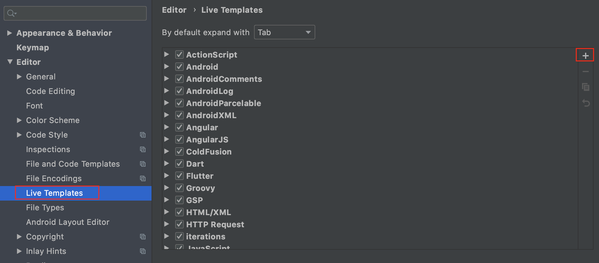
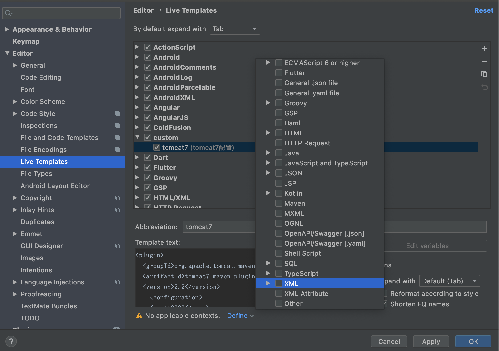

# IDEA动态模板

以Mac为例:  

Preferences > Editor > Live Templates > 



然后选择 Template Group... (如果不选择组,而直接选择Live Template,则会默认创建一个基于用户的组) --> 给组起个名字, 比如: `custom`  -->  选中组,然后点击`+` --> Live Template > 



- Abbreviation: 比如填写为 `tomcat7`
- Description: 表示简介
- Template text: 表示真正的模板正文, 比如填写为:  
```
<plugin>
  <groupId>org.apache.tomcat.maven</groupId>
  <artifactId>tomcat7-maven-plugin</artifactId>
  <version>2.2</version>
	<configuration>
	<port>8080</port>
	</configuration>
</plugin>
```

像上图出现了: No applicable contexts. 意思是说未定义使用场景, 我们可以点击Define, 选择XML, 即在XML中可用, 这样配置好了之后, 在XML中直接输入`tomcat7`, 则模板正文就出现了


